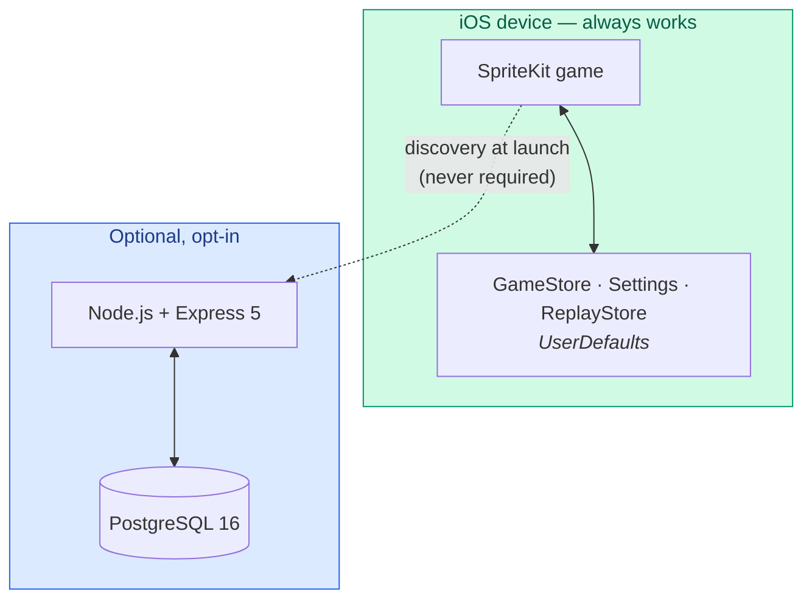
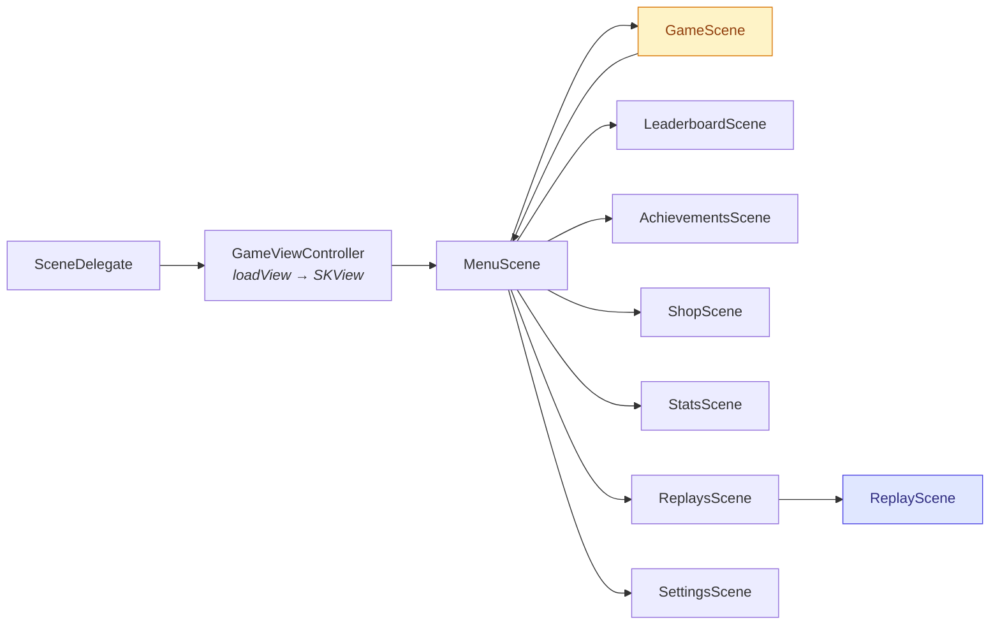
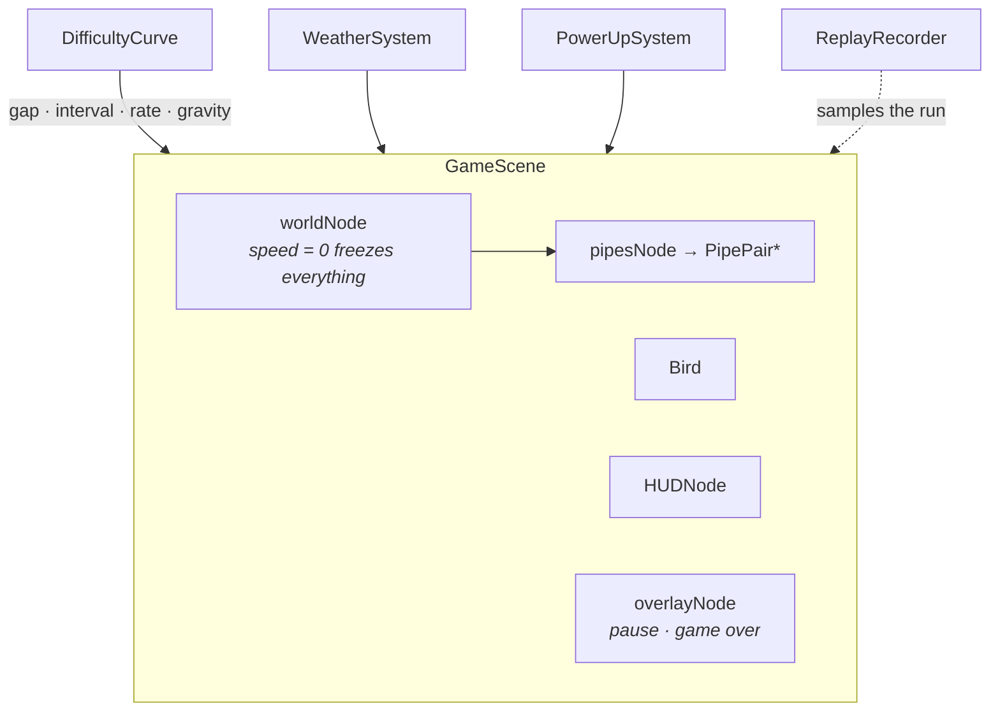
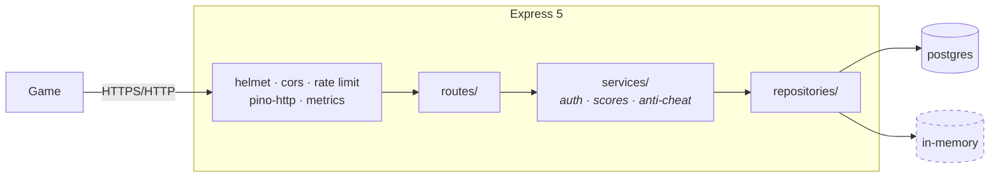
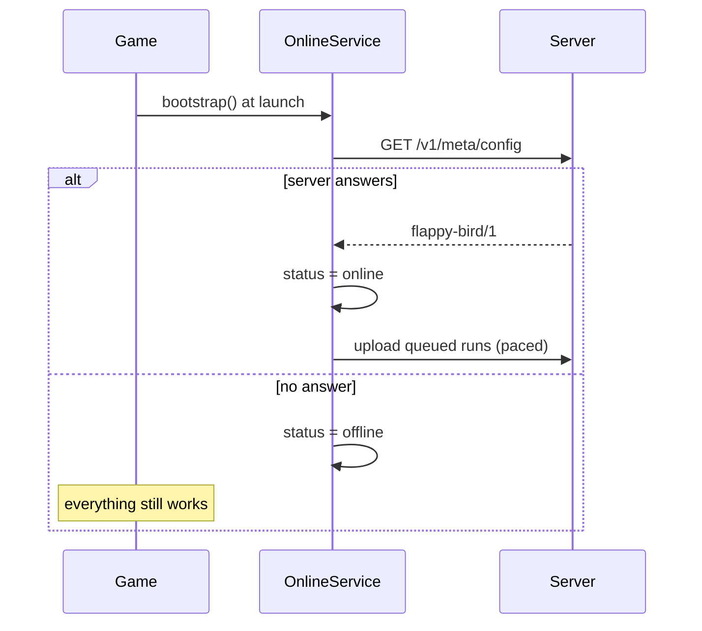

# Architecture

A map of the whole project: what each piece is, where it lives, and why it is
shaped the way it is. Every section links to the document that goes deeper.

> Looking for something specific? [`docs/`](docs/) is the full index. This page
> is the overview that ties it together.

---

## The one rule everything else follows

**The game is complete on its own.** Clone it, open it in Xcode, press ⌘R, and
you have the whole thing: six modes, power-ups, weather, a coin economy,
achievements, replays and a daily challenge, all persisted locally.

Everything under `backend/` is *additive*. It contributes accounts,
leaderboards and cloud saves — and the game discovers it at launch, uses it if
it answers, and carries on exactly as before if it does not. There is no
degraded mode, no "offline" banner blocking play, and no feature that breaks
when the server is absent.

This constraint is the reason for most of the decisions below, and it is
recorded formally in [ADR 0001](docs/adr/0001-optional-backend.md).



---

## Repository layout

```
.
├── FlappyBird/            the game (Swift · SpriteKit)
│   ├── App/               app + scene lifecycle, the SKView host
│   ├── Core/              config, models, persistence, settings, audio, logging
│   ├── Entities/          bird, pipes, collectibles, parallax world
│   ├── Scenes/            menu, game, and every list screen
│   ├── Systems/           difficulty, power-ups, weather, achievements, replays
│   ├── UI/                buttons, panels, HUD, accessibility
│   └── Backend/           the optional API client and sync service
├── FlappyBirdTests/       unit tests (no simulator UI driving)
├── FlappyBirdUITests/     XCUITest — drives the real app on a simulator
├── backend/               the optional Node.js API
│   ├── src/               routes, services, repositories, middleware
│   ├── migrations/        forward-only SQL
│   ├── openapi/           the specification, verified against the routers
│   └── tests/             Vitest, run against both storage drivers
├── docs/                  everything written down
├── ops/                   Prometheus and Grafana configuration
├── scripts/               bootstrap, capture, release, project generation
└── index.html             the landing page, with a playable demo
```

---

## The game

A single `UIWindow` hosts a single `SKView`. Navigation is presenting a new
`SKScene` — there is no navigation controller, no storyboard and no segues.



`GameScene` is the only scene with a frame loop and physics. Every other screen
is static content over a dark background, which is why they are cheap to open
and why list screens share one base class.

Read next: [Screens and navigation](docs/SCREENS.md) ·
[Rendering](docs/RENDERING.md) · [Physics and flight](docs/PHYSICS.md)

### Inside a run



The single most useful thing to know about `GameScene`: **`worldNode.speed` is
the one lever for pausing and for slow motion.** Setting it to `0` freezes every
action inside it; the HUD and overlays live outside it and keep rendering.

---

## Where state lives

Three stores, deliberately separate, all backed by `UserDefaults`:

| Store | Key | Holds |
|-------|-----|-------|
| `GameStore` | `player.profile.v2` | Scores, wallet, skins, achievements, run history, the upload queue |
| `Settings` | individual keys | Sound, haptics, contrast, selected skin and mode |
| `ReplayStore` | `player.replays.v1` | The ten newest recordings |

Replays are kept out of the profile on purpose: the profile is re-encoded on
every coin and is what backend sync serialises, while a replay is far larger
than everything else in it put together and the server has no use for it.

Read next: [Persistence and state](docs/PERSISTENCE.md) · [Replays](docs/REPLAYS.md)

---

## The optional backend

Express 5 over PostgreSQL, with every repository implemented twice — once for
Postgres, once in memory — behind identical contracts. The entire test suite
runs against both, which is what keeps the in-memory driver honest enough to
develop against without Docker.



Read next: [Backend](docs/BACKEND.md) · [API reference](docs/API.md) ·
[Database](docs/DATABASE.md) · [ADR 0003](docs/adr/0003-two-storage-drivers.md)

---

## How the two halves meet

The game never blocks on the network. Discovery runs in the background at
launch, runs are queued locally and uploaded when a server is reachable, and a
failed upload is retried rather than lost.



Read next: [Sync and the offline queue](docs/SYNC.md) ·
[Security model](docs/SECURITY-MODEL.md)

---

## Determinism

Two things must produce identical results on every device and in both
languages:

1. **The daily challenge.** Derived from `SHA-256("flappy-bird-daily:YYYY-MM-DD")`
   in both Swift and TypeScript, with a test pinning both against the same
   values. If they drifted, players would silently get different challenges.
2. **Replays.** Recorded rather than re-simulated, because pipe spawning is
   driven by accumulated frame time and would not line up twice.

Read next: [Determinism and seeds](docs/DETERMINISM.md)

---

## Build and delivery

The Xcode project is **generated** from the files on disk by
`scripts/generate_xcodeproj.py`, with object IDs derived from paths so the
output is byte-for-byte stable. CI asserts the checked-in project matches the
tree, so adding a source file without regenerating fails the build rather than
being silently ignored.

Read next: [Development](docs/DEVELOPMENT.md) · [CI/CD](docs/CI-CD.md) ·
[Configuration](docs/CONFIGURATION.md) · [ADR 0002](docs/adr/0002-generated-xcode-project.md)

---

## Quality

| Layer | Tooling |
|-------|---------|
| Swift unit | XCTest — pure logic, isolated `UserDefaults` per test |
| Swift UI | XCUITest — drives the real app, doubles as an accessibility test |
| Backend | Vitest + supertest, against both storage drivers |
| Contract | The OpenAPI spec is diffed against the live Express routers |
| Lint | SwiftLint (required in CI), SwiftFormat, ESLint, Prettier, ShellCheck |

Read next: [Testing](docs/TESTING.md) · [Accessibility](docs/ACCESSIBILITY.md) ·
[Performance](docs/PERFORMANCE.md) · [Observability](docs/OBSERVABILITY.md)
