# Architecture

A full map of the Flappy Bird project: what each piece is, where it lives, how
data and control flow move through it, and why the system is shaped the way it
is. Every section links to the document that goes deeper.

> Looking for something specific? [`docs/`](docs/) is the full index. This page
> is the architectural spine that ties those guides together. Read this first if
> you are new to the repository; skim it when you need to remember how two
> halves meet.

---

## Table of contents

1. [The one rule everything else follows](#the-one-rule-everything-else-follows)
2. [System context](#system-context)
3. [Repository layout](#repository-layout)
4. [Design principles and invariants](#design-principles-and-invariants)
5. [The iOS game](#the-ios-game)
6. [Where state lives](#where-state-lives)
7. [The optional backend](#the-optional-backend)
8. [How the two halves meet](#how-the-two-halves-meet)
9. [Shared contracts and determinism](#shared-contracts-and-determinism)
10. [Security model (summary)](#security-model-summary)
11. [Observability](#observability)
12. [Build, delivery and CI](#build-delivery-and-ci)
13. [Quality and testing](#quality-and-testing)
14. [Gameplay surface (architectural view)](#gameplay-surface-architectural-view)
15. [Physics and collision architecture](#physics-and-collision-architecture)
16. [Rendering architecture](#rendering-architecture)
17. [Audio, haptics and accessibility](#audio-haptics-and-accessibility)
18. [End-to-end: one scored run](#end-to-end-one-scored-run)
19. [Database and migrations](#database-and-migrations)
20. [Live leaderboard stream (SSE)](#live-leaderboard-stream-sse)
21. [Configuration surface](#configuration-surface)
22. [Failure modes and degradation](#failure-modes-and-degradation)
23. [Docker and runtime topology](#docker-and-runtime-topology)
24. [Developer entry points (Make)](#developer-entry-points-make)
25. [Concurrency and threading](#concurrency-and-threading)
26. [Extension points](#extension-points)
27. [What is deliberately out of scope](#what-is-deliberately-out-of-scope)
28. [Where to go next](#where-to-go-next)
29. [Appendix: mental model cheat sheet](#appendix-mental-model-cheat-sheet)

---

## The one rule everything else follows

**The game is complete on its own.** Clone it, open it in Xcode, press ⌘R, and
you have the whole thing: six modes, power-ups, weather, a coin economy,
achievements and a daily challenge, all persisted locally.

Everything under `backend/` is *additive*. It contributes accounts,
leaderboards and cloud saves — and the game discovers it at launch, uses it if
it answers, and carries on exactly as before if it does not. There is no
degraded mode, no “offline” banner blocking play, and no feature that breaks
when the server is absent.

This constraint is the reason for most of the decisions below, and it is
recorded formally in [ADR 0001](docs/adr/0001-optional-backend.md).

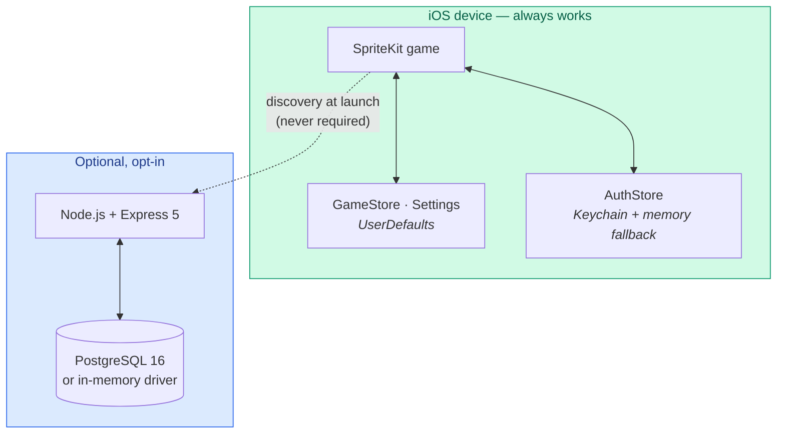

### What “complete offline” actually means

| Capability | Offline | Online (backend present) |
|------------|:-------:|:------------------------:|
| Play all six modes | ✅ | ✅ |
| Coins, skins, shop | ✅ | ✅ (skin also syncs) |
| Achievements | ✅ local catalog | ✅ merge with server progress |
| Daily challenge layout | ✅ same SHA-256 seed | ✅ same seed + ranked board |
| Leaderboard screen | ✅ recent local runs | ✅ global / friends boards |
| Auth / cloud profile | — | ✅ guest → register upgrade |
| Score upload | queued locally | flushed when reachable |

The offline column is the product. The online column is an overlay.

---

## System context

```mermaid
C4Context
    title System context — Flappy Bird

    Person(player, "Player", "Taps to flap on an iPhone or simulator")
    Person(ops, "Self-hoster", "Optional: runs the API with Docker or npm")
    Person(contrib, "Contributor", "Touches Swift, TypeScript, docs or CI")

    System_Boundary(flappy, "This repository") {
        System(game, "iOS game", "Swift · SpriteKit · local-first")
        System(api, "Optional backend", "Express 5 · Zod · Postgres/memory")
        System(site, "Landing page", "index.html + Canvas demo on GitHub Pages")
    }

    System_Ext(pg, "PostgreSQL 16", "Durable storage when DB_DRIVER=postgres")
    System_Ext(prom, "Prometheus / Grafana", "ops/ Compose profile")

    Rel(player, game, "Plays")
    Rel(game, api, "HTTPS/HTTP when discovered", "flappy-bird/1")
    Rel(api, pg, "SQL")
    Rel(ops, api, "make up / npm run dev")
    Rel(contrib, flappy, "PRs · tests · docs")
    Rel(player, site, "Tries the browser demo")
    Rel(prom, api, "Scrapes /metrics")
```

Three deployable surfaces ship from one repo:

| Surface | Entry | Required to play? |
|---------|-------|:-----------------:|
| iOS app | `Flappy Bird.xcodeproj` → ⌘R | **Yes** (this *is* the game) |
| Backend API | `make up` or `cd backend && npm run dev` | No |
| Landing / demo | GitHub Pages from `index.html` | No |

---

## Repository layout

```
.
├── FlappyBird/                 the game (Swift · SpriteKit)
│   ├── App/                    UIApplication / scene lifecycle, SKView host
│   ├── Core/                   config, models, persistence, settings, audio, RNG
│   ├── Entities/               bird, pipes, collectibles, parallax world
│   ├── Scenes/                 menu, game, and every list screen
│   ├── Systems/                difficulty, power-ups, weather, achievements
│   ├── UI/                     buttons, panels, HUD, accessibility helpers
│   ├── Backend/                optional API client, discovery, sync, auth
│   ├── bird.atlas              skinned bird frames
│   └── Images.xcassets         pipes, land, sky, app icon
├── FlappyBirdTests/            XCTest — pure logic, isolated UserDefaults
├── FlappyBirdUITests/          XCUITest — drives the real app on a simulator
├── backend/
│   ├── src/
│   │   ├── config/             env, constants, logger
│   │   ├── domain/             pure models, achievement + daily challenge logic
│   │   ├── routes/             HTTP adapters (thin)
│   │   ├── services/           auth, scores, anti-cheat, tokens, users, events
│   │   ├── repositories/       dual drivers: postgres/ + memory/
│   │   ├── middleware/         auth, validation, rate limit, metrics, errors
│   │   ├── db/                 pool, migrate, seed
│   │   ├── app.ts              Express wiring (side-effect free for tests)
│   │   └── server.ts           process boot, listen, graceful shutdown
│   ├── migrations/             forward-only SQL
│   ├── openapi/openapi.yaml    contract source of truth
│   └── tests/                  Vitest · both storage drivers
├── docs/                       deep guides (see docs/README.md)
│   └── adr/                    architecture decision records
├── ops/                        Prometheus + Grafana dashboards
├── scripts/                    xcodegen, bootstrap, capture, release, smoke helpers
├── site/                       static assets for the landing page
├── index.html                  marketing page + playable Canvas demo
├── docker-compose.yml          postgres · api · optional observability
└── .github/workflows/          CI, release, Pages
```

### Module responsibilities (game)

| Folder | Owns | Must not own |
|--------|------|--------------|
| `App/` | Window, `SKView`, scene presentation | Gameplay rules |
| `Core/` | Numbers, persistence, settings, audio, RNG | Network I/O |
| `Entities/` | Visual + physics nodes | Mode selection, menus |
| `Systems/` | Difficulty / weather / power-ups / achievements | Scene navigation |
| `Scenes/` | Screen flow and input routing | Raw SQL / HTTP details |
| `UI/` | Reusable SpriteKit chrome | Persistence writes (call into `GameStore`) |
| `Backend/` | Discovery, sessions, upload queue | Physics or rendering |

### Module responsibilities (backend)

| Layer | Owns | Must not own |
|-------|------|--------------|
| `routes/` | HTTP paths, status codes, wiring Zod schemas | Business rules |
| `services/` | Auth, scoring, fair-play, merges | SQL dialect |
| `repositories/` | Persistence contracts + two implementations | JWT minting |
| `domain/` | Pure functions shared across services | Express types |
| `middleware/` | Cross-cutting HTTP concerns | Domain tables |
| `openapi/` | External contract | Runtime behaviour (tests keep it honest) |

---

## Design principles and invariants

These are the rules contributors should assume are true. Breaking one usually
means updating an ADR as well as the code.

1. **Local-first.** A missing server is a normal state, not an error state the
   player must clear before playing.
2. **One pause lever.** `worldNode.speed` freezes or slows the playfield;
   HUD/overlays live outside it. Physics uses `physicsWorld.speed` separately.
3. **Dual storage drivers stay identical.** Every repository method exists for
   Postgres *and* memory; CI runs the suite on both
   ([ADR 0003](docs/adr/0003-two-storage-drivers.md)).
4. **Handshake before trust.** A probe is only accepted when
   `protocol: "flappy-bird/1"` comes back from `/v1/meta/config`.
5. **Monotonic sync.** Achievement progress only increases; unlock timestamps
   are never overwritten by older cloud values.
6. **Generated Xcode project.** Sources on disk are the truth;
   `scripts/generate_xcodeproj.py` produces stable object IDs
   ([ADR 0002](docs/adr/0002-generated-xcode-project.md)).
7. **Contract tests over wishful mirroring.** Daily seeds and achievement codes
   that exist in Swift *and* TypeScript are pinned by tests on both sides.
8. **Proportionate security.** Reject the impossible, flag the improbable, keep
   evidence — do not pretend the client is trusted or simulate every run on the
   server.

---

## The iOS game

A single `UIWindow` hosts a single `SKView`. Navigation is presenting a new
`SKScene` — there is no `UINavigationController`, no storyboard and no segues.

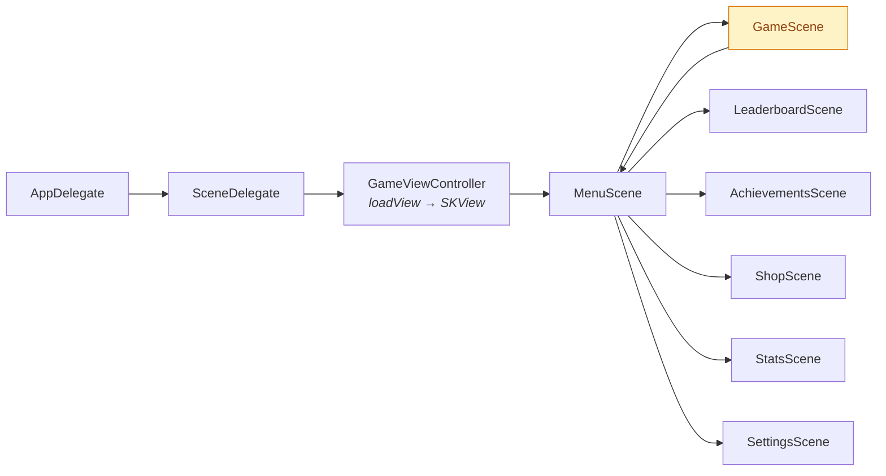

`GameScene` is the only scene with a continuous frame loop and physics. Every
other screen is static content over a dark background, which is why they are
cheap to open and why list screens share `ListScene`.

Read next: [Screens and navigation](docs/SCREENS.md) ·
[Rendering](docs/RENDERING.md) · [Physics and flight](docs/PHYSICS.md) ·
[Gameplay](docs/GAMEPLAY.md)

### App bootstrap

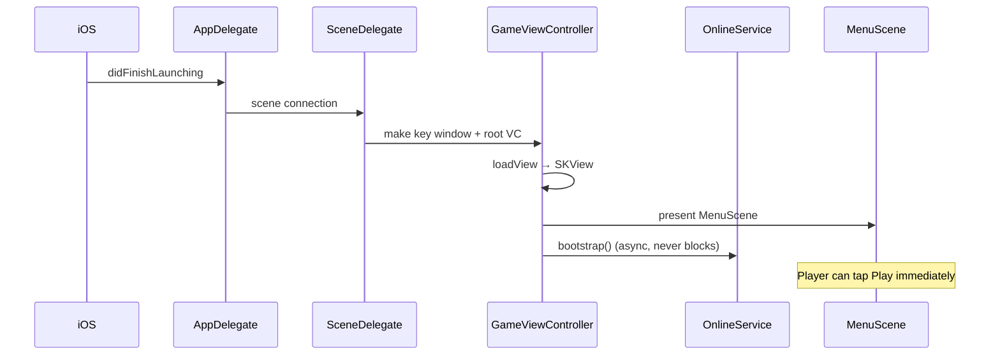

`LaunchOptions` parses process arguments (`-demo`, `-debug-hud`, UI-test hooks)
so XCUITest and the landing-page capture scripts can drive the app without
private APIs.

### Scene map

| Scene | Role | Built from |
|-------|------|------------|
| `MenuScene` | Mode picker, entry to every subsystem | Custom layout + `ButtonNode` |
| `GameScene` | The run | `worldNode` + physics + systems |
| `LeaderboardScene` | Local and/or online boards | `ListScene` |
| `AchievementsScene` | Catalog + progress | `ListScene` |
| `ShopScene` | Spend coins on skins | `ListScene` |
| `StatsScene` | Lifetime aggregates | Panels over `ListScene` patterns |
| `SettingsScene` | Sound, haptics, contrast, server URL, online toggle | Form-like SpriteKit UI |

### Inside a run (`GameScene`)

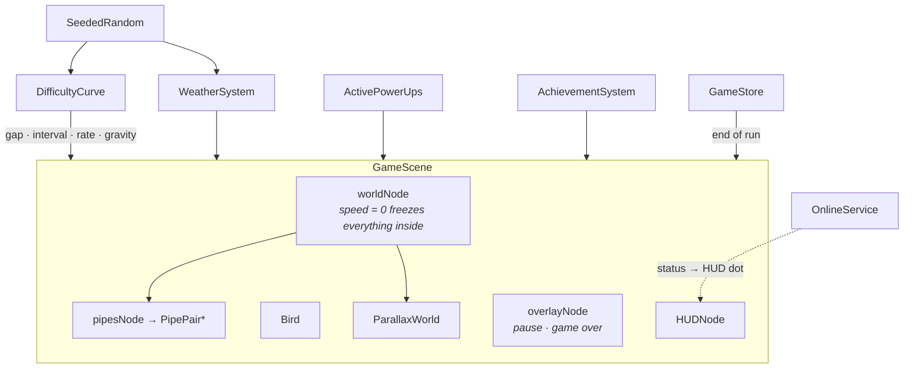

#### The frame loop (conceptual)

```
update(currentTime)
  ├─ dt = clamp(currentTime - lastUpdate)
  ├─ if state == .playing:
  │     ├─ elapsed += dt * worldNode.speed
  │     ├─ spawnAccumulator → maybe spawn PipePair
  │     ├─ difficulty.snapshot(pipesPassed) → apply gravity / scroll
  │     ├─ powerUps.tick(dt) → worldNode.speed, magnet, shrink…
  │     ├─ weather.tick(dt) → lateral forces / particles
  │     └─ bird.clamp velocities · update rotation
  ├─ parallax.scroll(scrollRate * dt)
  └─ hud.refresh(stats)
```

#### Node ownership

| Node | Inside `worldNode`? | Why |
|------|:-------------------:|-----|
| Sky, clouds, ground, pipes, collectibles | Yes | Must freeze / slow with the world |
| Bird | Sibling (see rendering doc) | Drawn above pipes; still physics-driven |
| `HUDNode` | No | Score must update while paused |
| Pause / game-over panels | No (`overlayNode`) | Must remain interactive |
| Toasts | No | Feedback during freeze |

The single most useful fact about `GameScene`: **`worldNode.speed` is the one
lever for pausing and for slow motion.** Setting it to `0` freezes every action
inside it; overlays keep rendering.

### Entities

| Type | File | Responsibility |
|------|------|----------------|
| `Bird` | `Entities/Bird.swift` | Physics body, flap impulse, skins, hitbox |
| `PipePair` | `Entities/PipePair.swift` | Top/bottom pipes, gate, optional pickup, scoring edge |
| `Collectible` | `Entities/Collectible.swift` | Coins and power-up tokens |
| `ParallaxWorld` | `Entities/ParallaxWorld.swift` | Tiled sky/ground, cloud drift, day/night tint |

Collision categories and the flight constants (gravity −5.0, flap impulse 30,
pinned mass `0.0804`) live in `GameConfig` and are explained in
[Physics](docs/PHYSICS.md).

### Systems

| System | Input | Output |
|--------|-------|--------|
| `DifficultyCurve` | mode + pipes passed | gap, spawn interval, scroll rate, gravity |
| `ActivePowerUps` / `PowerUp` | pickups + dt | world speed, hitbox scale, score multiplier, shield charges |
| `WeatherSystem` | run seed | clear / wind / rain / fog forces + particles |
| `AchievementSystem` | run + lifetime stats | unlocks written into `GameStore` |

Modes (`GameMode`) select which systems are allowed: Hardcore and Daily disable
power-ups; Zen disables lethal collisions and ranking.

### UI kit

SpriteKit has no UIKit controls. The shared chrome is small on purpose:

- `ButtonNode` — hit target + label + accessibility traits
- `PanelNode` / `GameOverPanel` — modal cards
- `HUDNode` — score, coins, combo, online indicator
- `ScrollContainer` — vertical lists for shop / achievements / boards
- `Accessibility` helpers — VoiceOver labels and ordering

Read next: [Accessibility](docs/ACCESSIBILITY.md) · [Audio and haptics](docs/AUDIO.md)

### Backend client (on device)

All network code sits under `FlappyBird/Backend/`:

| Type | Role |
|------|------|
| `BackendDiscovery` | Ordered probe list, URL normalisation, handshake |
| `APIClient` | URLSession wrapper, auth header, 401 → refresh |
| `APIModels` | Codable mirrors of OpenAPI schemas |
| `AuthStore` | Access (memory) + refresh (Keychain, with memory fallback) |
| `OnlineService` | Facade every scene talks to; owns status + upload flush |
| `DailyChallengeHelper` | Shared daily seed derivation (Swift side) |

Scenes never call `URLSession` directly. They ask `OnlineService` and react to
`Status` (`.disabled | .searching | .offline | .online(ServerConfig)`).

---

## Where state lives

Two stores, deliberately separate, both backed by `UserDefaults` (plus Keychain
for refresh tokens):

| Store | Key / location | Holds | Leaves the device? |
|-------|----------------|-------|:------------------:|
| `GameStore` | `player.profile.v2` | Scores, wallet, skins, achievements, run history, upload queue | Yes, via sync |
| `Settings` | `settings.*` scalars | Sound, haptics, contrast, skin, mode, server URL, online toggle | No |
| `AuthStore` | Keychain (+ memory) | Refresh token, username, guest flag | Tokens only |

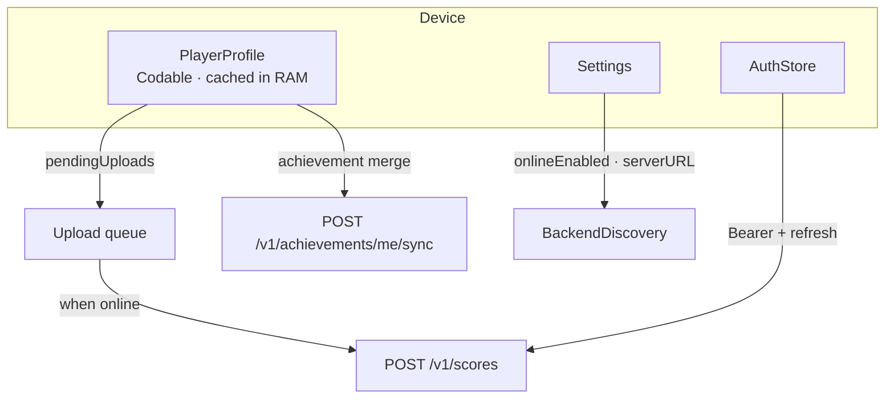

`PlayerProfile` is one document so a scene can decode once and read many times
per frame. Settings are individual keys so flipping “sound off” does not rewrite
the entire profile.

Migrations are additive version bumps on the profile blob — see
[Persistence](docs/PERSISTENCE.md).

---

## The optional backend

Express 5 over PostgreSQL, with every repository implemented twice — once for
Postgres, once in memory — behind identical contracts. The entire test suite
runs against both, which is what keeps the in-memory driver honest enough to
develop against without Docker.

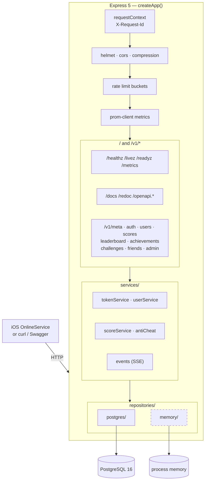

### Request path

1. `requestContext` assigns `X-Request-Id`.
2. Helmet / CORS / compression / JSON body (64 KB cap).
3. Optional `pino-http` access log (skipped in tests; `/metrics` and `/livez`
   ignored).
4. Router matches; Zod validates params/query/body (`validate` middleware).
5. Auth middleware attaches `req.user` when a Bearer token is present / required.
6. Service performs the use case; repository persists.
7. Errors become typed JSON via `errorHandler` (`422` validation, `401` auth,
   `429` rate limit, …).

### Route map (`/v1`)

| Prefix | Purpose |
|--------|---------|
| `/meta` | Discovery handshake, capabilities, limits |
| `/auth` | Guest, register, login, refresh, logout, upgrade |
| `/users` | Profile read/update, public lookups |
| `/scores` | Submit runs, personal history |
| `/leaderboard` | Ranked windows + SSE stream |
| `/achievements` | Catalog + merge sync |
| `/challenges` | Daily challenge metadata / entries |
| `/friends` | Follow graph |
| `/admin` | Ban, flag, moderation (`X-Admin-Token`) |

Unversioned: health probes, docs, OpenAPI artefacts, `/` → redirect to `/docs`.

### Storage drivers

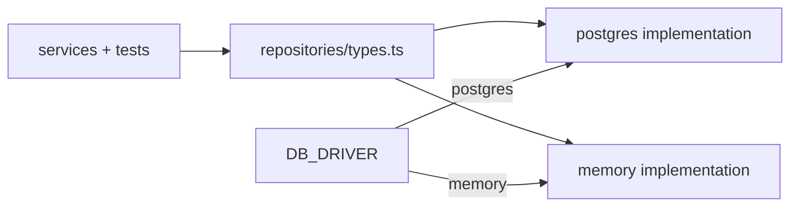

| Driver | When to use | Durability |
|--------|-------------|------------|
| `memory` (default for `npm run dev`) | Local game networking, CI matrix cell, demos | Process lifetime |
| `postgres` | `make up`, production-like runs | Disk + migrations |

Production refuses `memory` so a misconfigured deploy cannot silently lose data.
See [ADR 0003](docs/adr/0003-two-storage-drivers.md) and
[Database](docs/DATABASE.md).

### Domain data (high level)

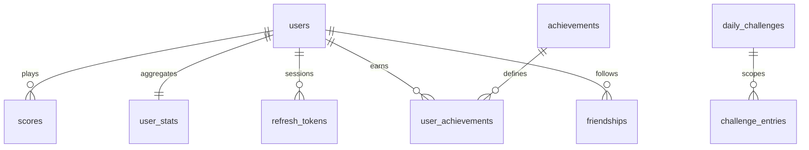

UUIDs are allocated in application code so both drivers share the same identity
model. All timestamps are `timestamptz` UTC.

### Fair play (server)

`antiCheat` / score validation:

- Hard rejects (HTTP 422): negative scores, impossible pipes/sec, unknown modes,
  malformed seeds.
- Soft flags: improbable but not impossible runs — stored with `flagged` +
  reason for admin review.
- Optional HMAC run signatures when `REQUIRE_SIGNED_RUNS=true` and the game
  shares `RUN_SIGNING_SECRET`.

This is intentionally not server-authoritative simulation. The threat model and
limits are spelled out in [Security](docs/SECURITY-MODEL.md).

Read next: [Backend](docs/BACKEND.md) · [API reference](docs/API.md) ·
[Docker](docs/DOCKER.md)

---

## How the two halves meet

The game never blocks on the network. Discovery runs in the background at
launch, runs are queued locally and uploaded when a server is reachable, and a
failed upload is retried rather than lost.

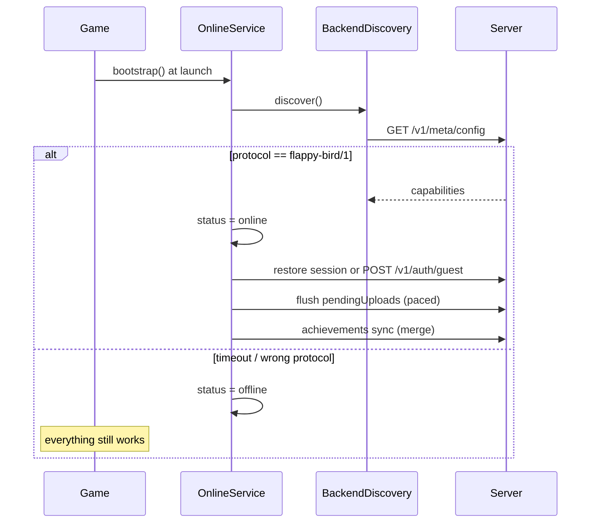

### Discovery order

1. Settings override (what the player typed)
2. `FlappyBackendURL` in `Info.plist` (what a fork ships)
3. `http://localhost:4000`
4. `http://127.0.0.1:4000`

Duplicates are removed while preserving order. Each candidate gets a short
timeout so launch stays snappy. On a physical device, `localhost` is the phone —
players point Settings at the Mac’s LAN IP.

### Upload queue

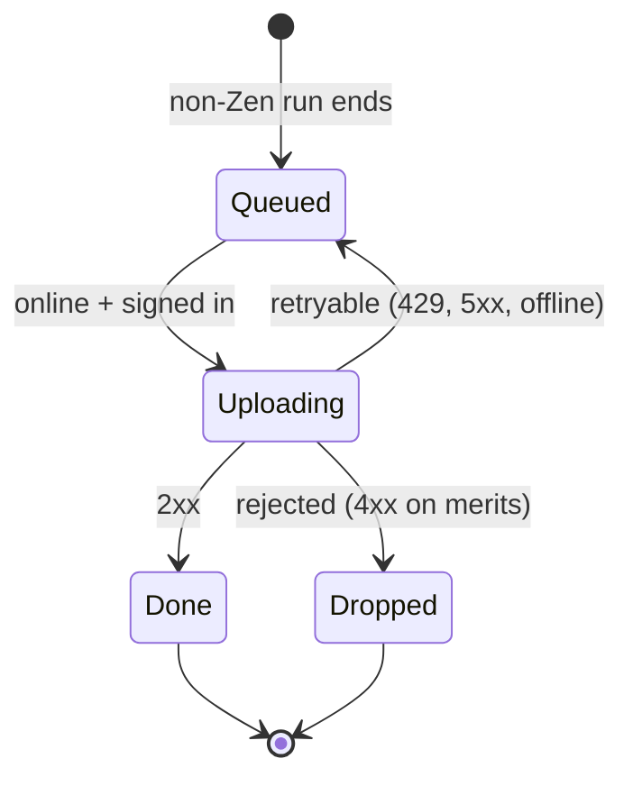

Zen runs never enter the queue (practice mode is unranked by design).

### Session model

- First contact creates a **guest** bound to `identifierForVendor`.
- Register/login **upgrades** the same row — scores are kept.
- Access JWT ~15 minutes; refresh token ~30 days, stored **hashed** server-side,
  rotated on use.
- Keychain write failures fall back to memory for the process lifetime so the
  app cannot look “connected” while uploading nothing.

Read next: [Sync and the offline queue](docs/SYNC.md)

---

## Shared contracts and determinism

Some behaviour must match on device and server even though the implementations
are separate languages.

### Daily challenge seed

```
seed = SHA-256("flappy-bird-daily:YYYY-MM-DD")
```

Derived in Swift (`DailyChallengeHelper`) and TypeScript (`domain/challenge.ts`).
Contract tests pin both against the same fixture dates. If they drifted, every
player would silently get a different layout on “the same” day.

### Enumerations that must stay aligned

| Concept | Swift | TypeScript |
|---------|-------|------------|
| Modes | `GameMode` | `GAME_MODES` |
| Skins | shop / profile strings | `BIRD_SKINS` / `BirdSkin` |
| Achievement codes | `AchievementSystem` | `domain/achievements.ts` |
| Leaderboard windows | API models | `LeaderboardWindow` |

OpenAPI (`backend/openapi/openapi.yaml`) is the external contract. A Vitest
suite asserts every Express route is documented and every documented path
exists.

### What is *not* deterministic

- Local classic/endless pipe layouts use a per-run seed (reproducible if stored
  with the run, but not global).
- Weather weights are seeded per run; only Daily forces the shared calendar seed.
- Network scheduling, toast timing and particle counts are allowed to vary.

Read next: [Determinism and seeds](docs/DETERMINISM.md)

---

## Security model (summary)

| Asset | Threat | Mitigation |
|-------|--------|------------|
| Passwords | DB disclosure | bcrypt cost 11; never logged |
| Sessions | Theft / replay | Short access JWT; hashed, rotating refresh |
| Leaderboards | Fabricated scores | Plausibility checks, optional HMAC, admin flags |
| API | Brute force / scraping | Global + auth + submit rate limits; Zod |
| Device | Local tampering | Out of scope for a local-first game |

Default transport is **HTTP to localhost** on purpose. Exposing the API beyond
a machine means TLS at a reverse proxy (`TRUST_PROXY`, tightened `CORS_ORIGINS`,
`PUBLIC_URL=https://…`).

Read next: [Security model](docs/SECURITY-MODEL.md)

---

## Observability

| Signal | Where | Notes |
|--------|-------|-------|
| Structured logs | pino → stdout | `X-Request-Id` on every line |
| Metrics | `GET /metrics` | prom-client; scrape via `ops/prometheus` |
| Dashboards | `ops/grafana` | Compose profile `observability` |
| Health | `/healthz` `/livez` `/readyz` | Driver + DB ping on ready |
| Client logs | `os.Logger` via `Log` | Subsystem-separated |

The smoke script (`make smoke`) is the operational “did the happy path work”
check used in CI and locally.

Read next: [Observability](docs/OBSERVABILITY.md)

---

## Build, delivery and CI

### Xcode project generation

The `.xcodeproj` is **generated** from the files on disk by
`scripts/generate_xcodeproj.py`. Object IDs are derived from paths so the output
is byte-for-byte stable. CI runs `python3 scripts/generate_xcodeproj.py --check`:
adding a Swift file without `make xcodegen` fails the build instead of being
silently ignored.

### Make targets (common)

| Target | Effect |
|--------|--------|
| `make up` | Compose: Postgres + API |
| `make down` | Tear down |
| `make smoke` | End-to-end API walk |
| `make test` | Backend + hints for iOS |
| `make xcodegen` | Regenerate the Xcode project |
| `make health` | Curl health document |

### CI topology

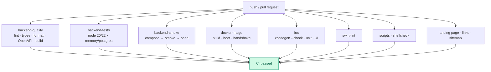

`CI passed` is the aggregate required check on `master` (together with the key
leaf jobs). Releases are cut by `release.yml` (tag, notes, GHCR image).
Pages deploys from `pages.yml` when site files change.

Read next: [Development](docs/DEVELOPMENT.md) · [CI/CD](docs/CI-CD.md) ·
[Configuration](docs/CONFIGURATION.md)

---

## Quality and testing

| Layer | Tooling | What it protects |
|-------|---------|------------------|
| Swift unit | XCTest · isolated `UserDefaults` | Flight math, store migrations, daily seed, discovery normalisation |
| Swift UI | XCUITest on simulator | Critical navigation + accessibility hooks |
| Backend unit/integration | Vitest + supertest | Both storage drivers, auth, scores, anti-cheat |
| Contract | OpenAPI ↔ Express route inventory | Drift between docs and code |
| Lint / format | SwiftLint, SwiftFormat, ESLint, Prettier, ShellCheck | Consistency without reformatting wars |
| Smoke | `scripts/smoke` against Compose | Real stack, same path the game uses |
| Container | Build production image, boot with `memory`, assert handshake | “Image we publish actually speaks `flappy-bird/1`” |

### Recommended local loop

```bash
# Game
make xcodegen
open "Flappy Bird.xcodeproj"   # ⌘U for tests

# API without Docker
cd backend && npm test && npm run dev

# API as the game will see it
make up && make smoke
```

### Test inventory (what protects what)

| Suite | Approx. count | Notable contracts |
|-------|--------------:|-------------------|
| `FlappyBirdTests` | 123 | Daily seed parity with TS · AuthStore Keychain fallback · difficulty floors |
| `FlappyBirdUITests` | 25 | Menu destinations · pause/summary · shop buy/equip · Settings tabs |
| Backend Vitest | 108 × 2 drivers | Auth rotation · anti-cheat rejects · OpenAPI ↔ router inventory |

Swift UI tests **are** accessibility tests: every control is reached through
`UIAccessibility`. If VoiceOver cannot see a button, neither can XCUITest.

Read next: [Testing](docs/TESTING.md) · [Performance](docs/PERFORMANCE.md)

---

## Gameplay surface (architectural view)

Numbers and feel live in [Gameplay](docs/GAMEPLAY.md). Architecturally, modes
are **feature flags over shared systems**, not separate scene subclasses.

| Mode | Difficulty ramp | Power-ups | Lethal | Ranked / upload queue | Seed source |
|------|:---------------:|:---------:|:------:|:---------------------:|-------------|
| Classic | — | ✅ | ✅ | ✅ | Per-run |
| Endless | ✅ | ✅ | ✅ | ✅ | Per-run |
| Time Attack | ✅ | ✅ | ✅ | ✅ | Per-run · 60 s clock |
| Hardcore | ✅ | ❌ | ✅ | ✅ | Per-run |
| Zen | — | ✅ | ❌ | ❌ | Per-run |
| Daily | ✅ | ❌ | ✅ | ✅ | Calendar SHA-256 |

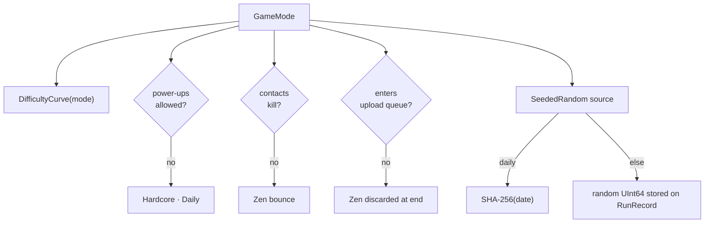

### Difficulty as pure function

```
t = 1 − (1 − min(1, pipesPassed / 40))³
→ gap, spawnInterval, scrollRate, gravity
```

Hard floors (gap ≥ 118 pt, spawn ≥ 1.25 s) are asserted in tests across every
mode so a tuning PR cannot accidentally make the late game impossible.

### Economy loop

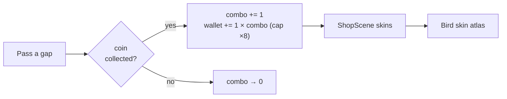

Coins are local-first; online play may mirror `avatarSkin` on the user profile
but never gates cosmetics behind the server.

---

## Physics and collision architecture

One dynamic body (the bird). Everything else is static or a sensor.

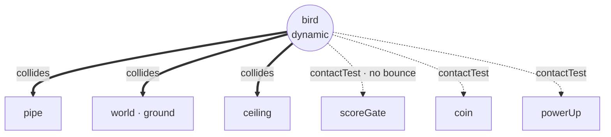

| Category | Role |
|----------|------|
| `bird` | Sole dynamic body |
| `world` | Ground |
| `pipe` | Lethal (except Zen) |
| `scoreGate` | Invisible full-height sensor past each pair → +1 pipe |
| `coin` / `powerUp` | Sensors → collectibles |
| `ceiling` | Soft pin so the bird cannot leave the top of the playfield |

### Load-bearing constants

| Constant | Value | Architectural reason |
|----------|------:|----------------------|
| `gravity` | −5.0 | Mode/challenge scale this; base stays classic-feel |
| `flapImpulse` | 30 | Impulse, not velocity set — stacks with gravity honestly |
| `birdMass` | **0.0804 pinned** | SpriteKit derives mass from area; forgiving hitboxes must not change Δv |
| `maxFallSpeed` / `maxRiseSpeed` | −900 / 520 | Keep long falls readable; stop tap-spam launches |
| Horizontal drift clamp | ±46 pt | Wind / shield knockback without leaving the screen |

**Invariant:** changing the collision circle radius must not change `birdMass`.

Read next: [Physics and flight](docs/PHYSICS.md)

---

## Rendering architecture

SpriteKit effective z = own `zPosition` + all ancestors. Bugs almost always come
from forgetting that `PipePair` inherits `pipesNode`’s z.

| Layer (`ZPosition`) | z | Notes |
|---------------------|--:|-------|
| sky | −30 | Recoloured by time-of-day |
| clouds | −25 | Slowest parallax |
| distantCity | −20 | Mid parallax |
| pipes | −10 | Inside `worldNode` |
| ground | 5 | Scrolls with world |
| collectible | 10 | Coins / power-ups |
| bird | 20 | Above pipes |
| particles / weather | 25–40 | FX |
| hud | 100 | Outside world |
| overlay | 200 | Pause / game over |
| toast | 300 | Transient copy |

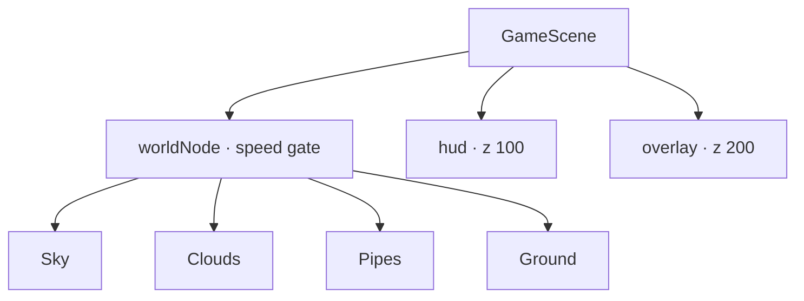

Textures: `Images.xcassets` for pipes/land/sky; `bird.atlas` for skinned frames.
Day/night cycles re-tint rather than swap full background atlases.

Read next: [Rendering](docs/RENDERING.md) · [Performance](docs/PERFORMANCE.md)

---

## Audio, haptics and accessibility

### Audio

**No audio files ship in the bundle.** `AudioManager` synthesises short PCM
buffers once at launch (square / soft waveforms per `Effect`) and schedules them
on `AVAudioPlayerNode`s. Session category is `.ambient` + `.mixWithOthers` so
the player’s music continues.

### Haptics

`Haptics` wraps `UIImpactFeedbackGenerator` / notification feedback, prepared at
scene start, gated by Settings.

### Accessibility

SpriteKit has no UIKit view tree. Interactive nodes opt into `UIAccessibility`
explicitly (`ButtonNode`, list rows, HUD). Reduce Motion is cached at
`didMove(to:)` so the frame loop does not call into UIKit every tick.

Assistive architecture goal: **if XCUITest can reach it, VoiceOver can too.**

Read next: [Audio](docs/AUDIO.md) · [Accessibility](docs/ACCESSIBILITY.md)

---

## End-to-end: one scored run

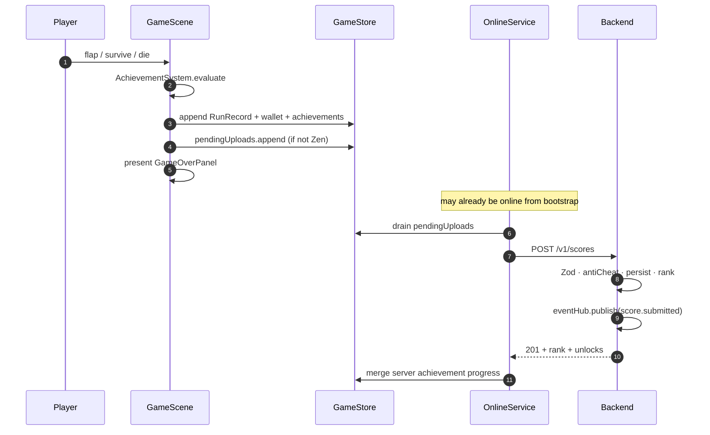

Offline: steps after “pendingUploads.append” simply wait until discovery
succeeds on a later launch or foreground.

---

## Database and migrations

Forward-only SQL under `backend/migrations/`, applied by `migrate.ts` (and
optionally auto-applied at boot when `DATABASE_AUTO_MIGRATE=true`).

| Migration | Intent |
|-----------|--------|
| `001_init.sql` | Core tables: users, scores, tokens, friendships, challenges… |
| `002_achievements_seed.sql` | Achievement catalog rows |
| `003_leaderboard_view.sql` | Ranking helpers / views |
| `004_score_sequence.sql` | Stable ordering for boards (`bigserial seq`) |
| `005_drop_ghost_rider.sql` | Data fix / cleanup |

### Ranking idea

Leaderboards are windowed (`all` / `daily` / `weekly` / `monthly`) and mode-
scoped. The Postgres path uses indexes on `(mode, submitted_at, score)` (see
[Database](docs/DATABASE.md)); the memory path sorts in process. Services call
the repository — never raw SQL from routes.

### Identity

Application-generated UUIDs for users and scores so memory and Postgres share
one identity story. Usernames are stored with a `username_lower` unique key for
case-insensitive lookups.

---

## Live leaderboard stream (SSE)

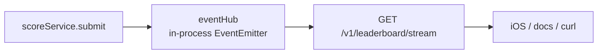

- Enabled with `ENABLE_SSE` (advertised as capability `leaderboard.stream`).
- **Single-process** pub/sub by design — hobby deploys run one container; the
  game falls back to polling when the stream is down.
- Event types: `score.submitted`, `leaderboard.changed`, `heartbeat`.
- Not a multi-region bus. If you need that, you are past the intended scale;
  introduce Redis later without changing the HTTP event shape.

---

## Configuration surface

| Layer | Mechanism | Examples |
|-------|-----------|----------|
| iOS launch args | `LaunchOptions` | `-demo`, `-debug-hud`, UI-test flags |
| iOS Settings | `Settings` / UserDefaults | sound, haptics, server URL, `onlineEnabled` |
| iOS Info.plist | build-time | `FlappyBackendURL` default for forks |
| Backend env | Zod-parsed `env.ts` | `DB_DRIVER`, JWT secrets, rate limits, feature flags |
| Compose | `docker-compose.yml` | ports, profiles, healthchecks |

Production backend **requires** real JWT secrets and rejects `DB_DRIVER=memory`.
Development generates ephemeral secrets so `npm run dev` works with an empty
`.env`.

Full tables: [Configuration](docs/CONFIGURATION.md) ·
[`backend/.env.example`](backend/.env.example).

---

## Failure modes and degradation

| Failure | Player-visible result | System behaviour |
|---------|----------------------|------------------|
| No server on LAN | “No server found” | Local play + queue grows |
| Player disables online | “Offline mode” | Discovery never runs |
| Wrong process on :4000 | Ignored | Handshake requires `flappy-bird/1` |
| Keychain write fails | Still plays | Refresh kept in memory for this launch |
| 429 / 5xx on upload | Silent retry | Run stays queued |
| 4xx on merits (anti-cheat) | Dropped from queue | Not retried forever |
| Postgres down | `/readyz` fails | Compose / K8s stop routing traffic |
| SSE disabled / broken | Boards still load | Polling / pull on open |

**Never:** block `MenuScene` on network, lose a local run because upload failed,
or require an account to open the shop.

---

## Docker and runtime topology

Only the backend is containerised — the game needs macOS and Xcode.

```mermaid
flowchart TB
    subgraph default["profile: default"]
        PG[("postgres:16<br/>volume")]
        API["backend:4000<br/>HEALTHCHECK /healthz"]
        API --> PG
    end

    subgraph tools["profile: tools"]
        PW["pgweb:8081"] --> PG
    end

    subgraph obs["profile: observability"]
        PR["prometheus:9090"] -->|scrape| API
        GR["grafana:3001"] --> PR
    end

    Sim["iOS Simulator"] -->|http://localhost:4000| API
```

### Image (`backend/Dockerfile`)

Four stages: `deps` → `build` (tsc) → `prod-deps` → `prod` (dist + prod
modules + migrations + openapi). Runtime runs as non-root `flappy` (uid 1001)
under `dumb-init` so `SIGTERM` stops Node cleanly.

Compose project names isolate volumes — CI can use `docker compose -p …`
without wiping a developer’s database.

Read next: [Docker](docs/DOCKER.md)

---

## Developer entry points (Make)

| Goal | Command |
|------|---------|
| Regenerate Xcode project | `make xcodegen` |
| Unit-test the game | `make test` |
| UI-test the game | `make test-ui` |
| Attract-mode capture | `make demo` / `make media` |
| API hot reload (memory) | `make dev` |
| Full stack | `make up` |
| + pgweb | `make up-tools` |
| + Prometheus/Grafana | `make up-observability` |
| Smoke the real stack | `make smoke` |
| Seed demo players | `make seed` |
| Everything CI-ish except iOS build | `make check` |

`scripts/xcode.sh` preserves `xcodebuild` exit status (no `grep || true` false
greens). Simulator destinations resolve to a **UDID**, not `name=…,OS=latest`.

---

## Concurrency and threading

| Component | Model |
|-----------|-------|
| SpriteKit scenes / `OnlineService` | `@MainActor` — UI and status observers on main |
| `URLSession` work | async/await; results hop back to main before touching nodes |
| Backend | Node single-threaded event loop; CPU work kept small |
| Postgres pool | `pg` pool (`DATABASE_POOL_MAX`, default 10) |
| SSE subscribers | In-process listeners; heartbeats keep proxies from buffering forever |

There is no game-logic thread pool and no shared mutable world crossing actors.
If you add background decoding, publish results onto the main actor before
mutating `SKNode`s.

---

## Extension points

Concrete places to grow without rewriting the spine:

| Want to add… | Extend |
|--------------|--------|
| A new game mode | `GameMode` + `DifficultyCurve` + backend `GAME_MODES` + OpenAPI enum + tests |
| A new power-up | `PowerUp` catalog + spawn weights + HUD affordance |
| A new achievement | Both catalogs (Swift + TS) + contract test vectors |
| A new REST resource | `routes/` + `services/` + **both** repositories + OpenAPI + Vitest |
| A new list screen | Subclass `ListScene` (title, segments, `buildContent`) |
| A new sound | `AudioManager.Effect` + synthesised buffer definition |
| A new deploy knobs | `env.ts` Zod schema + `.env.example` + Configuration.md |

Anti-pattern: calling `URLSession` from a scene, or embedding SQL in a route
handler.

---

## What is deliberately out of scope

From the [roadmap](docs/ROADMAP.md) “not planned” list — architectural
constraints, not temporary gaps:

| Out of scope | Why |
|--------------|-----|
| Mandatory accounts | Breaks the local-first rule |
| In-app purchases / ads | Economy is earn-only by design |
| Server-authoritative simulation | Disproportionate for this game; fair-play is honest instead |
| Cross-platform rewrite | SpriteKit *is* the point of the iOS half |
| Treating the backend as required in docs or onboarding | Would recreate the problem ADR 0001 solved |

---

## Where to go next

### By job to be done

| If you want to… | Open |
|-----------------|------|
| Run the game | [README](README.md) · [Development](docs/DEVELOPMENT.md) |
| Understand a run | [Gameplay](docs/GAMEPLAY.md) · [Physics](docs/PHYSICS.md) · [Rendering](docs/RENDERING.md) |
| Change persistence | [Persistence](docs/PERSISTENCE.md) |
| Wire or debug online features | [Sync](docs/SYNC.md) · [Backend](docs/BACKEND.md) · [API](docs/API.md) |
| Touch the schema | [Database](docs/DATABASE.md) |
| Harden or deploy | [Security](docs/SECURITY-MODEL.md) · [Docker](docs/DOCKER.md) · [Observability](docs/OBSERVABILITY.md) |
| Add CI confidence | [Testing](docs/TESTING.md) · [CI/CD](docs/CI-CD.md) |
| Tune feel safely | [Physics](docs/PHYSICS.md) · `GameConfig.swift` · difficulty floors tests |
| Learn why | [ADR 0001](docs/adr/0001-optional-backend.md) · [0002](docs/adr/0002-generated-xcode-project.md) · [0003](docs/adr/0003-two-storage-drivers.md) |
| See what’s next / not planned | [Roadmap](docs/ROADMAP.md) |
| Decode jargon | [Glossary](docs/GLOSSARY.md) |
| Unstick a broken setup | [Troubleshooting](docs/TROUBLESHOOTING.md) · [FAQ](docs/FAQ.md) |

### Reading order for a new contributor

1. This file (ARCHITECTURE.md) — the map
2. [ADR 0001](docs/adr/0001-optional-backend.md) — the product rule
3. [Gameplay](docs/GAMEPLAY.md) or [Backend](docs/BACKEND.md) — pick your half
4. [Sync](docs/SYNC.md) — if you touch anything online
5. [Testing](docs/TESTING.md) — before you open a PR

### Decision records

| ADR | Decision |
|-----|----------|
| [0001](docs/adr/0001-optional-backend.md) | Backend is optional; game is complete offline |
| [0002](docs/adr/0002-generated-xcode-project.md) | Xcode project is generated from the tree |
| [0003](docs/adr/0003-two-storage-drivers.md) | Postgres and in-memory drivers share one contract |

### Glossary

Terms used across the docs (`worldNode`, `flappy-bird/1`, soft flag, Zen,
scoreGate, pendingUploads, …) are defined in [Glossary](docs/GLOSSARY.md).

---

## Appendix: mental model cheat sheet

```
┌──────────────────────────────────────────────────────────────────────┐
│ iOS                                                                  │
│  MenuScene ──► GameScene(worldNode.speed, physics, systems)          │
│       │              │                                               │
│       ▼              ▼                                               │
│  ListScene*     GameStore (profile.v2) + Settings                    │
│       │              │                                               │
│       └──── OnlineService.bootstrap() / flush queue ─────┐           │
└──────────────────────────────────────────────────────────│───────────┘
                                                           │
                              flappy-bird/1 handshake      │
                                                           ▼
┌──────────────────────────────────────────────────────────────────────┐
│ Express createApp()                                                  │
│  middleware → /v1 routes → services → repositories[postgres|memory]  │
│                              │                                       │
│                              ├── antiCheat                           │
│                              └── eventHub → SSE /leaderboard/stream  │
└──────────────────────────────────────────────────────────────────────┘
```

If a change does not fit this diagram cleanly, pause — you may be coupling the
halves or bypassing a store/facade that exists to keep offline play honest.
