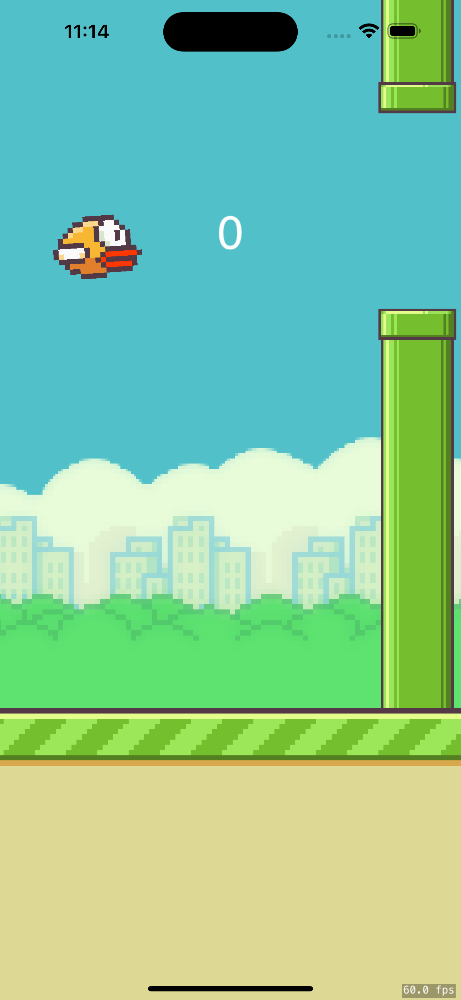

# Flappy Bird Game in Swift

Created by [Son Nguyen](https://github.com/hoangsonww) in 2024, this project is a whole new version of the popular mobile game Flappy Bird, developed using Swift and SpriteKit for iOS. The game aims to replicate the original's gameplay, featuring a bird that the player navigates between a series of obstacles by tapping the screen to make the bird fly. The goal is to achieve the highest possible score by avoiding the pipes.

## User Interface

<p align="center">
 
</p>

## Features

- Classic Flappy Bird gameplay
- Score tracking with high score memory
- Simple tap control
- Endless game mode (for now)
- Sound effects and background music
- FPS counter for easier debugging

## Requirements

- iOS 14.0+
- Xcode 12.0+
- Swift 5.3+
- SpriteKit Framework

## Installation

To run this game on your device, follow these steps:

1. Clone the repository to your local machine:

    ```bash
    git clone https://github.com/hoangsonww/Flappy-Bird-Game.git
    ```

2. Open the project in Xcode:

    ```bash
    open FlappyBirdGame.xcodeproj
    ```

3. Select your target device or simulator. Ideally, use an iPhone with iOS 14.0 or later for the best experience.

4. Press `Cmd + R` to build and run the project on your selected device or simulator.

5. Play the game and enjoy! If you wish to display FPS and node count, press `Cmd + F` to toggle the debug information.

## How to Play

- Tap anywhere on the screen to make the bird flap its wings and fly.
- Avoid the pipes by flying through the gaps between them.
- The game ends if the bird touches the pipes or falls to the ground.
- Try to beat your highest score!

## Contributing

Contributions are what make the open-source community such an amazing place to learn, inspire, and create. Any contributions you make are **greatly appreciated**.

To contribute to Flappy Bird Game Clone, follow these steps:

1. Fork the project.
2. Create your Feature Branch (`git checkout -b feature/AmazingFeature`).
3. Commit your Changes (`git commit -m 'Add some AmazingFeature'`).
4. Push to the Branch (`git push origin feature/AmazingFeature`).
5. Open a Pull Request.

## License

This project is distributed under the MIT License. See [LICENSE](LICENSE) for more information.

## Acknowledgements

- [Original Flappy Bird Game](https://en.wikipedia.org/wiki/Flappy_Bird)
- [SpriteKit Documentation](https://developer.apple.com/documentation/spritekit)
- [Swift Programming Language](https://swift.org/documentation/)

---

Created with ❤️ by [Son Nguyen](https://github.com/hoangsonww) in Spring 2024.
