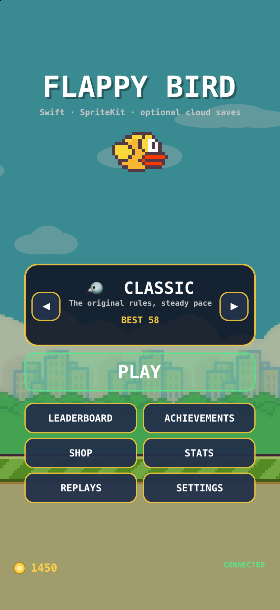
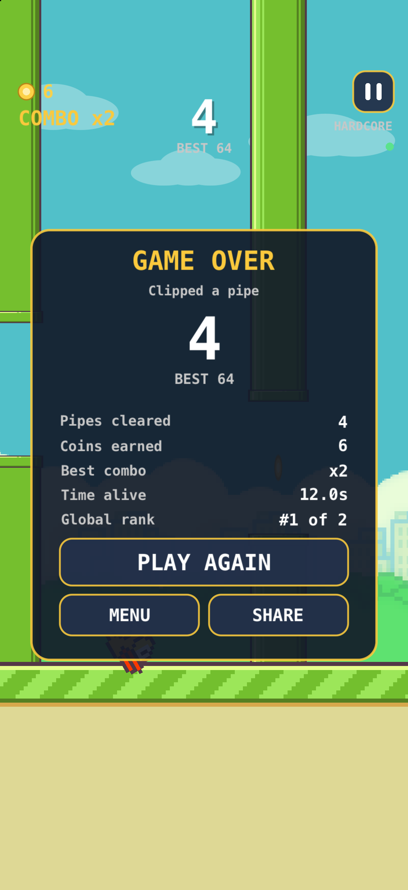
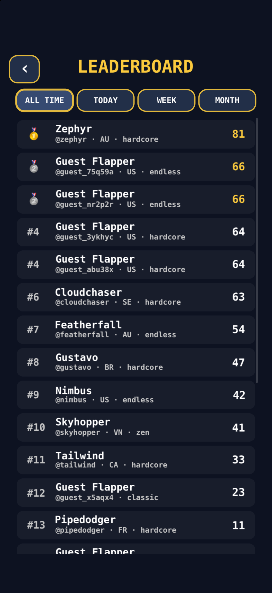
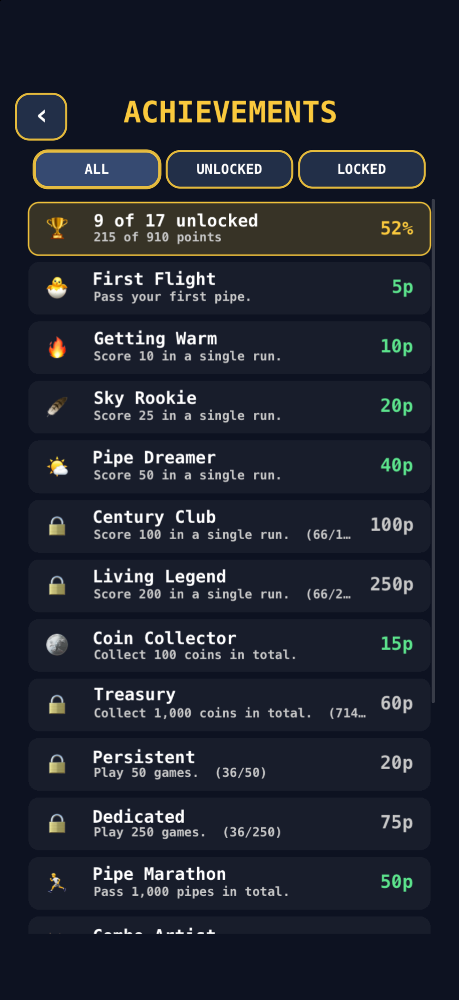
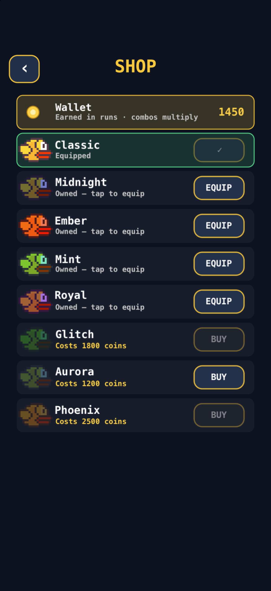
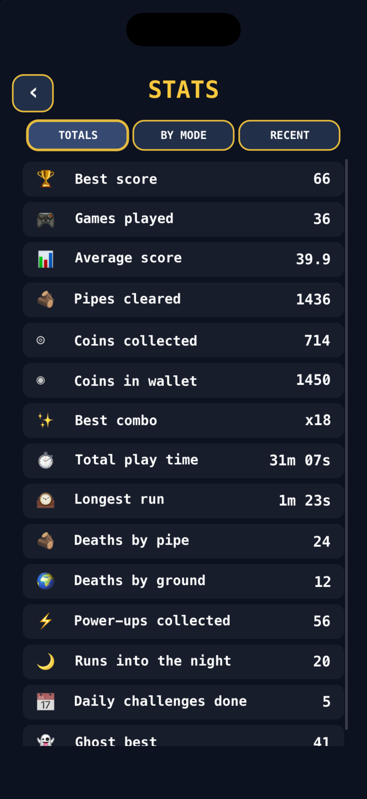
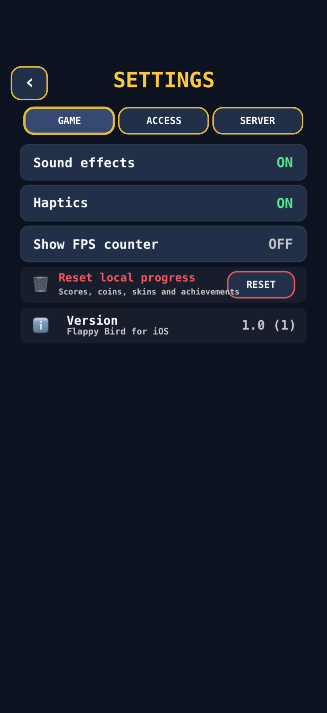
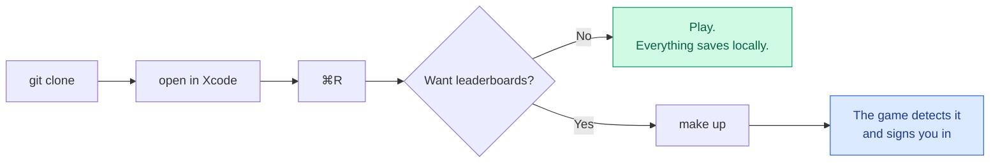
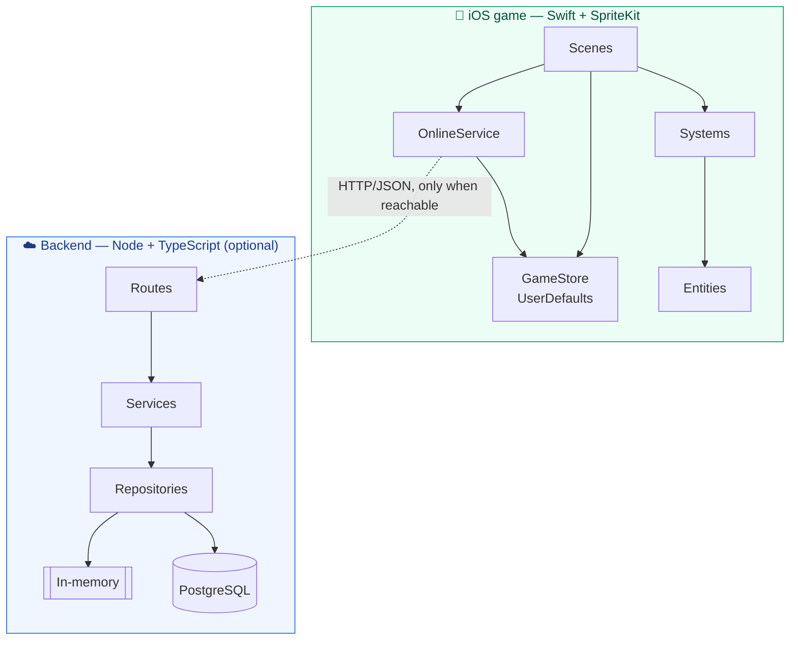

<div align="center">

# 🐦 Flappy Bird

### A Swift + SpriteKit tribute with modes, power-ups, weather, daily challenges — and an optional backend for leaderboards

[](https://swift.org)
[](https://developer.apple.com/spritekit/)
[](https://developer.apple.com/documentation/uikit)
[](https://developer.apple.com/documentation/coregraphics)
[](https://developer.apple.com/documentation/avfoundation)
[](https://developer.apple.com/documentation/cryptokit)
[](https://developer.apple.com/documentation/security)
[](https://developer.apple.com/documentation/os/logger)
[](https://developer.apple.com/documentation/uikit/accessibility)
[](https://developer.apple.com/xcode/)
[](https://developer.apple.com/ios/)
[](https://nodejs.org)
[](https://www.typescriptlang.org)
[](https://expressjs.com)
[](https://www.postgresql.org)
[](https://node-postgres.com)
[](https://zod.dev)
[](https://jwt.io)
[](https://github.com/dcodeIO/bcrypt.js)
[](https://helmetjs.github.io)
[](https://github.com/expressjs/cors)
[](https://express-rate-limit.mintlify.app)
[](https://github.com/expressjs/compression)
[](https://getpino.io)
[](https://github.com/siimon/prom-client)
[](https://github.com/motdotla/dotenv)
[](https://eemeli.org/yaml/)
[](backend/openapi/openapi.yaml)
[](docs/API.md)
[](docs/API.md)
[](docs/TESTING.md)
[](docs/TESTING.md)
[](docs/TESTING.md)
[](https://github.com/ladjs/supertest)
[](docs/TESTING.md#both-drivers-one-suite)
[](docs/TESTING.md#backend)
[](docs/TESTING.md#coverage)
[](docs/TESTING.md#coverage)
[](.swiftlint.yml)
[](.swiftformat)
[](backend/eslint.config.js)
[](https://prettier.io)
[](https://www.shellcheck.net)
[](https://tsx.is)
[](Makefile)
[](scripts/)
[](scripts/generate_xcodeproj.py)
[](.editorconfig)
[](backend/Dockerfile)
[](docker-compose.yml)
[](https://alpinelinux.org)
[](https://github.com/Yelp/dumb-init)
[](.devcontainer/devcontainer.json)
[](ops/prometheus/prometheus.yml)
[](ops/grafana/dashboards/backend.json)
[](https://sosedoff.github.io/pgweb/)
[](https://github.com/hoangsonww/Flappy-Bird-Game/pkgs/container/flappy-bird-backend)
[](.github/workflows/ci.yml)
[](.github/workflows/release.yml)
[](https://www.conventionalcommits.org)
[](scripts/release.mjs)
[](https://hoangsonww.github.io/Flappy-Bird-Game/)
[](index.html)
[](index.html)
[](index.html)
[](index.html)
[](ARCHITECTURE.md)
[](docs/)

**[Play the browser demo →](https://hoangsonww.github.io/Flappy-Bird-Game/)** · **[Architecture →](ARCHITECTURE.md)** · **[Documentation →](docs/)** · **[API reference →](docs/API.md)**

</div>

---

## What this is

The original Flappy Bird loop — tap, dodge, repeat — rebuilt in Swift and
SpriteKit, and then taken seriously: six modes, five power-ups, a coin economy,
weather, a day/night cycle, 17 achievements, and a daily challenge that is the
same for everyone who plays it.

There is also a complete Node.js backend for accounts and leaderboards. **You do
not need it.** Clone, open, press ⌘R.

```bash
git clone https://github.com/hoangsonww/Flappy-Bird-Game.git
cd Flappy-Bird-Game
open "Flappy Bird.xcodeproj"   # then ⌘R
```

That is the entire setup. Everything saves locally. If you *also* want
leaderboards, `make up` starts the backend and the game finds it by itself.

---

## Screenshots

<div align="center">

| Menu | In flight | Game over |
|:---:|:---:|:---:|
|  |  |  |

| Leaderboard | Achievements | Shop |
|:---:|:---:|:---:|
|  |  |  |

| Stats | Settings |
|:---:|:---:|
|  |  |

*Every screenshot above is generated by `make media`, which drives the simulator
and lets the bird fly itself.*

</div>

---

## Features

<table>
<tr><td width="50%" valign="top">

### 🎮 Gameplay

- **Six modes** — Classic, Endless, Time Attack, Hardcore, Zen and a daily challenge
- **Five power-ups** — shield, slow-motion, coin magnet, double points, shrink
- **Coins and combos** — a coin streak multiplies rewards up to ×8
- **Eight bird skins**, bought with coins
- **Bounded difficulty** — gaps narrow and the world speeds up over 40 pipes, then plateaus
- **Weather** — wind, rain and fog, rolled from the run seed
- **Day → Sunset → Night → Dawn** every 20 pipes
- **17 achievements**, 910 points
- **Medals** — bronze, silver, gold, platinum

</td><td width="50%" valign="top">

### ☁️ Backend *(optional)*

- **Accounts** — password or instant device-bound guest
- **Leaderboards** — global, daily, weekly, monthly, friends-only
- **Live updates** over Server-Sent Events
- **Achievement sync** that merges offline unlocks
- **Daily challenge** board, identical for everyone
- **Fair play** — impossible runs rejected, improbable ones flagged
- **OpenAPI 3.1** with Swagger UI bundled locally
- **Two storage drivers** — Postgres, or in-memory with zero setup
- **Metrics, health probes**, structured logs, rate limits
- **Moderation** — ban, flag, recompute

</td></tr>
</table>

### 🛠 And the boring parts done properly

`make doctor` · a generated Xcode project that never conflicts · Docker Compose
with observability profiles · a dev container · 314 tests run on every push ·
automatic releases from Conventional Commits · reproducible screenshots.

---

## Quick start

### Just the game

```bash
make run      # build, install and launch in a simulator
make demo     # the same, in self-playing attract mode
make test     # 143 Swift unit tests
make test-ui  # 38 Swift UI tests, driven on a simulator
```

Every target exits non-zero when it fails, and `make` on its own lists them all.

Or open `Flappy Bird.xcodeproj` and press ⌘R. Requires **Xcode 16+**; the
deployment target is **iOS 16**.

### With leaderboards

```bash
make up       # Postgres + API in Docker, migrations applied
make seed     # demo players so the board is not empty
```

Relaunch the game. It probes `localhost:4000`, confirms the handshake and
switches on the online features by itself — nothing to configure.

<div align="center">


```mermaid
flowchart LR
    A["git clone"] --> B["open in Xcode"] --> C["⌘R"]
    C --> D{"Want leaderboards?"}
    D -- "No" --> E["Play.<br/>Everything saves locally."]
    D -- "Yes" --> F["make up"] --> G["The game detects it<br/>and signs you in"]

    style E fill:#d1fae5,stroke:#059669,color:#065f46
    style G fill:#dbeafe,stroke:#2563eb,color:#1e3a8a
```

</div>

### Backend without Docker

```bash
cd backend && npm install && npm run dev
```

`DB_DRIVER` defaults to `memory`, so the API is fully functional with no
database at all.

---

## How the two halves fit together


```mermaid
flowchart TB
    subgraph Game["📱 iOS game — Swift + SpriteKit"]
        direction LR
        Scenes["Scenes"] --> Systems["Systems"] --> Entities["Entities"]
        Scenes --> Store["GameStore<br/>UserDefaults"]
        Scenes --> Online["OnlineService"]
        Online --> Store
    end

    subgraph Backend["☁️ Backend — Node + TypeScript (optional)"]
        direction LR
        Routes["Routes"] --> Services["Services"] --> Repos["Repositories"]
        Repos --> PG[("PostgreSQL")]
        Repos --> Mem[["In-memory"]]
    end

    Online -. "HTTP/JSON, only when reachable" .-> Routes

    style Game fill:#ecfdf5,stroke:#059669,color:#064e3b
    style Backend fill:#eff6ff,stroke:#2563eb,color:#1e3a8a
```

The dotted line is the entire relationship. The game holds a `URL` and some
`Codable` structs; the backend has never heard of SpriteKit. Runs queue locally
while you are offline and upload when a server appears.

More: [architecture](ARCHITECTURE.md) · [why the backend is optional](docs/adr/0001-optional-backend.md)

---

## Project layout

```
FlappyBird/            the game
├── App/               UIApplication + the single view controller
├── Core/              config, modes, state, RNG, audio, haptics, persistence
├── Entities/          Bird, PipePair, Collectible, ParallaxWorld
├── Systems/           difficulty, power-ups, weather, achievements
├── UI/                buttons, panels, HUD, scroll container, toasts
├── Scenes/            one file per screen
└── Backend/           the optional client: discovery, HTTP, models, sync

FlappyBirdTests/       Swift unit tests
FlappyBirdUITests/     Swift UI tests
backend/               the optional API — 133 tests × 2 drivers, OpenAPI 3.1
docs/                  guides + architectural decision records
scripts/               project generation, xcodebuild wrappers, capture, release
ops/                   Prometheus and Grafana configuration
index.html             the landing page
robots.txt sitemap.xml crawler rules and the search-engine index
site.webmanifest       name, colours and icons for a saved page
```

---

## Make targets

<table>
<tr><td width="50%" valign="top">

**Game**

| | |
|---|---|
| `make run` | Build and launch in a simulator |
| `make demo` | Self-playing attract mode |
| `make build` / `test` | Build / run the Swift tests |
| `make xcodegen` | Regenerate the Xcode project |
| `make media` | Regenerate every screenshot |

**Quality**

| | |
|---|---|
| `make doctor` | What is installed, what it unlocks |
| `make check` | Everything CI runs but the iOS build |
| `make ci` | The full local equivalent |

</td><td width="50%" valign="top">

**Backend**

| | |
|---|---|
| `make dev` | Hot reload, no infrastructure |
| `make api-test` / `api-test-pg` | Tests, in-memory / Postgres |
| `make openapi` | Validate the specification |
| `make smoke` | End-to-end against a live server |

**Docker**

| | |
|---|---|
| `make up` / `down` | Start / stop the stack |
| `make up-tools` | + pgweb on :8081 |
| `make up-observability` | + Prometheus and Grafana |
| `make seed` / `psql` / `logs` | Demo data / shell / logs |

</td></tr>
</table>

`make` on its own lists all of them with descriptions.

---

## A few things worth knowing

**The Xcode project is generated.** `project.pbxproj` is derived from the file
tree by a Python script with deterministic IDs, so adding a file is `touch` +
`make xcodegen` and two branches adding files never conflict. CI fails if the
committed project is stale. *([why](docs/adr/0002-generated-xcode-project.md))*

**The backend has two storage drivers**, and the whole test suite runs against
both. That is not ceremony — it has already caught a Postgres type-inference bug
and a ranking difference that the in-memory driver hid.
*([why](docs/adr/0003-two-storage-drivers.md))*

**The sound effects are synthesised**, not sampled. `AudioManager` renders square
and triangle waves into PCM buffers at launch. No audio assets, no licensing
questions, and the chiptune character is deliberate.

**The daily challenge needs no server.** Its parameters come from
`SHA-256("flappy-bird-daily:YYYY-MM-DD")`, and the identical function runs in
Swift and TypeScript — with a test pinning both against the same values.

**The screenshots are reproducible.** The app takes launch arguments to open any
screen and to fly itself, so `make media` regenerates every image without a
human tapping anything.

---

## Documentation

| Guide | |
|-------|---|
| [Development](docs/DEVELOPMENT.md) | Clone → run → contribute |
| [Gameplay](docs/GAMEPLAY.md) | Modes, power-ups, combos, weather, the numbers |
| [Architecture](ARCHITECTURE.md) | How it is put together |
| [Backend](docs/BACKEND.md) | Running and operating the API |
| [API reference](docs/API.md) | Every endpoint with examples |
| [Database](docs/DATABASE.md) | Schema, indexes, the ranking query |
| [Docker](docs/DOCKER.md) | Compose profiles, images, observability |
| [Testing](docs/TESTING.md) | What is tested and why |
| [CI/CD](docs/CI-CD.md) | The pipeline and automatic releases |
| [Security model](docs/SECURITY-MODEL.md) | Tokens, fair play, threat model |
| [Troubleshooting](docs/TROUBLESHOOTING.md) | Symptoms → fixes |
| [Screens](docs/SCREENS.md) | Every screen and how you reach it |
| [Rendering](docs/RENDERING.md) | Scene graph, layer order, parallax, textures |
| [Physics](docs/PHYSICS.md) | Flight model, collisions, the frame loop |
| [Audio](docs/AUDIO.md) | Synthesised sound and haptics |
| [Persistence](docs/PERSISTENCE.md) | Local stores and their formats |
| [Sync](docs/SYNC.md) | Discovery, sessions, the offline queue |
| [Accessibility](docs/ACCESSIBILITY.md) | How SpriteKit reaches VoiceOver |
| [Determinism](docs/DETERMINISM.md) | Seeds, the daily challenge, what is not reproducible |
| [Performance](docs/PERFORMANCE.md) | The frame budget and profiling |
| [Observability](docs/OBSERVABILITY.md) | Logs, metrics, dashboards |
| [Configuration](docs/CONFIGURATION.md) | Every launch argument, setting and env var |
| [Glossary](docs/GLOSSARY.md) | What the terms mean here |
| [FAQ](docs/FAQ.md) · [Roadmap](docs/ROADMAP.md) · [Decisions](docs/adr/) | |

---

## Contributing

Issues and pull requests are welcome — see
[CONTRIBUTING.md](.github/CONTRIBUTING.md).

The one rule: **the game must keep working with no backend at all.**

```bash
make bootstrap   # hooks, dependencies, .env
make check       # before you open a PR
```

Commits follow [Conventional Commits](https://www.conventionalcommits.org/) —
the release version is derived from them.

---

## Licence

[MIT](LICENSE). Use it, fork it, learn from it.

## Acknowledgements

- Dong Nguyen's original **Flappy Bird**, for a loop that has never needed improving
- Apple's [SpriteKit](https://developer.apple.com/spritekit/) documentation
- Everyone who has filed an issue against this repository

---

<div align="center">

Built with ❤️ by **[Son Nguyen](https://github.com/hoangsonww)** · Spring 2024, rebuilt 2026

**[⬆ back to top](#-flappy-bird)**

</div>
