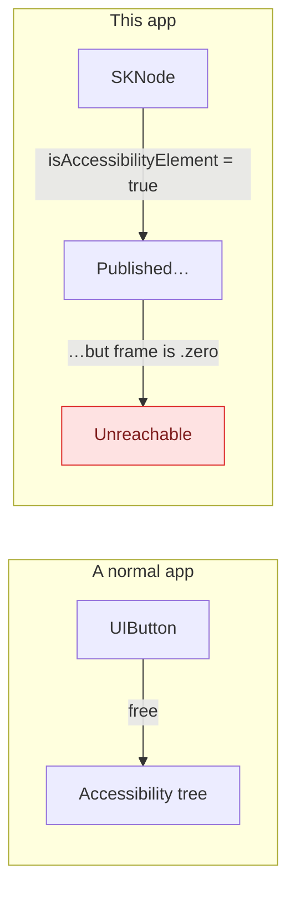
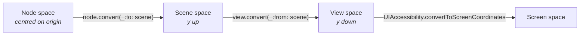
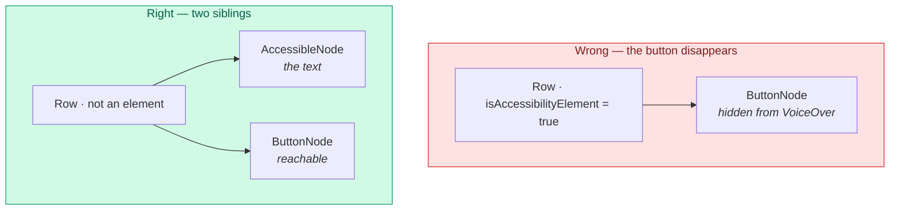
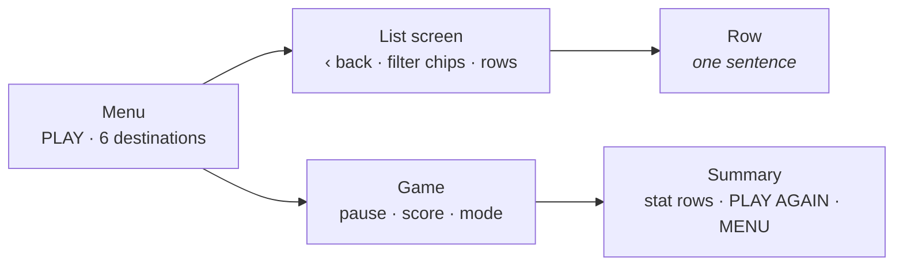

# Accessibility

How a SpriteKit game reaches VoiceOver, what was broken, and the rule that keeps
it working. This page matters more than it looks: the UI test suite talks to the
app through exactly the same accessibility tree a screen reader uses, so
anything invisible to VoiceOver is also invisible to the tests.

---

## The core problem

<div align="center">
  
  <br/>
  <sub>Every row here is a real accessibility element, not a painted label.</sub>
</div>

There is no view hierarchy. The whole game is `SKNode`s drawn into one
`SKView` — no `UIButton`, no `UILabel`, nothing UIKit can describe on its own.
SpriteKit bridges this, but only partly, and the gaps are sharp.



---

## Three defects the UI suite found on its first run

All three were real, all three shipped, and all three were invisible without a
screen reader or a UI test.

### 1. Every control had a zero-size frame

Setting `isAccessibilityElement = true` publishes a node — but SpriteKit
**never derives `accessibilityFrame` from the node**. The inherited default is
`.zero`, and a zero-sized element cannot be focused by the VoiceOver cursor,
activated by assistive technology, or tapped by `XCUITest`.

Every button in the game reported `{{201, 533}, {0, 0}}`. **No control was
reachable.**

### 2. List rows were not published at all

The leaderboard, stats and achievements screens build rows out of plain
`SKLabelNode`s inside a container. Nothing opted in, so a screen reader found an
empty screen.

### 3. Disabled buttons advertised themselves as enabled

`setEnabled(false)` dimmed the alpha and stopped touch handling, which tells a
sighted player everything and a VoiceOver user nothing. It offered "BUY" on a
skin the wallet could not afford.

---

## The fix

`FlappyBird/UI/Accessibility.swift`.

### Screen-space frames

```swift
extension SKNode {
    func screenFrame(ofSize size: CGSize) -> CGRect {
        guard size.width > 0, size.height > 0,
              let scene, let view = scene.view else { return .zero }

        let corners = [
            CGPoint(x: -size.width / 2, y: -size.height / 2),
            CGPoint(x:  size.width / 2, y:  size.height / 2),
        ].map { view.convert(convert($0, to: scene), from: scene) }

        // …normalise into a rect…
        return UIAccessibility.convertToScreenCoordinates(rect, in: view)
    }
}
```

Three coordinate spaces, in order — and getting the order wrong silently
produces a plausible-looking rect in the wrong place:



`ButtonNode` overrides the property directly, since it knows its own size:

```swift
override var accessibilityFrame: CGRect {
    get { screenFrame(ofSize: size) }
    set { super.accessibilityFrame = newValue }
}
```

### `AccessibleNode`

For nodes that are not buttons — list rows — a small subclass carries its bounds
and publishes itself:

```swift
row.describe(
    accessibilitySentence(badge, title, subtitle, value),
    size: rowSize,
    traits: highlighted ? [.staticText, .selected] : .staticText
)
```

`accessibilitySentence` joins the parts with commas, so a row reads as
**"Best score, 58"** in one gesture rather than making the cursor walk four
separate elements.

### The containment rule

> **An accessibility element hides its children.**

A row that is itself an element takes its own button out of the tree. So rows
that carry a button — the shop, the settings action rows — are *not* elements;
instead a sibling `AccessibleNode` covers the text to the left of the button,
and the button publishes itself as usual.



### Disabled state

```swift
func setEnabled(_ enabled: Bool) {
    isUserInteractionEnabled = enabled
    alpha = enabled ? 1 : 0.45
    if enabled { accessibilityTraits.remove(.notEnabled) }
    else { accessibilityTraits.insert(.notEnabled) }
}
```

---

## What the tree looks like

Worth knowing before writing a query, because it is not what you would guess:

| Control | `elementType` | Label source |
|---------|---------------|--------------|
| `ButtonNode` | `.button` | its title |
| `ToggleNode` | `.button` | title; **state is in `value`** (`"on"` / `"off"`) |
| `SKLabelNode` | `.other` | its text |
| `AccessibleNode` | `.other` | the composed sentence |

> **`app.staticTexts` matches nothing in this app.** SpriteKit publishes labels
> as `.other`, not `.staticText`. A UI test that loops over `app.staticTexts`
> does not fail — it iterates zero elements and passes vacuously. One assertion
> in this repo did exactly that for a while.

---

## Reduce Motion

Read from `UIAccessibility.isReduceMotionEnabled` at scene setup and honoured by
the parallax world and the weather system: no cloud layer, no scroll actions, no
weather particles. The game remains fully playable — only the decoration stops.

There is also an in-app **Reduce flashing** setting, separate from the system
one, which suppresses the red death flash.

---

## VoiceOver navigation



Every button carries a `.button` trait and its visible title, and the tap target
is inset 8 pt beyond the visible bounds so small controls stay comfortably
reachable.

---

## Known gaps

Stated honestly rather than omitted:

- **Flapping has no accessible control.** The input is a raw tap anywhere on the
  scene, with no published element behind it, so the core action is not
  reachable by assistive technology. This is not solved.
- **The HUD does not announce changes.** Score and combo update silently; there
  is no `UIAccessibility.post(notification:)` on a score change.
- **No Dynamic Type.** Font sizes are fixed points; labels shrink to fit their
  container rather than following the system text size.

---

## Testing it

The UI suite *is* the accessibility test — it can only reach what VoiceOver can.

```bash
make test-ui
```

If you add a control and the suite cannot find it, that is the finding: a
sighted player can use it and a screen-reader user cannot.

See [Testing](TESTING.md) for the suite's structure and the polling rules that
keep it deterministic.
