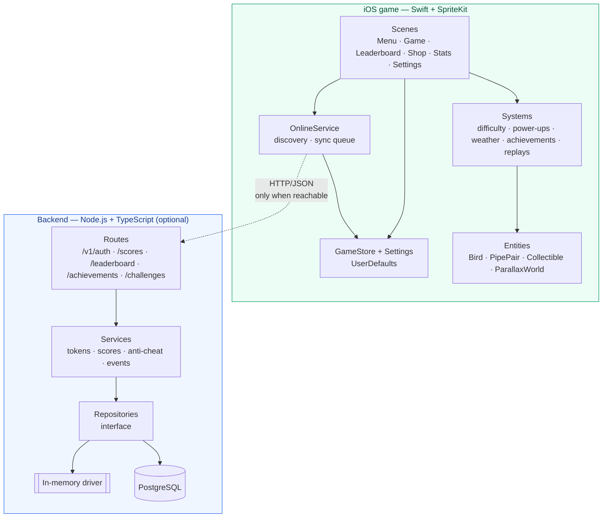
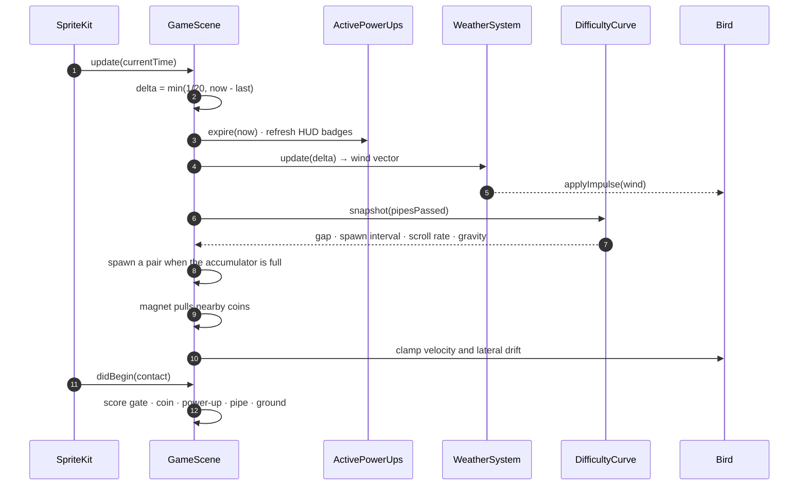
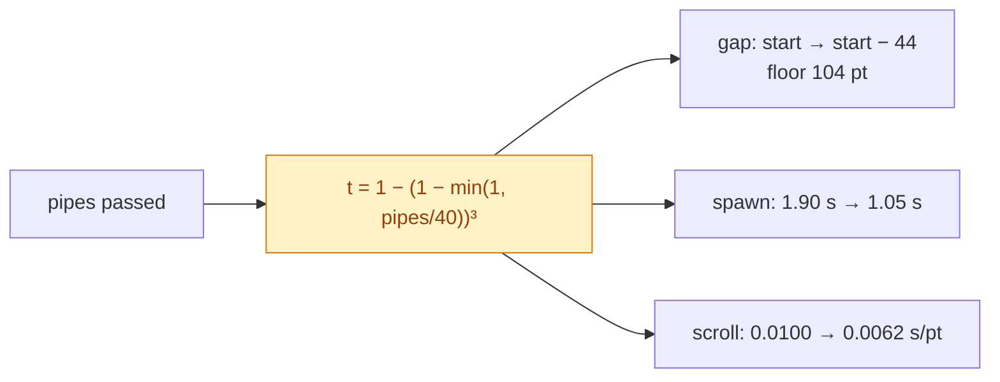
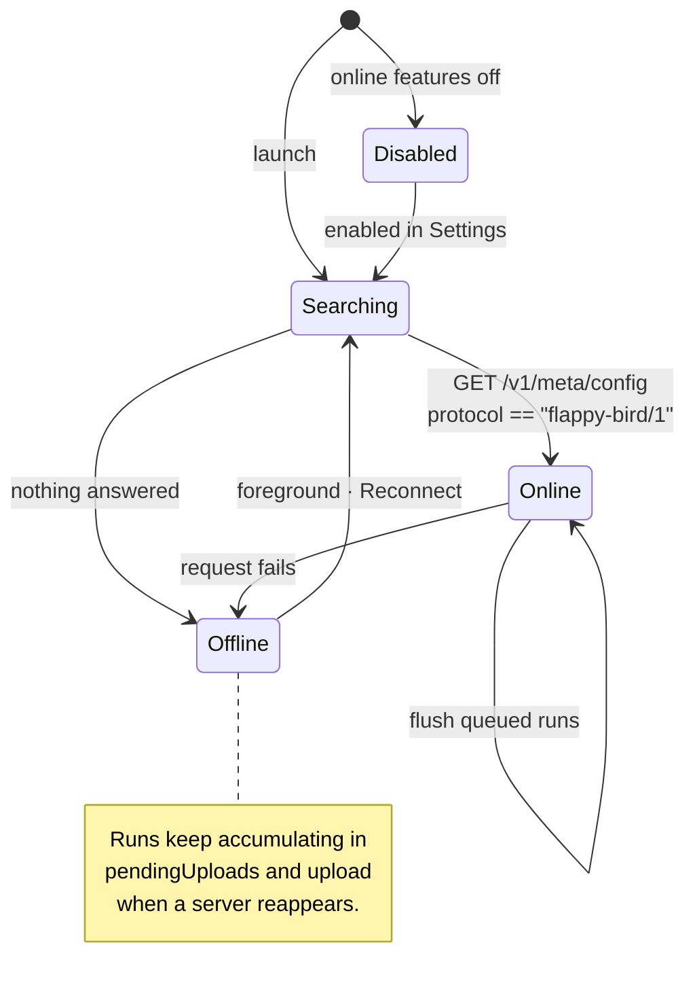

# Architecture

## The shape of the project

Two independent halves that know as little as possible about each other:



The dotted line is the whole relationship. The game holds a `URL` and some
`Codable` structs; the backend has never heard of SpriteKit.

## Source layout

```
FlappyBird/
├── App/          UIApplication + the single view controller
├── Core/         config, modes, state, RNG, audio, haptics, persistence, theme
├── Entities/     the things you see: Bird, PipePair, Collectible, ParallaxWorld
├── Systems/      the rules: difficulty, power-ups, weather, achievements, replays
├── UI/           reusable nodes: buttons, panels, HUD, scroll container, toasts
├── Scenes/       one file per screen
└── Backend/      the optional client: discovery, HTTP, models, sync

backend/
├── src/
│   ├── routes/          one file per resource, thin — validation + delegation
│   ├── services/        the logic worth testing on its own
│   ├── repositories/    storage contracts + two implementations
│   ├── domain/          entities, the achievement catalog, challenge derivation
│   ├── middleware/       auth, validation, rate limits, metrics, errors
│   └── config/          environment, logging, constants shared with the game
├── migrations/          forward-only SQL
├── openapi/             the API contract
└── tests/               106 tests, run against both storage drivers
```

## One frame of the game loop

`GameScene.update(_:)` is the only place per-frame work happens. It is ordered
so that later steps see the results of earlier ones:



Two details that matter:

* **`delta` is clamped to 1/20 s.** A dropped frame must not teleport the bird
  through a pipe.
* **`worldNode.speed` is the single time lever.** Pausing sets it to `0`;
  slow-motion sets it to `0.55`. Nothing else has its own notion of paused,
  which is what keeps the ground, the sky and the pipes from drifting apart.

## Difficulty

The curve is bounded on purpose — a long run should stay hard but never become
impossible:



Ease-out cubic: most of the difficulty arrives in the first 40 pipes, then it
plateaus. `classic` and `zen` opt out of ramping entirely.

## Talking to the backend

The game never blocks on the network. Discovery runs in the background, and the
result only ever *enables* extra UI.



Candidate URLs are tried in order: the URL typed into Settings, then
`FlappyBackendURL` from `Info.plist`, then `http://localhost:4000`, then
`http://127.0.0.1:4000`. A server is only accepted if it answers with
`protocol: "flappy-bird/1"`, so pointing the game at an unrelated service fails
immediately and clearly instead of producing confusing errors later.

## Storage

Both sides store the same shapes, which is what makes the sync trivial.

| | Game (offline) | Backend |
|---|---|---|
| Runs | `PlayerProfile.recentRuns` (last 50) | `scores` table |
| Aggregates | `LifetimeStats` | `user_stats`, maintained on insert |
| Achievements | `[code: AchievementProgress]` | `user_achievements` |
| Queue | `pendingUploads` (max 200) | — |
| Format | one JSON document in `UserDefaults` | normalised SQL |

The merge rules are monotonic in both directions: progress only increases, an
unlock timestamp is never overwritten. Replaying an old payload is a no-op,
which means the sync needs no coordination and no conflict resolution.

## Design decisions

Recorded in full under [`adr/`](adr/):

1. [The backend is optional](adr/0001-optional-backend.md)
2. [The Xcode project is generated](adr/0002-generated-xcode-project.md)
3. [Two storage drivers, one test suite](adr/0003-two-storage-drivers.md)
