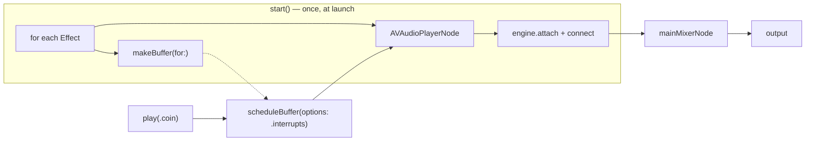
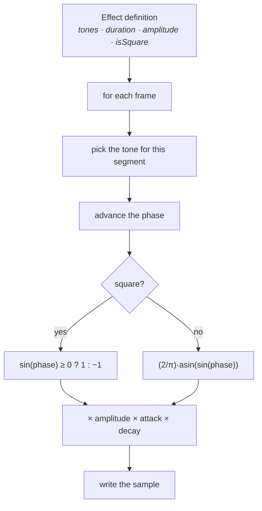
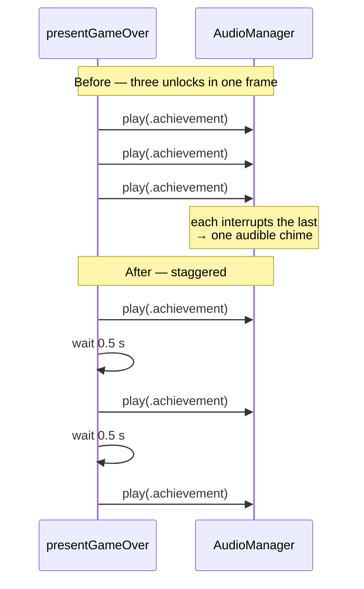
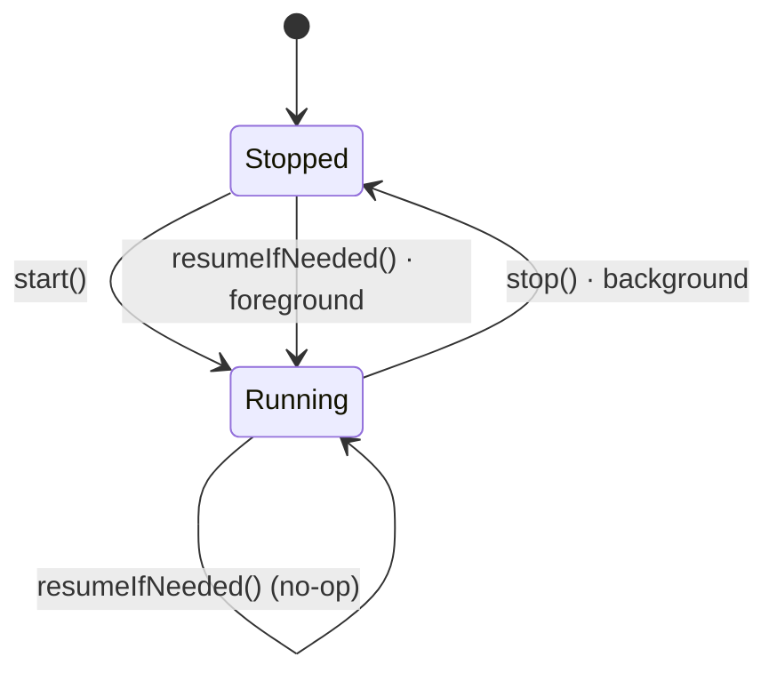

# Audio and haptics

The game ships **no audio files**. Every sound is synthesised at launch as a
short PCM buffer and played through `AVAudioEngine`. This page covers why, how
the synthesis works, what each cue means, and the one bug that shaped the API.

---

## Why synthesised

Three reasons, in order of how much they mattered:

1. **Cloning stays light.** No binary assets to fetch, store or license.
2. **No licensing question.** Nothing to attribute, nothing to replace before
   shipping.
3. **It suits the art.** A chiptune voice is the right register for pixel art,
   and it is easier to generate a coherent set of square waves than to find one.

If a real asset is ever dropped into the bundle it can simply replace the
matching case — nothing else in the game knows how a sound is produced.

---

## The graph



One player node and one pre-rendered buffer **per effect**, built once. Playing
a sound is then just scheduling an existing buffer — no allocation, no file I/O,
nothing that could cause a hitch mid-flight.

The session category is `.ambient` with `.mixWithOthers`, so the player's own
music keeps going. That is the respectful default for a casual game; the
alternative would stop someone's podcast every time they open it.

---

## Synthesis

Each effect is a list of tone steps, a duration, an amplitude and a waveform.



The envelope is a short attack (6% of the duration) and an exponential decay.
Without the attack every sound starts with an audible click, because a waveform
that begins at full amplitude is a discontinuity.

Square waves read as 8-bit and are used for gameplay; triangle waves are gentler
and used for UI and the softer cues.

---

## The cues

| Effect | Tones (Hz) | Length | Wave | When |
|--------|------------|-------:|------|------|
| `flap` | 520 → 700 | 0.07 s | square | Every tap |
| `score` | 880 → 1180 | 0.10 s | square | A pipe cleared |
| `coin` | 1046 → 1318 → 1568 | 0.16 s | square | A coin collected |
| `combo` | 988 → 1318 | 0.12 s | square | Every 5th coin in a combo |
| `powerUp` | 660 → 880 → 1100 → 1320 | 0.26 s | square | Power-up taken, shield absorbs |
| `crash` | 220 → 160 → 110 | 0.34 s | square | Death |
| `bounce` | 300 → 430 | 0.11 s | triangle | Zen mode bounce |
| `achievement` | 880 → 1108 → 1318 → 1760 | 0.42 s | square | Unlock |
| `personalBest` | 880 → 1108 → 1318 → 1568 → 1976 | 0.60 s | square | New best |
| `pause` | 620 → 440 | 0.14 s | triangle | Pausing |
| `resume` | 440 → 620 | 0.14 s | triangle | Resuming |
| `uiTap` | 740 | 0.05 s | triangle | Any button |
| `countdown` | 620 | 0.09 s | triangle | Ready-state tick |

Note the deliberate symmetry: `pause` falls, `resume` rises. The same two tones
in opposite order encode direction without anyone having to learn a convention.

---

## The interrupts trap

`play` schedules with `.interrupts`, which stops whatever that **same** player
node is doing. One node per effect means two different sounds overlap happily,
but the *same* sound cannot play twice at once.

That is right for gameplay — thirty rapid flaps should not stack into noise —
and wrong for a burst of end-of-run unlocks:



Three unlocks now play as three chimes, spaced by
`GameConfig.achievementChimeSpacing`, and a personal best takes the first slot
so the fanfare is not cut off by an unlock landing on top of it.

---

## Lifecycle



iOS can tear the engine down while the app is backgrounded, so
`resumeIfNeeded()` restarts it and any player nodes that stopped. `play` also
calls `start()` if the graph was never built, so a sound is never silently lost
because of ordering.

**Audio failure is never fatal.** A failed `engine.start()` leaves
`isConfigured` false and the game carries on silently — a game that will not run
because a speaker is unavailable would be a worse bug than no sound.

---

## Haptics

A separate, parallel system using `UIFeedbackGenerator`.

| Trigger | Feedback |
|---------|----------|
| Flap | Light impact |
| Coin | Selection |
| Power-up | Medium impact |
| Crash | Error notification |
| Achievement / combo milestone | Success notification |
| Button | Light impact |

Generators are prepared at launch and again when a run starts, because an
unprepared generator has a noticeable latency on its first use — long enough to
feel disconnected from the tap that caused it.

---

## Settings

Both are toggles in Settings ▸ Game, both default **on**, and both are checked
at the call site:

```swift
func play(_ effect: Effect) {
    guard Settings.shared.soundEnabled else { return }
    …
}
```

Checking inside `play` rather than at every call keeps the rule in one place.

---

## Where to look next

- [Gameplay](GAMEPLAY.md) — the events these cues attach to
- [Accessibility](ACCESSIBILITY.md) — non-visual feedback more broadly
- [Configuration](CONFIGURATION.md) — every setting in one table
