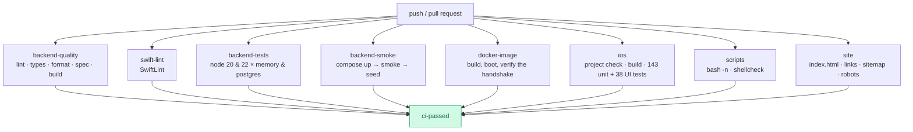
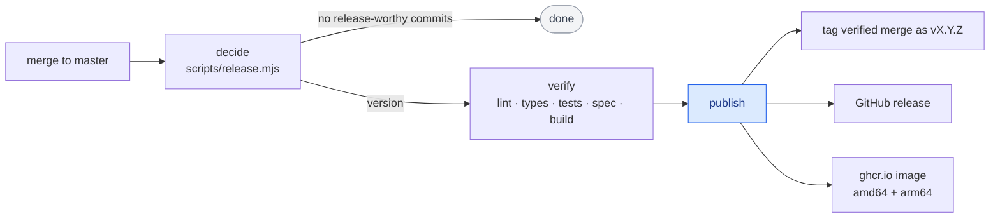

# CI/CD

Three repository workflows. Everything is GitHub-hosted; nothing needs a secret
beyond the built-in `GITHUB_TOKEN`.

| Workflow | Trigger | Purpose |
|----------|---------|---------|
| [`ci.yml`](../.github/workflows/ci.yml) | push, PR | Build, lint and test everything |
| [`release.yml`](../.github/workflows/release.yml) | push to default branch | Tag, release, publish the image |
| [`pages.yml`](../.github/workflows/pages.yml) | push (site files) | Deploy the landing page |

## CI



`ci-passed` is the single job to make a required status check — it fails if any
of its dependencies failed or was cancelled.

### Notable jobs

**`backend-tests`** is a 2×2 matrix: Node 20 and 22 × the in-memory and Postgres
drivers. Running the same suite against both drivers is what keeps them
behaviourally identical, and it has already caught real bugs the in-memory
driver hid. Each matrix cell runs all 133 backend tests, including direct
repository-contract coverage and a real streamed SSE connection.

**`backend-smoke`** brings the real Compose stack up, waits on the healthcheck,
runs the end-to-end smoke test, seeds demo data, and dumps container logs if
anything fails.

**`docker-image`** builds the production target, boots it with `DB_DRIVER=memory`
and asserts that `/v1/meta/config` advertises `flappy-bird/1` — the handshake the
game depends on.

**`ios`** first runs `python3 scripts/generate_xcodeproj.py --check`. A stale
project means somebody added a source file without running `make xcodegen`, and
the build would silently ignore it.

**`swift-lint`** is a required job. The configuration is tuned to how the code
is actually written — `trailing_comma` is off because it contradicts
`.swiftformat`'s `--commas always`, and `implicitly_unwrapped_optional` is off
because it is the idiomatic shape for SpriteKit scene properties and XCTest
fixtures. SwiftLint exits non-zero only for `error`-severity violations, so a
new release adding rules shows up as warnings rather than breaking the build.

`.swiftformat` is deliberately narrow: it handles whitespace and leaves code
alone. Every rule that restructures working code — switch expressions, hoisted
`let`, single-expression bodies wrapped onto their own lines — is disabled,
because the result is a large diff that changes how the code reads without
making it more correct. Its width matches SwiftLint's `line_length.error`
rather than the warning, so the two tools cannot disagree about a line.

**`ios`** runs the unit tests and the UI tests as separate steps. The UI suite
drives a simulator, so it is minutes rather than seconds; splitting it keeps
which of the two failed obvious in the run summary.

Both steps resolve a simulator **UDID** first and pass `-destination id=…`.
A bare `name=` makes `xcodebuild` default to `OS:latest`, so a device that only
exists on an older runtime stops matching the moment the image adds a newer one —
a failure that reads like a broken project. Both also run under
`set -o pipefail`, because piping `xcodebuild` into a formatter otherwise reports
the formatter's exit status and every failure comes out green.

**`site`** does three things: parses `index.html` and asserts it has a title and
a meta description; runs [`scripts/check-links.py`](../scripts/check-links.py),
which resolves every relative link, image and heading anchor across all 37
Markdown files plus the landing page, and checks the JSON-LD parses and its FAQ
questions match the visible ones; and validates `sitemap.xml` and `robots.txt`.
Screenshots get renamed and headings get reworded — this is the job that stops a
link rotting quietly between releases. Run the same check locally with
`make check-links`.

## Releases

Every merge to the default branch is *evaluated* for a release. A merge that
only contains chores produces none.



### How the version is chosen

[`scripts/release.mjs`](../scripts/release.mjs) reads the commits since the last
`v*` tag — no third-party release tooling, no configuration file.

| Commit | Bump |
|--------|------|
| `BREAKING CHANGE` in the body, or `type!:` | **major** |
| `feat:` | **minor** |
| `fix:`, `perf:`, `revert:` | **patch** |
| anything else | none |

Try it locally before merging:

```bash
node scripts/release.mjs          # human summary
node scripts/release.mjs --json   # what CI reads
node scripts/release.mjs --notes  # the markdown body
```

### What a release does

1. Tags the already-verified merge commit as `vX.Y.Z` without modifying the
   protected default branch.
2. Creates the GitHub release with the generated notes.
3. Builds and pushes `ghcr.io/<owner>/flappy-bird-backend:vX.Y.Z` and `:latest`
   for `linux/amd64` and `linux/arm64`.

Need an exact version? Run the workflow manually with `force_version`.

## Security automation

Dependabot updates and alerts, and GitHub code scanning, are disabled for this
repository. Linting and type-checking still run on every push and pull request.

## The landing page

`index.html`, `img/`, `robots.txt`, `sitemap.xml` and `site.webmanifest` are
published to GitHub Pages whenever any of them changes. The page is a single
self-contained file and works just as well opened from a clone, so Pages is a
convenience rather than a dependency.

What ships alongside the page, and why:

| File | What it does |
|------|--------------|
| `robots.txt` | Allows everything, points crawlers at the sitemap, and throttles the two SEO crawlers that only cost bandwidth on a static page |
| `sitemap.xml` | The page plus an [image sitemap](https://developers.google.com/search/docs/crawling-indexing/sitemaps/image-sitemaps) entry for all ten screenshots, each with a title and caption |
| `site.webmanifest` | Name, colours, icons and screenshots, so a phone that saves the page gets the app icon rather than a rendering of the URL |
| `img/icons/` | 192, 512 and the 180-point Apple touch icon, all derived from the app icon itself |

The page's `<head>` carries thirty meta tags: description and keywords, Open
Graph and Twitter cards pointing at a 1200×630 card generated from a real run,
`robots` directives that allow large image previews, and a JSON-LD `@graph` with
six entities — `WebSite`, `Person`, `VideoGame`, `SoftwareSourceCode`, `FAQPage`
and `BreadcrumbList`. The FAQ entity is backed by a **visible** FAQ section on
the page; structured data that describes content a visitor cannot see is a
guideline violation, so `scripts/check-links.py` asserts the two match.

## Running CI locally

```bash
make check    # xcodegen check, backend lint, OpenAPI, backend tests
make ci       # the above plus the iOS build and Swift tests
```

## Caching

| What | Where |
|------|-------|
| npm | `actions/setup-node` keyed on `backend/package-lock.json` |
| Docker layers | `type=gha` on build and release |
| Xcode | none — the project is small and a cold build is under two minutes |
