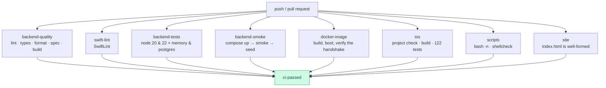
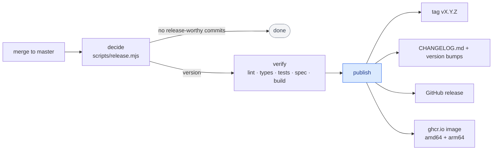

# CI/CD

Four workflows. Everything is GitHub-hosted; nothing needs a secret beyond the
built-in `GITHUB_TOKEN`.

| Workflow | Trigger | Purpose |
|----------|---------|---------|
| [`ci.yml`](../.github/workflows/ci.yml) | push, PR | Build, lint and test everything |
| [`release.yml`](../.github/workflows/release.yml) | push to default branch | Version, tag, release, publish the image |
| [`pages.yml`](../.github/workflows/pages.yml) | push (site files) | Deploy the landing page |

## CI



`ci-passed` is the single job to make a required status check — it fails if any
of its dependencies failed or was cancelled.

### Notable jobs

**`backend-tests`** is a 2×2 matrix: Node 20 and 22 × the in-memory and Postgres
drivers. Running the same suite against both drivers is what keeps them
behaviourally identical, and it has already caught real bugs the in-memory
driver hid.

**`backend-smoke`** brings the real Compose stack up, waits on the healthcheck,
runs the end-to-end smoke test, seeds demo data, and dumps container logs if
anything fails.

**`docker-image`** builds the production target, boots it with `DB_DRIVER=memory`
and asserts that `/v1/meta/config` advertises `flappy-bird/1` — the handshake the
game depends on.

**`ios`** first runs `python3 scripts/generate_xcodeproj.py --check`. A stale
project means somebody added a source file without running `make xcodegen`, and
the build would silently ignore it.

**`swift-lint`** is a required job. The configuration is tuned to how the code
is actually written — `trailing_comma` is off because it contradicts
`.swiftformat`'s `--commas always`, and `implicitly_unwrapped_optional` is off
because it is the idiomatic shape for SpriteKit scene properties and XCTest
fixtures. SwiftLint exits non-zero only for `error`-severity violations, so a
new release adding rules shows up as warnings rather than breaking the build.

`.swiftformat` is deliberately narrow: it handles whitespace and leaves code
alone. Every rule that restructures working code — switch expressions, hoisted
`let`, single-expression bodies wrapped onto their own lines — is disabled,
because the result is a large diff that changes how the code reads without
making it more correct. Its width matches SwiftLint's `line_length.error`
rather than the warning, so the two tools cannot disagree about a line.

**`ios`** runs the unit tests and the UI tests as separate steps. The UI suite
drives a simulator, so it is minutes rather than seconds; splitting it keeps
which of the two failed obvious in the run summary.

## Releases

Every merge to the default branch is *evaluated* for a release. A merge that
only contains chores produces none.



### How the version is chosen

[`scripts/release.mjs`](../scripts/release.mjs) reads the commits since the last
`v*` tag — no third-party release tooling, no configuration file.

| Commit | Bump |
|--------|------|
| `BREAKING CHANGE` in the body, or `type!:` | **major** |
| `feat:` | **minor** |
| `fix:`, `perf:`, `revert:` | **patch** |
| anything else | none |

Try it locally before merging:

```bash
node scripts/release.mjs          # human summary
node scripts/release.mjs --json   # what CI reads
node scripts/release.mjs --notes  # the markdown body
```

### What a release does

1. Prepends grouped notes to `CHANGELOG.md`.
2. Bumps `MARKETING_VERSION` in the project generator and regenerates the Xcode
   project, and bumps `backend/package.json`.
3. Commits with `[skip ci]`, tags `vX.Y.Z`, pushes both.
4. Creates the GitHub release with those notes.
5. Builds and pushes `ghcr.io/<owner>/flappy-bird-backend:vX.Y.Z` and `:latest`
   for `linux/amd64` and `linux/arm64`.

Need an exact version? Run the workflow manually with `force_version`.

## Security scanning

Dependabot opens grouped weekly PRs for npm, GitHub Actions and the Docker base
image. There is no static-analysis workflow: linting and type-checking run on
every push, and the project has no untrusted input surface that would justify
the extra minutes.

## The landing page

`index.html` plus `img/` are published to GitHub Pages whenever they change. The
page is a single self-contained file and works just as well opened from a clone,
so Pages is a convenience rather than a dependency.

## Running CI locally

```bash
make check    # xcodegen check, backend lint, OpenAPI, backend tests
make ci       # the above plus the iOS build and Swift tests
```

## Caching

| What | Where |
|------|-------|
| npm | `actions/setup-node` keyed on `backend/package-lock.json` |
| Docker layers | `type=gha` on build and release |
| Xcode | none — the project is small and a cold build is under two minutes |
