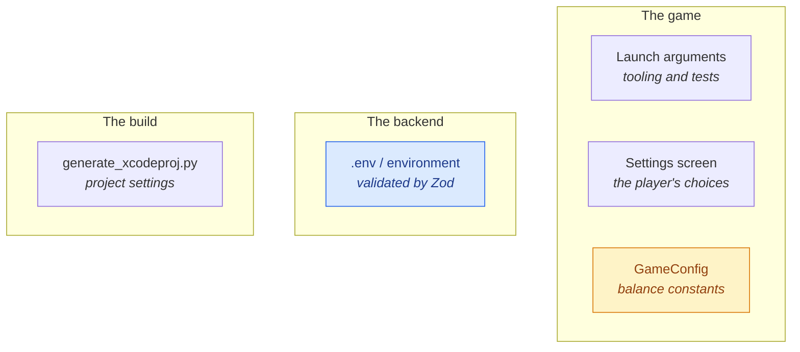
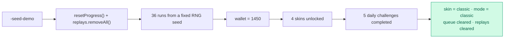
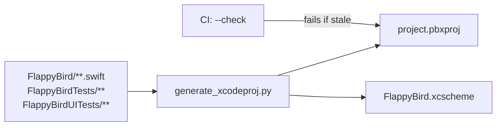

# Configuration

Every knob in the project, in one place: launch arguments for the game,
environment variables for the backend, and the build settings that are generated
rather than edited.

---

## The three layers



The important distinction: **launch arguments are for tooling**, not for
players. Nothing in that table changes behaviour on a normal launch.

---

## Launch arguments

```bash
xcrun simctl launch booted com.hoangsonww.flappybird -screen shop -seed-demo
```

| Argument | Value | Effect |
|----------|-------|--------|
| `-screen` | screen name | Skip the menu and open it directly |
| `-segment` | integer | Pre-select a filter chip on a list screen |
| `-mode` | mode name | Force a game mode, overriding the saved one |
| `-seed-demo` | — | Reset and write a believable profile |
| `-demo` | — | Attract mode: the bird flies itself |
| `-demo-die` | seconds | End an attract run on cue |
| `-debug-hud` | — | Overlay state, velocity and the targeted gap |

Screens: `menu`, `game`, `leaderboard`, `achievements`, `shop`, `stats`,
`replays`, `settings`.
Modes: `classic`, `endless`, `timeAttack`, `hardcore`, `zen`, `daily`.

### What `-seed-demo` writes



Three details that exist because of real bugs:

- **The queue is cleared.** Otherwise a seeded launch pushes 36 fabricated runs
  at a real server, and 36 at once trips the rate heuristic.
- **The mode is reset.** `selectedMode` persists across launches, so a test that
  ran with `-mode zen` would leave Zen selected for the next one.
- **The skin is reset to classic.** The seeded profile is what screenshots show,
  and that should be the bird the game ships with.
- **Replays are cleared, and none are seeded.** A replay is a recording of a
  run. Fabricated entries were seeded here once, and anyone who opened the list
  saw a generated wave through evenly spaced pipes and reasonably concluded the
  feature was broken.

---

## Player settings

| Tab | Setting | Default |
|-----|---------|:-------:|
| GAME | Sound effects | on |
| GAME | Haptics | on |
| GAME | Show FPS counter | off |
| GAME | Reset local progress | — |
| ACCESS | High contrast | off |
| ACCESS | Reduce flashing | off |
| ACCESS | Reduce Motion *(system)* | follows iOS |
| SERVER | Server URL | unset |
| SERVER | Reconnect | — |

---

## Balance constants

All in `FlappyBird/Core/GameConfig.swift`, so a balance change never means
hunting through scene code.

| Group | Examples |
|-------|----------|
| Physics | `gravity`, `flapImpulse`, `birdMass`, speed clamps |
| World | pipe gaps, spawn intervals, scroll rates |
| Scoring | points per pipe, coin value, combo cap |
| Power-ups | spawn chance and per-kind durations |
| Replays | sample interval, frame and obstacle caps |
| Presentation | death flash, toast duration |

> `birdMass` is pinned deliberately. SpriteKit derives mass from body area, so
> changing the hitbox would otherwise change how far a flap lifts the bird. See
> [Physics](PHYSICS.md).

---

## Backend environment

Validated by Zod at startup — an invalid value fails fast with a readable error
rather than surfacing later as odd behaviour.

### Core

| Variable | Default | Notes |
|----------|---------|-------|
| `PORT` | `4000` | |
| `NODE_ENV` | `development` | |
| `LOG_LEVEL` | `info` | `fatal` … `trace`, `silent` |
| `DB_DRIVER` | `memory` | **`memory` is refused in production** |
| `DATABASE_URL` | local postgres | |
| `DATABASE_AUTO_MIGRATE` | `true` | Applies pending migrations at boot |

### Auth

| Variable | Default | Notes |
|----------|---------|-------|
| `JWT_ACCESS_SECRET` | generated | Ephemeral if unset — **set it in production** |
| `JWT_REFRESH_SECRET` | generated | Same |
| `JWT_ISSUER` | `flappy-bird-backend` | |
| `ACCESS_TOKEN_TTL` | `15m` | Short by design |
| `REFRESH_TOKEN_TTL_DAYS` | `30` | The durable credential |
| `BCRYPT_ROUNDS` | `11` | Cost factor |

An unset secret is generated per process, so restarting invalidates every
session. That is a convenience for local development and a bug in production.

### Limits

| Variable | Default | Protects |
|----------|--------:|----------|
| `RATE_LIMIT_WINDOW_MS` | `60000` | The window for all buckets |
| `RATE_LIMIT_MAX` | `240` | General traffic |
| `AUTH_RATE_LIMIT_MAX` | `20` | Credential stuffing |
| `SUBMIT_RATE_LIMIT_MAX` | `60` | Score flooding |
| `CORS_ORIGINS` | `*` | Browser callers |

> `SUBMIT_RATE_LIMIT_MAX` is the one the game's upload pacing is tuned against.
> Raise the pacing or this limit together, not one alone — see [Sync](SYNC.md).

### Fair play

| Variable | Default | Meaning |
|----------|--------:|---------|
| `MAX_SCORE` | `100000` | Above this, rejected outright |
| `MAX_PIPES_PER_SECOND` | `1.6` | Faster than this is implausible |
| `RUN_SIGNING_SECRET` | unset | Shared secret for signed runs |
| `REQUIRE_SIGNED_RUNS` | `false` | Startup fails if true with no secret |
| `ENABLE_METRICS` | `true` | Exposes `/metrics` |

See [Security model](SECURITY-MODEL.md) for how "reject" and "flag" differ.

---

## Compose profiles

```bash
make up                              # backend + postgres
docker compose --profile tools up    # + pgweb
docker compose --profile observability up   # + prometheus + grafana
```

| Profile | Adds |
|---------|------|
| *(default)* | `backend`, `postgres` |
| `tools` | `pgweb` on :8081 |
| `observability` | Prometheus on :9090, Grafana on :3000 |

Detail in [Docker](DOCKER.md).

---

## The Xcode project

**Generated, never hand-edited.** `scripts/generate_xcodeproj.py` builds
`project.pbxproj` from the files on disk, with object IDs derived from paths so
the output is byte-for-byte stable.



Add a file, run `make xcodegen`. CI asserts the checked-in project matches the
tree, so a forgotten regeneration fails the build rather than silently dropping
your new source file.

Settings that live there: deployment target (iOS 16.0), Swift version, bundle
identifier, marketing version, and the three targets' build configurations.

---

## Where to look next

- [Development](DEVELOPMENT.md) — the workflow these settings serve
- [Backend](BACKEND.md) — running the server
- [Docker](DOCKER.md) — the compose stack
- [Security model](SECURITY-MODEL.md) — which of these are security-relevant
