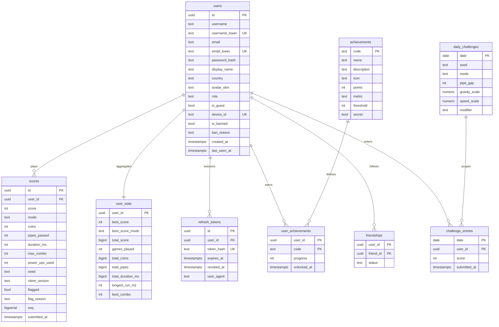

# Database

PostgreSQL 16. Everything is UTC (`timestamptz`) and every primary key is a UUID
generated by the application, so the same code path works for both storage
drivers.

## Schema



## Why the tables look like this

**`username_lower` / `email_lower`.** Uniqueness is case-insensitive, and a
plain unique index on a generated lower-case column is both portable and
index-friendly — no `citext` extension required.

**`user_stats` is a maintained aggregate, not a view.** Every leaderboard and
profile read would otherwise scan the whole run history. It is updated inside
the same statement that inserts a run, and `recompute()` can always rebuild it
from `scores` — which is exactly what moderation does after flagging a run.

**`scores.seq`.** `submitted_at` has millisecond resolution, so two runs stored
in the same millisecond had an arbitrary "newest first" order. A monotonic
sequence gives every run a stable tiebreaker without changing the public API.

**`flagged` lives on the row.** A suspicious run is kept with its reasons rather
than dropped, so it can be reviewed. Every query that feeds a leaderboard or an
aggregate filters `flagged = FALSE`.

## Indexes

| Index | Table | Purpose |
|-------|-------|---------|
| `users_username_lower_key` | users | Case-insensitive uniqueness and lookup |
| `users_email_lower_key` | users | Partial — only where an email exists |
| `users_device_id_key` | users | Guest resumption |
| `scores_board_idx` | scores | `(mode, submitted_at DESC, score DESC)` where not flagged |
| `scores_user_recent_idx` | scores | Run history |
| `scores_user_best_idx` | scores | Personal best |
| `scores_user_seq_idx` | scores | Deterministic ordering |
| `user_stats_best_idx` | user_stats | Top-N by best score |
| `refresh_tokens_hash_key` | refresh_tokens | Token lookup |
| `challenge_entries_board_idx` | challenge_entries | Daily board |

## The ranking query

One row per player — their best eligible run in the window — ranked so that ties
share a rank:

```sql
WITH eligible AS (
  SELECT DISTINCT ON (s.user_id)
    s.user_id, s.id AS score_id, s.score, s.mode, s.coins,
    s.pipes_passed, s.duration_ms, s.submitted_at
  FROM scores s
  JOIN users u ON u.id = s.user_id
  WHERE s.flagged = FALSE
    AND u.is_banned = FALSE
    AND ($1::text IS NULL OR s.mode = $1::text)
    AND ($2::timestamptz IS NULL OR s.submitted_at >= $2::timestamptz)
  ORDER BY s.user_id, s.score DESC, s.submitted_at ASC, s.seq ASC
),
ranked AS (
  -- RANK() orders by score alone so tied players share a rank (1, 1, 3 …);
  -- row ordering applies submitted_at separately.
  SELECT e.*,
         RANK() OVER (ORDER BY e.score DESC) AS rank,
         COUNT(*) OVER () AS total
  FROM eligible e
)
SELECT r.*, u.username, u.display_name, u.avatar_skin, u.country
FROM ranked r
JOIN users u ON u.id = r.user_id
ORDER BY r.rank ASC, r.submitted_at ASC, u.username ASC
LIMIT $3 OFFSET $4;
```

`DISTINCT ON` collapses each player to one run; the window functions then rank
and count in a single pass. The same three rules are implemented in the
in-memory driver, and the shared test suite runs against both.

Window starts (UTC): `daily` = midnight, `weekly` = Monday, `monthly` = the 1st.

## Migrations

Forward-only SQL in `backend/migrations/`, applied in filename order inside one
transaction each, and recorded in `schema_migrations` with a SHA-256 checksum.

```bash
make migrate          # apply pending
make migrate-status   # applied / pending / DRIFT
```

Editing an applied migration is reported as **drift** rather than silently
diverging — write a new file instead.

| File | What it does |
|------|--------------|
| `001_init.sql` | Every table and index |
| `002_achievements_seed.sql` | The achievement catalog (reference data, upserted) |
| `003_leaderboard_view.sql` | `leaderboard_all_time` for ad-hoc queries |
| `004_score_sequence.sql` | `scores.seq` for deterministic ordering |

The backend applies pending migrations at boot when `DATABASE_AUTO_MIGRATE=true`
(the default), so `make up` needs no separate step.

## Working with the data

```bash
make psql     # a shell on the dev database
make seed     # 12 demo players with plausible run histories
make up-tools # pgweb, a browser UI, at http://localhost:8081
```

```sql
-- Top ten, all time
SELECT rank, username, score, mode FROM leaderboard_all_time ORDER BY rank LIMIT 10;

-- Flagged runs awaiting review
SELECT u.username, s.score, s.duration_ms, s.flag_reason
FROM scores s JOIN users u ON u.id = s.user_id
WHERE s.flagged ORDER BY s.submitted_at DESC;

-- Mode popularity
SELECT mode, COUNT(*), ROUND(AVG(score), 1) AS avg_score
FROM scores WHERE NOT flagged GROUP BY mode ORDER BY 2 DESC;
```

## Backup and restore

```bash
docker compose exec -T postgres pg_dump -U flappy flappybird > backup.sql
cat backup.sql | docker compose exec -T postgres psql -U flappy -d flappybird
make clean-volumes   # delete the volume entirely
```
