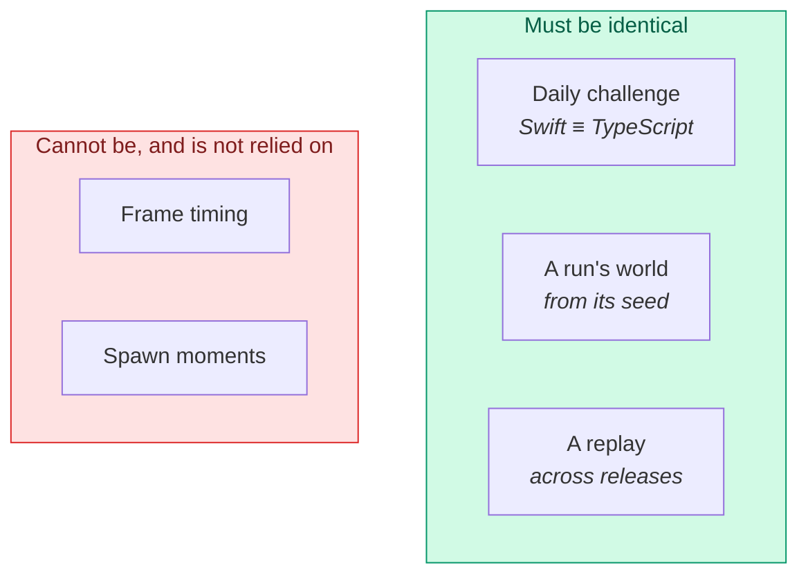
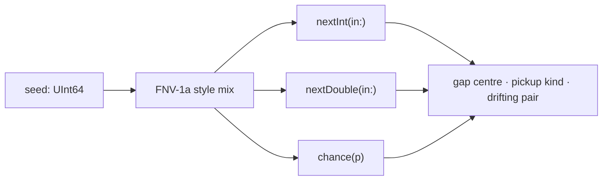
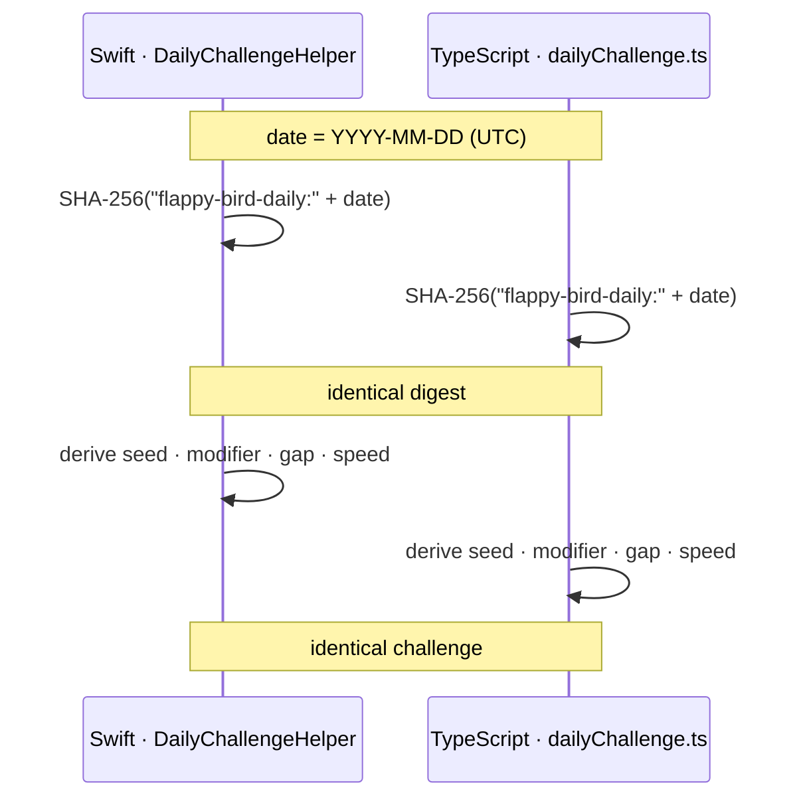
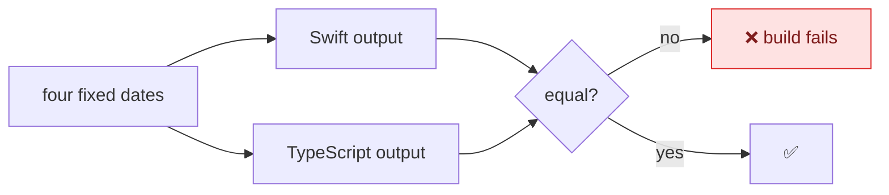
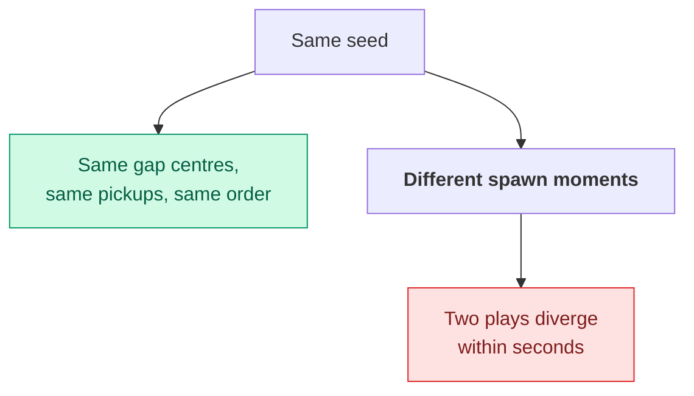

# Determinism and seeds

Three things in this project must produce identical results in two places at
once: the daily challenge (Swift *and* TypeScript), a run's world (from its
seed), and a replay (across releases). This page explains how each is achieved
and, more usefully, where determinism deliberately stops.

---

## Why it matters



Getting this wrong is quiet. Two players would get different "daily" challenges
and never know the feature was broken — there is no error, just an unfair
leaderboard.

---

## The seeded generator

`SeededRandom` is a small, explicit PRNG. The point is not cryptographic quality
— it is that the same seed gives the same sequence, on every device, forever.



**Do not replace this with `Int.random(in:)`.** The system generator is not
reproducible and is not required to be stable between OS versions. Anywhere the
world's shape is decided, the seeded generator is used.

Each run stores its seed in its `RunRecord`, so a run can always be traced back
to the world it was played in.

---

## The daily challenge

The hardest constraint in the project: **the same function, in two languages,
must agree exactly.**



Both sides take the digest, read the same bytes in the same order, and map them
onto the same tables. Swift uses CryptoKit; TypeScript uses `node:crypto`.

### The test that makes it safe

`DailyChallengeHelperTests` pins **four fixed dates** against values produced by
the server's TypeScript. It is a contract test, not a unit test: if either
implementation drifts, the test fails rather than players silently receiving
different challenges.



**If you change the derivation, you must change both sides and update the
fixtures in the same commit.** There is no version negotiation — a mismatch is
simply wrong.

### Why UTC

The date key is UTC so that "today's challenge" is the same challenge
everywhere. A local-time key would mean a player in Auckland and one in Los
Angeles competing on different worlds on the same leaderboard.

---

## What is *not* deterministic

This is the part worth internalising, because an earlier feature assumed
otherwise and was wrong.

**Pipe spawning is driven by accumulated frame time:**

```swift
spawnAccumulator += delta * Double(slowMotionFactor)
guard spawnAccumulator >= currentSnapshot.spawnInterval else { return }
```

`delta` is real elapsed time. It varies with frame rate, thermal state, and
whatever else the device is doing.



So the seed determines **what** the world contains, not **when**. That is why
replays are recorded rather than re-simulated — a design decision covered in
[Replays](REPLAYS.md).

### Making spawning deterministic would be possible

Drive the accumulator from a fixed simulation step rather than wall-clock delta.
It is a real option, and it would make seed-only replays viable. It would also
mean decoupling the simulation from the render loop, which is a much larger
change than it sounds, and the recorded-replay approach removes the need.

---

## Replays across releases

Because a replay stores what happened rather than the inputs to a simulation, it
stays correct even when the difficulty constants change. A recording made before
the pipe spacing was widened still plays back at its original spacing — it is a
record of that run, not a re-run of it.

This is the main practical argument for recording over re-simulation, beyond the
timing problem: **balance changes do not invalidate history.**

---

## Test determinism

The same discipline applies to tests, for the same reason — a test that depends
on timing or on shared state fails intermittently, which is worse than failing.

| Source of flakiness | How it is removed |
|---------------------|-------------------|
| Shared `UserDefaults` | Each test gets its own suite name |
| Sticky `selectedMode` | Seeding resets it |
| Accessibility tree races | Every read polls; nothing reads once |
| Non-atomic tree reads | One `app.snapshot()`, never enumerate-then-resolve |
| The auto-pilot's lifespan | `-demo-die` ends a run on cue |
| Simulator compositing | Captures are verified and retried |

Detail in [Testing](TESTING.md).

---

## Where to look next

- [Gameplay](GAMEPLAY.md) — what the daily challenge modifiers do
- [Replays](REPLAYS.md) — why recording beat re-simulation
- [Testing](TESTING.md) — the contract test, and test determinism
- [API reference](API.md) — the challenge endpoints
