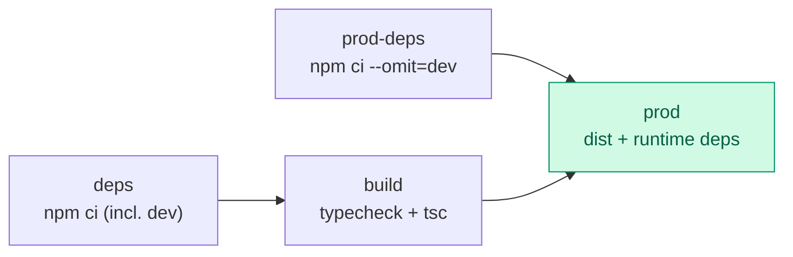

# Docker

Only the backend is containerised — the game needs macOS and Xcode.

Compose owns container names instead of hard-coding them. That matters when a
contributor runs an isolated validation stack with `docker compose -p …`: each
project gets its own containers, network and volumes, so tests cannot collide
with or truncate the normal development database.

## Quick start

```bash
make up                 # Postgres + API
make up-tools           # + pgweb, a database browser
make up-observability   # + Prometheus and Grafana
make down               # stop everything
make clean-volumes      # stop and delete the database volume
```

## What is in the stack

| Service | Image | Port | Profile |
|---------|-------|-----:|---------|
| `postgres` | `postgres:16-alpine` | 5432 | default |
| `backend` | built from `./backend` | 4000 | default |
| `pgweb` | `sosedoff/pgweb` | 8081 | `tools` |
| `prometheus` | `prom/prometheus` | 9090 | `observability` |
| `grafana` | `grafana/grafana-oss` | 3001 | `observability` |

```mermaid
flowchart LR
    subgraph default
        PG[("postgres:5432<br/>volume: postgres-data")]
        API["backend:4000<br/>healthcheck /healthz"]
        API --> PG
    end

    subgraph tools
        PW["pgweb:8081"] --> PG
    end

    subgraph observability
        PR["prometheus:9090"] -->|scrape /metrics| API
        GR["grafana:3001"] --> PR
    end

    Game["iOS simulator"] -->|http://localhost:4000| API

    style default fill:#eff6ff,stroke:#2563eb,color:#1e3a8a
    style tools fill:#f5f3ff,stroke:#7c3aed,color:#4c1d95
    style observability fill:#fff7ed,stroke:#ea580c,color:#7c2d12
```

Profiles keep the default stack small. `make up` starts two containers; the
extras are there when you want them.

## The image

`backend/Dockerfile` is a four-stage build:



The runtime stage:

- runs as a non-root `flappy` user (uid 1001);
- uses `dumb-init` so `SIGTERM` reaches Node directly — `docker compose down`
  is immediate rather than a ten-second wait;
- ships `dist/`, production `node_modules`, `migrations/` and `openapi/` only;
- declares a `HEALTHCHECK` against `/healthz`, which is what `depends_on:
  condition: service_healthy` uses.

Build it on its own:

```bash
docker build -t flappy-bird-backend ./backend
docker run --rm -p 4000:4000 -e DB_DRIVER=memory flappy-bird-backend
```

With `DB_DRIVER=memory` the container needs no database at all — handy for a
throwaway demo.

## Configuration

Compose reads a root `.env`. Every value has a default, so the file is optional.

```bash
BACKEND_PORT=4000
POSTGRES_PORT=5432
POSTGRES_USER=flappy
POSTGRES_PASSWORD=flappy
POSTGRES_DB=flappybird
JWT_ACCESS_SECRET=$(openssl rand -hex 48)
JWT_REFRESH_SECRET=$(openssl rand -hex 48)
ADMIN_TOKEN=$(openssl rand -hex 24)
LOG_LEVEL=info
```

The compose file ships placeholder JWT secrets so `make up` works immediately.
**Replace them on any machine other people can reach.**

## Data

The database lives in the named volume `postgres-data` and survives
`make down`. To start clean:

```bash
make clean-volumes
```

Back up and restore:

```bash
docker compose exec -T postgres pg_dump -U flappy flappybird > backup.sql
cat backup.sql | docker compose exec -T postgres psql -U flappy -d flappybird
```

## Observability

```bash
make up-observability
open http://localhost:3001     # Grafana, anonymous viewer access is on
```

The Prometheus datasource and a "Flappy Bird — Backend" dashboard are
provisioned from `ops/`, so there is nothing to click through: request rate,
error rate, p95 latency, runs submitted by mode, flagged runs, accounts created,
event-loop lag and resident memory.

## Troubleshooting

**Port already in use** — change `BACKEND_PORT` or `POSTGRES_PORT` in `.env`.

**`backend` keeps restarting** — `make logs`. Almost always Postgres not being
ready yet; compose waits on the healthcheck, so this usually means the database
container itself failed.

**Migrations did not run** — they apply at boot when `DATABASE_AUTO_MIGRATE` is
true. Check with `make migrate-status`, apply with `make migrate`.

**Build is slow the first time** — the npm install layer is cached after that.
CI additionally uses GitHub Actions cache mounts.
