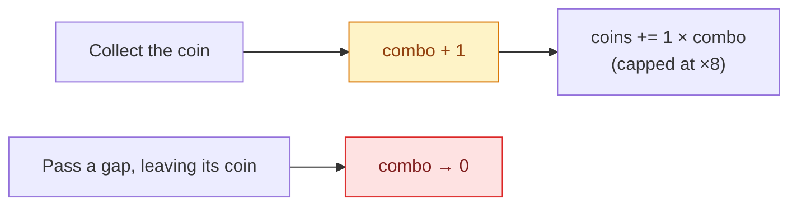

# Gameplay

<p align="center">
  
</p>

Tap to flap. Everything below is what was built on top of that.

## Modes

| Mode | Symbol | Ramps | Power-ups | Lethal | Ranked | Starting gap | Notes |
|------|:------:|:-----:|:---------:|:------:|:------:|:------------:|-------|
| Classic | 🐦 | — | ✅ | ✅ | ✅ | 155 pt | The original rules, steady pace. |
| Endless | ♾️ | ✅ | ✅ | ✅ | ✅ | 155 pt | Difficulty climbs and then plateaus. |
| Time Attack | ⏱️ | ✅ | ✅ | ✅ | ✅ | 165 pt | 60 seconds. Score, not survival. |
| Hardcore | 💀 | ✅ | ❌ | ✅ | ✅ | 118 pt | Narrow gaps, heavier gravity, no help. |
| Zen | 🧘 | — | ✅ | ❌ | ❌ | 185 pt | Contact bounces instead of killing. Practice. |
| Daily | 📅 | ✅ | ❌ | ✅ | ✅ | from seed | Everyone plays the same layout today. |

Zen is deliberately unranked — a mode you cannot lose would flatten every
leaderboard.

## The flight model

| Quantity | Value | Why |
|----------|-------|-----|
| Gravity | `-5.0` × mode × challenge | The original clone's value. |
| Flap impulse | `30` | Lifts the bird ≈ 90 pt. |
| Bird mass | `0.0804` (pinned) | Lets the hitbox shrink without changing the feel. |
| Hitbox radius | sprite height ÷ 2.4 | Slightly forgiving — near-misses read as misses. |
| Max fall / rise | `-900` / `520` pt·s⁻¹ | Keeps a long drop readable and stops tap-spam launches. |
| Lateral drift | ±46 pt, springs back | Wind can push you, not carry you off-screen. |

Pinning the mass is the subtle one: SpriteKit derives mass from the body's area,
so shrinking the hitbox for fairness would otherwise make every flap launch the
bird much higher.

## Difficulty curve

```
t = 1 − (1 − min(1, pipesPassed / 40))³
```

| Passed | Gap | Spawn every | Scroll |
|-------:|----:|------------:|-------:|
| 0 | 155 pt | 1.90 s | 0.0100 s/pt |
| 10 | 128 pt | 1.38 s | 0.0077 s/pt |
| 25 | 114 pt | 1.12 s | 0.0065 s/pt |
| 40+ | 111 pt | 1.05 s | 0.0062 s/pt |

Hard floors: the gap never drops below **104 pt** and the spawn interval never
below **1.05 s**, whatever the mode or challenge asks for. Past 25 pipes, some
pairs start drifting vertically — the amplitude stays inside the gap, so a
moving pair is always passable.

## Coins and combos

Every gap holds a coin (or, 14 % of the time in modes that allow them, a
power-up). The combo is a **coin streak**, not a pipe streak:



So the interesting line is not the safest one. Coins buy skins in the shop, and
the combo multiplier is what makes a greedy run worth it.

## Power-ups

Disabled in Hardcore and Daily, where everyone must face the same layout.

| Power-up | Symbol | Duration | Effect |
|----------|:------:|---------:|--------|
| Shield | 🛡 | until used | Absorbs one lethal hit and bounces you clear. Up to 2 banked. |
| Slow-Mo | ⏳ | 5 s | The whole world scrolls at 55 %. |
| Coin Magnet | 🧲 | 8 s | Pulls coins within 170 pt toward you. |
| Double Points | ✖️2 | 10 s | Two points per pipe. |
| Shrink | 🔻 | 8 s | 65 % size, hitbox included. |

Re-collecting the same power-up **extends** it rather than replacing it. The
shield is the rarest by spawn weight, because it is the only one that forgives a
mistake.

## Weather

Rolled per run from the run's seed (so a daily challenge is identical for
everyone), weighted heavily toward clear.

| Weather | Chance | Effect |
|---------|-------:|--------|
| ☀️ Clear | 62 % | — |
| 🌬 Windy | 16 % | Lateral gusts that reverse every 2.4–4.8 s. |
| 🌧 Rain | 13 % | A constant downdraft, plus rain particles. |
| 🌫 Fog | 9 % | A translucent overlay. |

Surviving 30 seconds of wind unlocks **Storm Chaser**.

## Day and night

Every 20 pipes the world moves to the next phase: **Day → Sunset → Night →
Dawn**. The sky, ground and pipes are re-tinted over 1.1 s. Finishing a run
during the night phase unlocks **Night Owl**.

## Medals

| Medal | Score |
|-------|------:|
| 🥉 Bronze | 10 |
| 🥈 Silver | 25 |
| 🥇 Gold | 50 |
| 💎 Platinum | 100 |

## Achievements

17 of them, 910 points in total. They unlock offline and reconcile with the
server later — the merge only ever moves progress forward.

| Code | Name | Requirement | Points |
|------|------|-------------|-------:|
| `first_flight` | First Flight | Pass your first pipe | 5 |
| `getting_warm` | Getting Warm | Score 10 | 10 |
| `sky_rookie` | Sky Rookie | Score 25 | 20 |
| `pipe_dreamer` | Pipe Dreamer | Score 50 | 40 |
| `century` | Century Club | Score 100 | 100 |
| `legend` | Living Legend | Score 200 | 250 |
| `coin_collector` | Coin Collector | 100 coins total | 15 |
| `treasury` | Treasury | 1,000 coins total | 60 |
| `persistent` | Persistent | 50 games | 20 |
| `dedicated` | Dedicated | 250 games | 75 |
| `pipe_marathon` | Pipe Marathon | 1,000 pipes total | 50 |
| `combo_artist` | Combo Artist | ×10 combo | 35 |
| `untouchable` | Untouchable | ×25 combo | 90 |
| `night_owl` | Night Owl | Finish a run at night | 15 |
| `storm_chaser` | Storm Chaser | 30 s of wind | 30 |
| `daily_devotee` | Daily Devotee | 7 daily challenges | 70 |
| `perfect_start` | Perfect Start | 10 pipes, no power-ups | 25 |

## Skins

<p align="center">
  
</p>

| Skin | Price |
|------|------:|
| Classic | free |
| Mint | 150 |
| Ember | 300 |
| Midnight | 500 |
| Royal | 800 |
| Aurora | 1,200 |
| Glitch | 1,800 |
| Phoenix | 2,500 |

Cosmetic only. Prices are distinct so the shop reads at a glance.

## The daily challenge

Derived from `SHA-256("flappy-bird-daily:YYYY-MM-DD")` — the same function runs
in the game and on the server, so the challenge exists with or without a
backend. The server is only needed to compare scores.

| Parameter | Range |
|-----------|-------|
| Mode | classic · endless · timeAttack · hardcore |
| Gap | 110–170 pt |
| Gravity | ×0.85–1.15 |
| Speed | ×0.90–1.30 |
| Modifier | none · windy · foggy · nightfall · narrow · turbo |

It rolls over at 00:00 UTC.

## Accessibility

| Setting | Effect |
|---------|--------|
| Sound effects | Mutes the synthesised audio. |
| Haptics | Disables every feedback generator. |
| Reduce flashing | Removes the red death flash. |
| High contrast | Brighter HUD and panel text. |
| Reduce Motion *(system)* | Drops parallax, clouds and weather particles. |

Buttons are exposed to VoiceOver with a `.button` trait and their title, and the
tap target is inset 8 pt beyond the visible bounds.

## Controls

| Action | Input |
|--------|-------|
| Flap | Tap anywhere |
| Start | Tap on "Tap to start" |
| Pause | The **II** button, or send the app to the background |
| Resume / Restart / Menu | Buttons on the pause panel |
| Share a score | **SHARE** on the summary panel |
