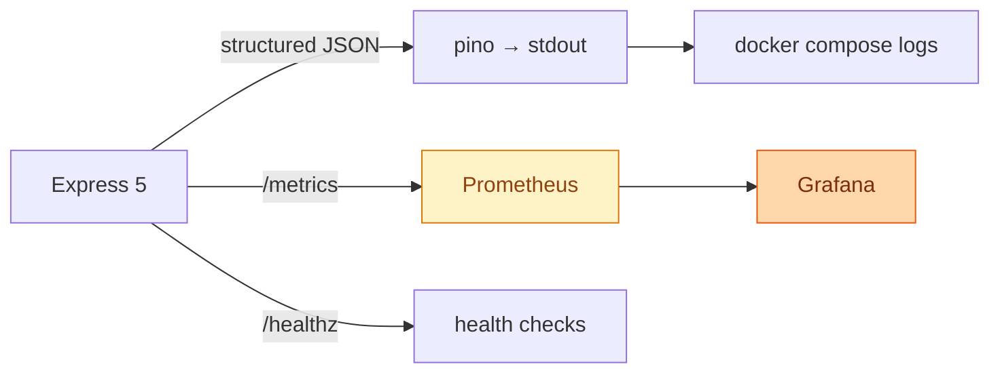
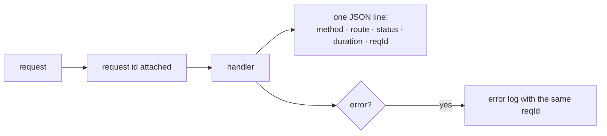
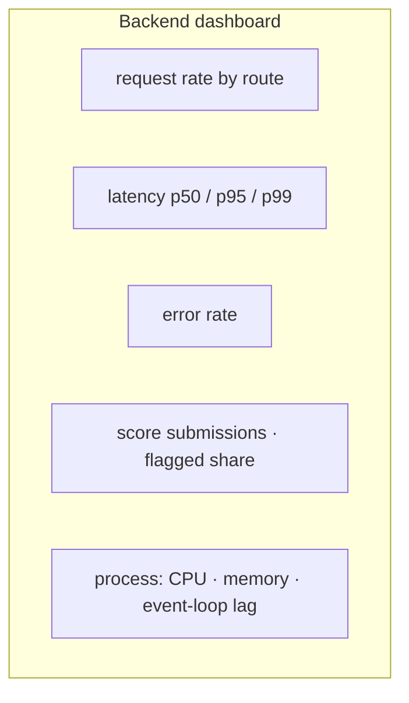

# Observability

What the backend emits, how to look at it, and what is worth alerting on. The
stack is opt-in: Prometheus and Grafana live behind a Compose profile, and the
API works fine without either.

---

## What exists



```bash
docker compose --profile observability up -d
open http://localhost:9090     # Prometheus
open http://localhost:3000     # Grafana — dashboard pre-provisioned
```

---

## Health

| Endpoint | Answers |
|----------|---------|
| `/healthz` | Liveness and readiness in one: process, driver, database reachability, uptime |

```json
{
  "status": "ok",
  "service": "flappy-bird-backend",
  "apiVersion": "1.0.0",
  "environment": "production",
  "driver": "postgres",
  "database": "ok",
  "uptimeSeconds": 5294
}
```

`database` is an actual round trip, not a cached flag — a server that cannot
reach Postgres reports unhealthy rather than accepting writes it will drop. This
is what Compose and CI wait on before running anything.

---

## Metrics

`prom-client`, with default Node process metrics plus the game's own.

| Metric | Type | Labels | Use |
|--------|------|--------|-----|
| `http_request_duration_seconds` | histogram | method, route, status | Latency and error rate |
| `scores_submitted_total` | counter | mode, flagged | Throughput and fair-play rate |
| `process_*`, `nodejs_*` | — | — | CPU, memory, event-loop lag, GC |

The route label uses the **route pattern**, not the path, so
`/v1/users/alice` and `/v1/users/bob` share one series instead of creating
unbounded cardinality.

### Queries worth keeping

```promql
# p95 latency per route
histogram_quantile(0.95,
  sum(rate(http_request_duration_seconds_bucket[5m])) by (le, route))

# error rate
sum(rate(http_request_duration_seconds_count{status=~"5.."}[5m]))
  / sum(rate(http_request_duration_seconds_count[5m]))

# share of submissions the anti-cheat flags
sum(rate(scores_submitted_total{flagged="true"}[15m]))
  / sum(rate(scores_submitted_total[15m]))

# event-loop lag — the first sign of saturation
nodejs_eventloop_lag_seconds
```

> The flagged ratio is the interesting one. A sudden jump usually means either a
> real cheating attempt **or** a heuristic that has started firing on legitimate
> play. This project has had the second: a rule compared the combo counter
> against the score, but combo advances on *coins*, so anyone who grabbed two
> coins and clipped the first pipe got flagged. See
> [Security model](SECURITY-MODEL.md).

---

## Logs

`pino` writing structured JSON to stdout, with `pino-http` adding one line per
request.



The request id is returned to the client in error envelopes, so a user-visible
failure can be traced to exactly one log line:

```json
{ "error": { "code": "unprocessable", "message": "…", "requestId": "01HQ…" } }
```

```bash
docker compose logs -f backend
docker compose logs backend | jq 'select(.level >= 50)'   # errors and worse
docker compose logs backend | jq 'select(.reqId == "01HQ…")'
```

Set `LOG_LEVEL=debug` for development; leave it at `info` in production, where
`trace` is loud enough to become its own performance problem.

---

## Grafana

The dashboard in `ops/grafana/dashboards/backend.json` is provisioned
automatically — the datasource too, so there is nothing to click through on
first boot.



Default credentials are `admin` / `admin` — fine on a laptop, not fine anywhere
else.

---

## What to watch

| Signal | Healthy | Investigate when |
|--------|---------|------------------|
| p95 latency | < 100 ms | Sustained above 500 ms |
| Error rate | ~0 | Above 1% |
| Event-loop lag | < 50 ms | Above 200 ms |
| Flagged share | low and steady | Any sudden change in either direction |
| `database` in `/healthz` | `ok` | Anything else |

The leaderboard's ranking query is the only one with real work in it; if latency
moves, check that first and confirm its indexes are being used. See
[Database](DATABASE.md).

---

## The game side

The app logs through `os.Logger` with per-subsystem categories, visible in
Console.app or:

```bash
xcrun simctl spawn booted log stream \
  --predicate 'subsystem == "com.hoangsonww.flappybird"'
```

In debug builds the same lines mirror to stderr, which is what `--console-pty`
surfaces — stdout is buffered and frequently never flushed for a UI process.

There is no analytics, no crash reporter and no telemetry of any kind. Nothing
about a player leaves the device except the runs they choose to upload by
running a server.

---

## Where to look next

- [Backend](BACKEND.md) — running and operating the API
- [Database](DATABASE.md) — the query behind the latency
- [Security model](SECURITY-MODEL.md) — what the flagged counter means
- [Docker](DOCKER.md) — the profiles that start this stack
