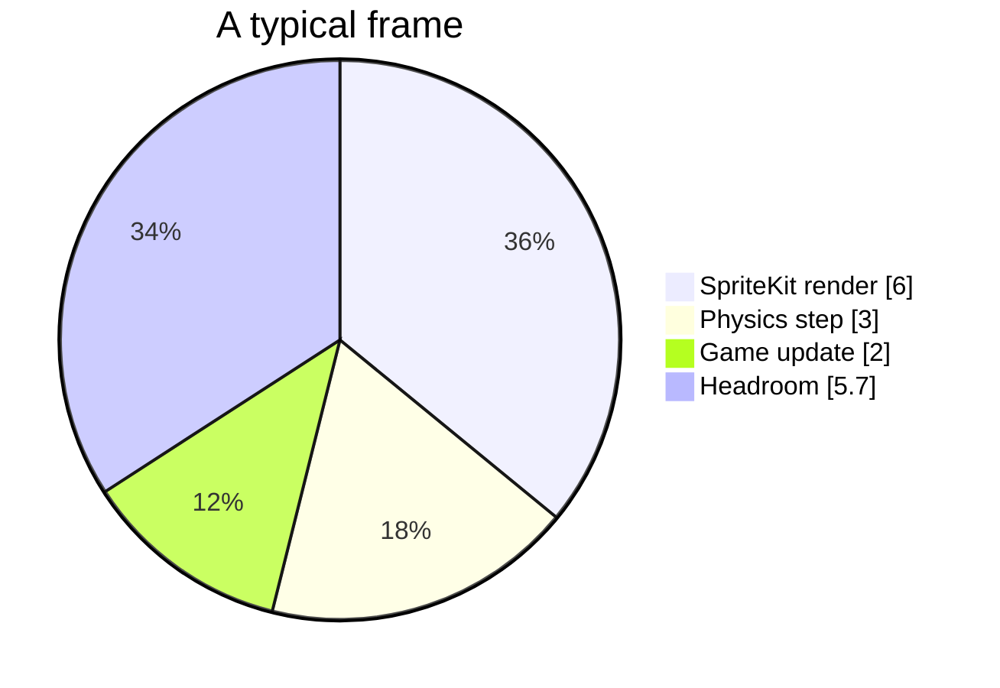
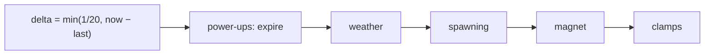

# Performance

The frame budget, what is in it, and how to find out what is eating it. The
target is a steady 60 fps on a phone that is several years old, and the game
comfortably meets it — this page is mostly about not losing that by accident.

---

## The budget

At 60 fps there are **16.7 ms** per frame for everything: the physics step, the
game's own update, and SpriteKit's render pass.



Those proportions are indicative, not measured per device — the useful number is
the headroom, and the useful habit is checking it stays.

---

## Seeing the numbers

Turn on **Show FPS** in Settings ▸ Game:

```
nodes:48 draws:45 60.0 fps
```

| Counter | Healthy | Meaning |
|---------|--------:|---------|
| `nodes` | 30–60 | Live `SKNode`s, including off-screen pipes |
| `draws` | 30–50 | Draw calls — the number to watch |
| `fps` | 60.0 | Anything sustained below 58 is worth investigating |

Node count tracks how much exists; **draw count tracks how much it costs**. Two
sprites sharing a texture can batch into one draw call; two sprites with
different textures cannot.

---

## What keeps it cheap

### Everything is pre-built

| Thing | Built when | Why it matters |
|-------|-----------|----------------|
| Audio buffers | Launch | No synthesis or file I/O mid-run |
| Haptic generators | Launch, and per run | First-use latency is prepared away |
| Pipe textures | Once, cached by SpriteKit | Shared across every pair |
| Clouds | Scene setup | Procedural shapes, not per-frame geometry |

### Pipes are recycled by removal

Each pair runs one action and removes itself:

```swift
pair.run(.sequence([move, .removeFromParent()]))
```

There is no pool, because there does not need to be: at most four pairs exist at
once, and `SKAction` handles the movement without the game touching them per
frame.

### The world is one node

`worldNode.speed = 0` freezes every descendant action at once. Pausing costs a
single property write rather than a walk over the tree.

### Atlases batch

The bird's four frames live in `bird.atlas`, compiled into one texture. Four
sprites from one atlas are one draw call; four separate images are four.

---

## The frame loop, in order



Every step is O(1) or O(pipes on screen), and pipes on screen is at most four.
The magnet is the only one that scans collectibles, and only while it is active.

### The delta clamp

```swift
let delta = lastUpdate == 0 ? 0 : min(1.0 / 20.0, currentTime - lastUpdate)
```

A frame that took longer than 50 ms is *treated* as 50 ms. Without this, a
stall — a breakpoint, a thermal throttle, returning from the background — would
advance the simulation by the whole gap and teleport the bird through a pipe.
The trade is a moment of slow motion instead of a phantom death.

---

## Accessibility and battery

`reduceMotion` removes the cloud layer and the parallax scroll actions, which is
both an accessibility feature and the cheapest frame in the game. Weather
particles are the other notable cost and are disabled by the same flag.

---

## Profiling

```bash
# Instruments, for a real trace
xcrun xctrace record --template 'Game Performance' \
  --device-name 'iPhone 17 Pro' --launch -- <app path>
```

Or from Xcode: **Product ▸ Profile**, then *Game Performance* or *Time Profiler*.

What to look at, in order:

1. **Draw calls climbing during a run.** Usually a new texture that is not in an
   atlas, or a node added and never removed.
2. **Node count climbing.** Something is not being removed — a particle emitter,
   a toast, a pipe that lost its action.
3. **Sawtooth frame times.** Allocation per frame. Look for something building
   an `SKShapeNode` or a `DateFormatter` inside `update`.

> `DateFormatter` is expensive to construct. The list screens build one *per
> screen*, not per row — building one per row is a genuine, easy mistake that
> shows up immediately as a stutter while scrolling.

---

## Storage cost

| Store | Typical | Cap |
|-------|--------:|----:|
| Profile | a few KB | 50 runs + 200 queued |
| Settings | bytes | — |

---

## Backend

Different budget entirely: the API is I/O-bound, and the only query that needs
thought is the leaderboard's ranking CTE. See [Database](DATABASE.md) for the
indexes it relies on, and [Observability](OBSERVABILITY.md) for the latency
histogram to watch.

---

## Where to look next

- [Rendering](RENDERING.md) — what the draw calls are drawing
- [Physics and flight](PHYSICS.md) — the simulation half of the budget
- [Observability](OBSERVABILITY.md) — measuring the server side
