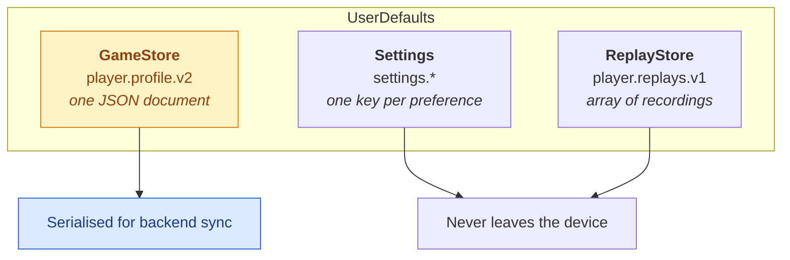
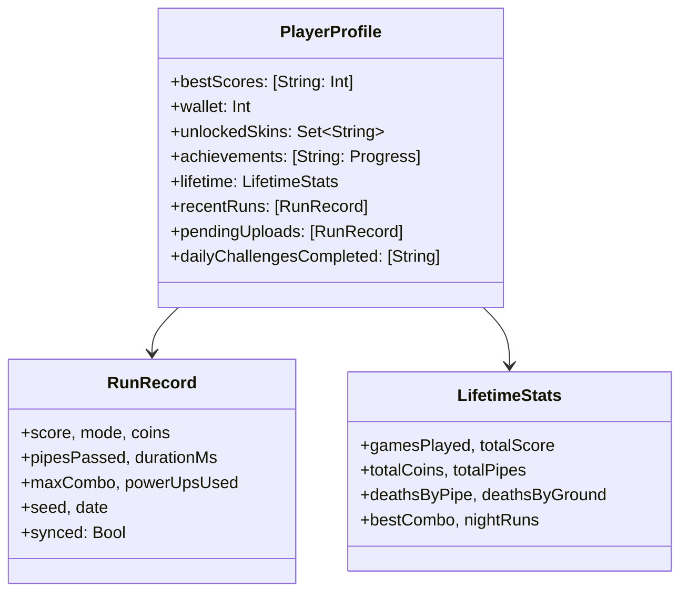
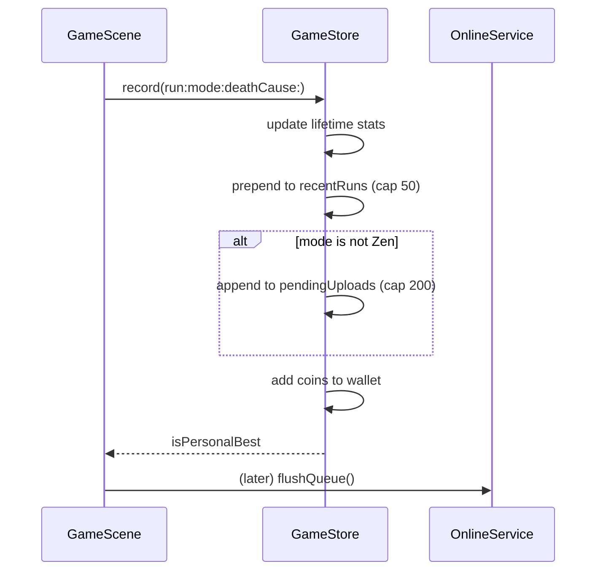
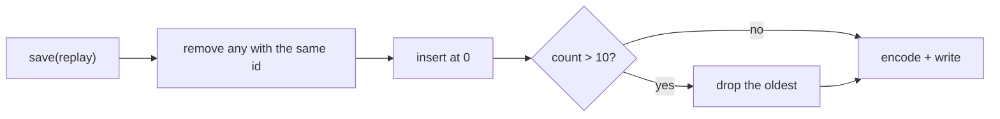
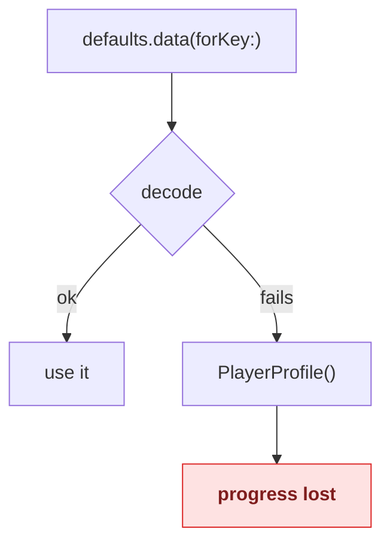

# Persistence and state

Where the game keeps things, how they are encoded, what happens when the format
changes, and why there are three stores rather than one.

---

## Three stores



They are separate for concrete reasons, not tidiness:

| Store | Write frequency | Shape | Leaves the device? |
|-------|-----------------|-------|:------------------:|
| `GameStore` | Every coin, every run | One document | Yes, via sync |
| `Settings` | On a toggle | Scalars | No |
| `ReplayStore` | Once per run | Large blobs | No |

A replay is bigger than the entire rest of the profile. Folding it in would mean
re-encoding megabytes every time the player picks up a coin, and sending it to a
server that has no use for it.

---

## The profile

One `Codable` document, cached in memory because the scene reads it many times
per frame.



### Reading and writing

Every mutation goes through one method, so nothing can change the profile
without persisting it:

```swift
func update(_ mutate: (inout PlayerProfile) -> Void) {
    mutate(&profile)
    save()
}
```

Encoding is JSON with `.iso8601` dates — readable when you dump the defaults,
and stable across timezones.

### Caps

| Collection | Limit | Why |
|------------|------:|-----|
| `recentRuns` | 50 | The stats screen shows a history, not an archive |
| `pendingUploads` | 200 | An offline player cannot grow storage forever |

---

## Recording a run



**Zen runs are not queued.** The mode is practice — it has no score worth
ranking, and uploading it would pollute a leaderboard with runs that cannot die.

---

## The upload queue

A run lives in two places at once until the server acknowledges it: in
`recentRuns` (history) and in `pendingUploads` (the queue). `markUploaded` has
to clear both:

```swift
func markUploaded(_ records: [RunRecord]) {
    update { profile in
        profile.pendingUploads.removeAll { … }
        for index in profile.recentRuns.indices where … {
            profile.recentRuns[index].synced = true   // ← easy to forget
        }
    }
}
```

> Forgetting the second half is a real bug this project shipped: the queue
> drained correctly, but the history kept showing "queued" against every run for
> the lifetime of the install, because nothing ever flipped `synced`. Two
> regression tests now pin it.

---

## Settings

Individual `UserDefaults` keys rather than a document, because they are read
independently and a corrupt blob should not take the whole set with it.

| Setting | Default | Notes |
|---------|:-------:|-------|
| Sound | on | Mutes the synthesised audio |
| Haptics | on | Disables every feedback generator |
| Show FPS | off | Node, draw and frame counters |
| High contrast | off | Brighter HUD and panel text |
| Reduce flashing | off | Suppresses the red death flash |
| Selected skin | `classic` | |
| Selected mode | `classic` | **Persists across launches** |
| Backend URL | unset | Overrides discovery |

Defaults are registered rather than hardcoded at each call site, so "on by
default" is stated once.

### The mode is sticky

`selectedMode` surviving a launch is correct for players and a hazard for tests:
a UI test that ran with `-mode zen` leaves Zen selected for the *next* test, and
a mode-cycling test can leave the card on Daily. Seeding demo data resets it for
exactly this reason. See [Testing](TESTING.md).

---

## Replay storage

Newest-first, capped at ten, de-duplicated by `id`:



Unplayable recordings — fewer than two frames — are rejected at the door rather
than stored and filtered later.

Full detail in [Replays](REPLAYS.md).

---

## Format changes

The storage key carries a version: `player.profile.v2`, `player.replays.v1`.

**Adding a field** is safe. Give it a default and Swift's synthesised decoding
fills it in for documents that predate it.

**Removing a field** is safe. The decoder ignores keys it does not declare, so
old documents decode fine — which is how the ghost replay's `ghostSamples` and
`ghostScore` disappeared without a migration.

**Renaming or changing a type** is not safe. Bump the key. A failed decode falls
back to a fresh profile, so a breaking change made in place silently wipes
everyone's progress.



That fallback is deliberate — a corrupt document should not brick the app — but
it is exactly why an incompatible change needs a new key rather than a shrug.

---

## Reset

`resetProgress()` wipes the profile and the settings keys it owns. It is offered
in Settings ▸ Game, used by every test that needs a clean slate, and called by
`-seed-demo` before it writes its fixture data.

---

## Testing

State is the easiest thing in the project to test, because every store takes its
`UserDefaults` by injection:

```swift
let defaults = TestSupport.isolatedDefaults("persistence")
let store = GameStore(defaults: defaults)
```

Each test gets its own suite name, so tests never see each other's writes or the
simulator's real save file.

---

## Where to look next

- [Sync and the offline queue](SYNC.md) — what happens to `pendingUploads`
- [Replays](REPLAYS.md) — the third store, in detail
- [Gameplay](GAMEPLAY.md) — what the numbers in the profile mean
- [Testing](TESTING.md) — the isolation helpers
