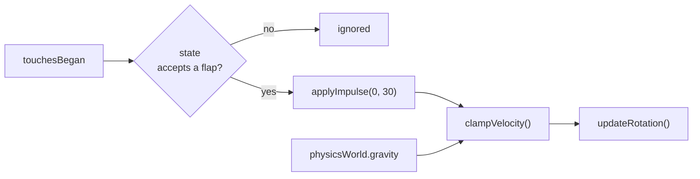
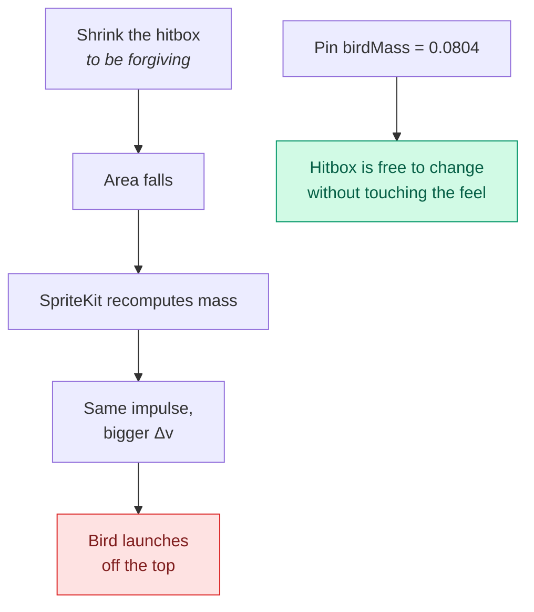
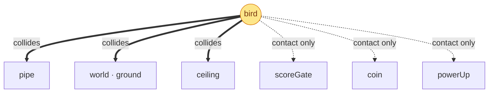
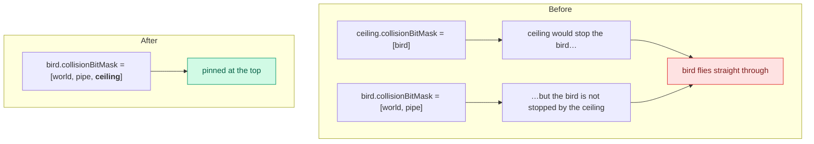
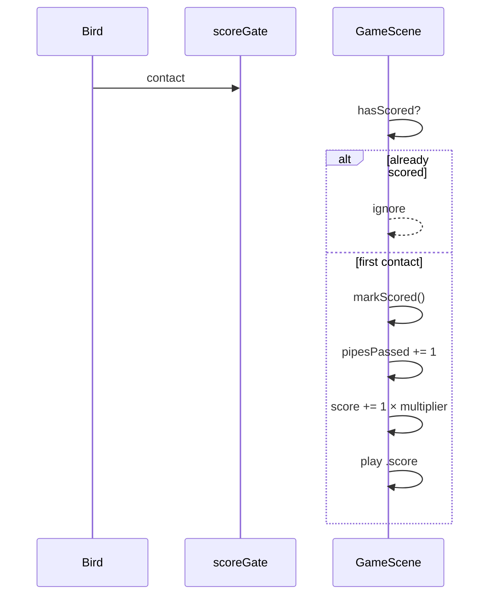
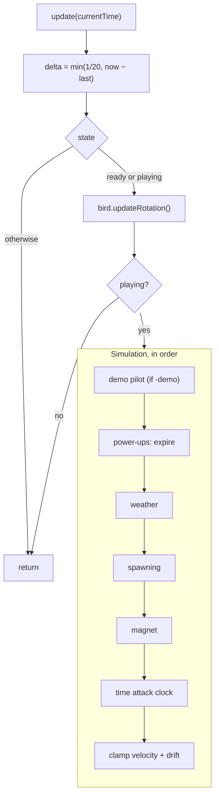
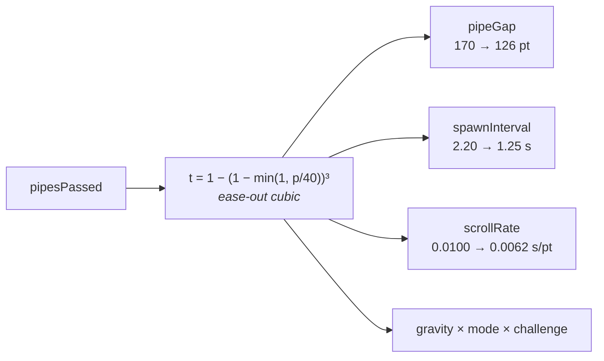

# Physics and flight

The flight model, the collision system, and why the numbers are what they are.
This is the document to read before changing anything that affects how the bird
*feels*, because several of these constants are load-bearing in non-obvious
ways.

---

## The flight model

One impulse per tap, constant gravity, and two velocity clamps.

| Constant | Value | Why |
|----------|------:|-----|
| `gravity` | −5.0 | Scaled per mode and by daily challenges |
| `flapImpulse` | 30.0 | Applied as an impulse, not a velocity set |
| `birdMass` | 0.0804 | **Pinned** — see below |
| `maxFallSpeed` | −900 | A long fall stays readable rather than blurring |
| `maxRiseSpeed` | 520 | Tap-spamming cannot launch the bird off-screen |

### Why the mass is pinned

This is the subtle one. SpriteKit **derives mass from the body's area**. The
collision shape is deliberately smaller than the sprite so that near-misses feel
fair — but shrinking the body also shrinks the mass, and an impulse applied to a
lighter body produces a *larger* velocity change.

The first time the hitbox was made forgiving, every flap started launching the
bird much higher, and the game became unplayable for reasons that had nothing to
do with the tuning anyone had changed.

**If you change the collision shape, do not change `birdMass`.** That is the
whole point of it being explicit.

### Rotation

The bird's angle is derived from its vertical velocity, not animated: rising
tilts it up, falling tilts it progressively down. It is clamped at both ends so
a long fall never spins the sprite past vertical.

### Horizontal clamping

The bird is nominally fixed on the x-axis, but wind (from the weather system)
and shield knock-back can push it. `clampHorizontal(anchorX:maxDrift:)` allows
up to 46 pt of drift and eases it back, so a windy run feels buffeted without
the bird ever being blown off-screen — which is exactly what happened before the
clamp existed.

---

## Collision categories

An `OptionSet`, so masks read as sets rather than bit soup:

| Category | Bit | Role |
|----------|----:|------|
| `bird` | 1 << 0 | The only dynamic body in the scene |
| `world` | 1 << 1 | The ground |
| `pipe` | 1 << 2 | Both halves of a pair |
| `scoreGate` | 1 << 3 | Full-height sensor just past each pair |
| `coin` | 1 << 4 | Sensor |
| `powerUp` | 1 << 5 | Sensor |
| `ceiling` | 1 << 6 | Pins the bird at the top edge — see below |

Solid arrows are *collisions* — the physics engine resolves them and the bird
stops. Dotted arrows are *contacts* — the bird passes through and the scene is
notified. Getting this distinction wrong is how you end up bouncing off a coin.

### Collisions are one-way

The trap that produced the fly-over exploit. A body is stopped **only by the
categories in its own `collisionBitMask`** — listing it on the *other* body is
not enough.

`maxRiseSpeed` caps how *fast* the bird rises, not how *high* it gets, so with
nothing stopping it, sustained tapping climbed roughly 600 pt in a second and a
half — against the 200 pt of overshoot a top pipe extends above the screen. The
bird cleared every pipe and the gap became optional.

Two things hold the invariant now, and `CoreModelTests` asserts both:

1. The bird's collision mask includes `ceiling`, so it is pinned just above the
   top edge.
2. A top pipe extends `overshoot` (200 pt) past the screen, which is well above
   the ceiling — so there is no band between the two to slip through.

### The scoring gate

A pair is scored by a thin, full-height sensor placed just past the pipes, not
by comparing x positions every frame. It is `2 × sceneHeight` tall so it cannot
be missed above or below, and `markScored()` latches so a second contact in the
same frame cannot double-count.

---

## The frame loop

Two details worth knowing:

**`delta` is clamped to 1/20 s.** If the app is descheduled — a breakpoint, a
slow frame, coming back from the background — an unclamped delta would teleport
the bird through a pipe. Clamping trades a moment of slow motion for never
tunnelling.

## Difficulty

Gravity, the pipe gap, the spawn interval and the scroll rate are all resolved
per frame from `DifficultyCurve.snapshot(pipesPassed:)`.

An ease-out cubic means most of the difficulty arrives early and then plateaus —
a great run stays hard but never becomes impossible. **Classic and Zen do not
ramp at all**, so they sit at the easiest row for the whole run.

The full table, and the reasoning behind the floors, is in
[Gameplay](GAMEPLAY.md#difficulty-curve). Tests assert the reaction window and the
on-screen pitch never fall below their floors, for every mode.

---

## Mode differences

| Mode | Gap | Scroll | Gravity | Ramps | Lethal |
|------|----:|-------:|--------:|:-----:|:------:|
| Classic | 170 | ×1.00 | ×1.0 | no | yes |
| Endless | 170 | ×0.95 | ×1.0 | yes | yes |
| Time Attack | 180 | ×0.85 | ×1.0 | yes | yes |
| Hardcore | 132 | ×0.80 | ×1.15 | yes | yes |
| Zen | 200 | ×1.15 | ×0.9 | no | **no** |
| Daily | 170 | ×1.00 | varies | yes | yes |

A lower scroll multiplier is *faster* — it multiplies seconds-per-point.

**Zen is not lethal.** `handleLethalContact` bounces the bird instead of ending
the run, which is why the mode is useful for practising a specific gap and why
the UI test suite uses it whenever it needs a run that will not die mid-assertion.

---

## Power-ups

| Kind | Duration | Effect |
|------|---------:|--------|
| Shield | until used | Absorbs one lethal hit, then knock-back and grace |
| Slow motion | 5 s | `worldNode.speed = 0.55` |
| Magnet | 8 s | Pulls coins within 170 pt |
| Double points | 10 s | ×2 per pipe |
| Shrink | 8 s | Bird scales to 0.65 — and the hitbox with it |

A gap contains a power-up instead of a coin with probability `0.14`, in modes
that allow them. Hardcore and Daily do not.

Shrink is the one that interacts with physics: it changes the body size, which
is precisely why the mass is pinned.

---

## Where to look next

- [Rendering](RENDERING.md) — the layers the physics moves through
- [Gameplay](GAMEPLAY.md) — the full difficulty table and scoring
- [Performance](PERFORMANCE.md) — the frame budget these steps share
