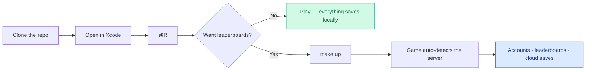

# Documentation

Everything written down about this project, in the order most people need it.

Start with [Architecture](../ARCHITECTURE.md) for the map, then pick a track.

### Getting started

| Guide | What it covers |
|-------|----------------|
| [Development](DEVELOPMENT.md) | Clone → run → contribute. Start here. |
| [Configuration](CONFIGURATION.md) | Every launch argument, setting and environment variable. |
| [FAQ](FAQ.md) | Short answers to common questions. |
| [Troubleshooting](TROUBLESHOOTING.md) | Symptoms, causes and fixes. |
| [Glossary](GLOSSARY.md) | What the terms mean here. |

### The game

| Guide | What it covers |
|-------|----------------|
| [Gameplay](GAMEPLAY.md) | Modes, power-ups, combos, weather, medals, achievements — and the numbers. |
| [Screens and navigation](SCREENS.md) | Every screen, how you reach it, what it is built from. |
| [Rendering](RENDERING.md) | The scene graph, layer order, parallax and textures. |
| [Physics and flight](PHYSICS.md) | The flight model, collision categories and the frame loop. |
| [Audio and haptics](AUDIO.md) | Synthesised sound, the cue table, feedback. |
| [Persistence and state](PERSISTENCE.md) | Local stores, formats and migrations. |
| [Accessibility](ACCESSIBILITY.md) | How a SpriteKit game reaches VoiceOver. |
| [Determinism and seeds](DETERMINISM.md) | What must be reproducible, and what is not. |
| [Performance](PERFORMANCE.md) | The frame budget and how to profile it. |

### The optional backend

| Guide | What it covers |
|-------|----------------|
| [Backend](BACKEND.md) | Running, configuring and operating the API. |
| [API reference](API.md) | Every endpoint, with request and response examples. |
| [Database](DATABASE.md) | Schema, indexes, migrations and the ranking query. |
| [Sync and the offline queue](SYNC.md) | Discovery, sessions, uploads and retries. |
| [Security model](SECURITY-MODEL.md) | Auth, token handling, fair play and the threat model. |
| [Observability](OBSERVABILITY.md) | Logs, metrics, dashboards and what to watch. |
| [Docker](DOCKER.md) | Compose profiles, images, volumes and the observability stack. |

### Project

| Guide | What it covers |
|-------|----------------|
| [Architecture](../ARCHITECTURE.md) | How every piece fits together. |
| [Testing](TESTING.md) | What is tested, how to run it, and how to add more. |
| [CI/CD](CI-CD.md) | The pipeline, and how automatic releases are cut. |
| [Roadmap](ROADMAP.md) | What is planned and what is deliberately out of scope. |
| [Decision records](adr/) | Why the project is built the way it is. |

## The one thing worth repeating

**The game is completely playable without the backend.** Clone, open in Xcode,
press ⌘R. Everything under `backend/` is opt-in: it adds accounts, leaderboards
and cloud saves, and the game detects it automatically when it is running.

