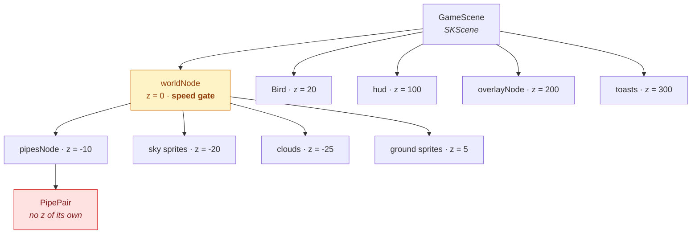
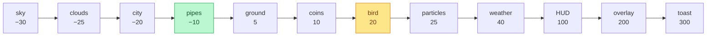
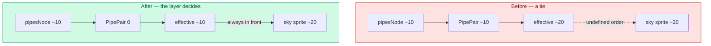
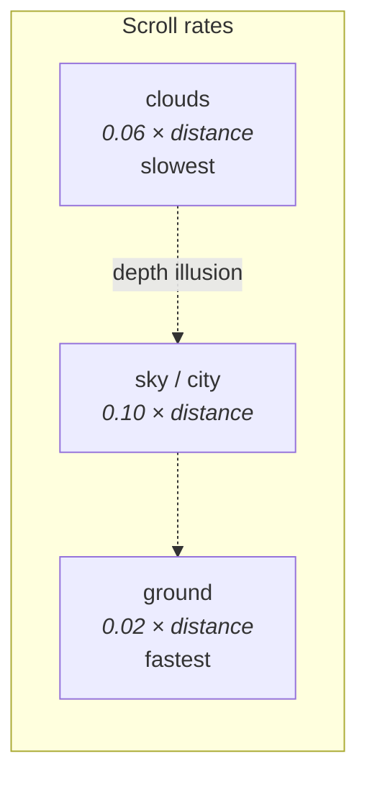
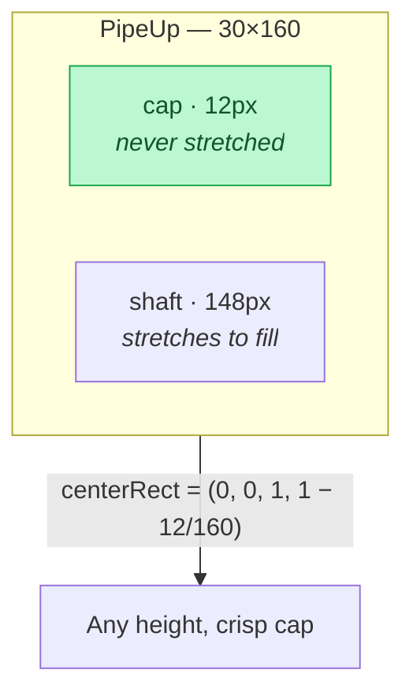
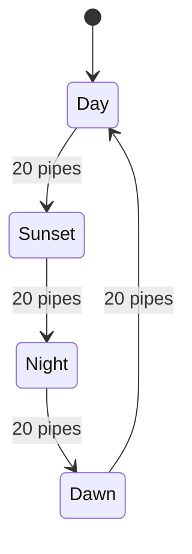

# Rendering

How a frame of Flappy Bird is put together: the scene graph, the layer order,
the parallax world, and the texture pipeline. If you are chasing a visual bug —
something drawn in front of something it should be behind, a seam, a sprite that
looks blurry — this is the page.

---

## The scene graph

SpriteKit renders a tree. Every node inherits its parent's transform, and a
node's *effective* z is the **sum of its own `zPosition` and all its
ancestors'**. That last point causes more bugs than anything else in this file,
and there is a worked example below.



### Why `worldNode` exists

Everything that scrolls lives inside it, which makes two features one line each:

```swift
worldNode.speed = 0      // pause: every action inside freezes
worldNode.speed = 0.55   // slow-motion power-up
```

The HUD, overlays and toasts sit **outside** it, so the pause menu still
animates while the world is frozen. Physics is stopped separately with
`physicsWorld.speed`, because `speed` only affects actions.

---

## Layer order

Defined once, in `ZPosition`, rather than scattered as magic numbers:

| Layer | z | Notes |
|-------|--:|-------|
| `sky` | −30 | Flat background colour, re-tinted by time of day |
| `clouds` | −25 | Procedural, drifting slowest |
| `distantCity` | −20 | The `sky` artwork: cloud band, skyline, grass |
| `pipes` | −10 | Obstacles |
| `ground` | 5 | The scrolling strip — pipes pass *behind* it |
| `collectible` | 10 | Coins and power-ups |
| `bird` | 20 | |
| `particles` | 25 | Feathers, trails |
| `weather` | 40 | Rain, fog, wind |
| `hud` | 100 | Score, coins, pause |
| `overlay` | 200 | Pause and game-over panels |
| `toast` | 300 | Transient messages, above everything |



### The z-summing trap, in full

A bug worth internalising, because it will happen again.

`GameScene` sets the layer's z once:

```swift
pipesNode.zPosition = ZPosition.pipes    // -10
```

`PipePair.make` used to *also* set it on each pair:

```swift
pair.zPosition = ZPosition.pipes         // -10  ← the bug
```

The pair's effective z became `0 + (−10) + (−10) = −20` — **exactly equal** to
the sky/city band. SpriteKit does not define a draw order for tied z, so the
background sometimes painted over the pipes and sometimes did not. The symptom
was a bottom pipe that appeared to stop partway down, on some pipes, some of the
time.



**The rule:** a layer node owns the layering decision. Children added to it
should leave `zPosition` at `0` unless they need ordering *within* that layer.

---

## The parallax world

Three layers scrolling at different rates, all inside one container so the whole
world freezes together.



Each layer is tiled: `2 + ceil(sceneWidth / tileWidth)` sprites, each running a
`moveBy` that resets, so the seam never enters the visible area. Clouds are
**procedural** — generated shapes rather than artwork — so they cost nothing to
ship and read well at any size.

`reduceMotion` (from `UIAccessibility.isReduceMotionEnabled`) skips the cloud
layer entirely and stops the scroll actions. See
[Accessibility](ACCESSIBILITY.md).

---

## Pipes: nine-slicing

`PipeUp.png` and `PipeDown.png` are 30 × 160 with a 12 px cap. Drawn at a fixed
size they leave open sky above the top pipe and a floating gap below the bottom
one on any modern phone, because phones are far taller than the artwork.

The fix is `centerRect`, SpriteKit's nine-slice: the cap stays pixel-perfect and
only the shaft stretches.



Each pipe extends `overshoot = 200 pt` past the screen edge, so nothing ever
pops in at the boundary, and the bottom pipe's shaft continues behind the ground
strip rather than stopping at it.

---

## Textures and filtering

Every texture is set to `.nearest` filtering. This is pixel art: linear
filtering would blur it into mush at 2× scale.

```swift
let texture = SKTexture(imageNamed: "bird-01")
texture.filteringMode = .nearest
```

The bird is a four-frame atlas in `FlappyBird/bird.atlas/`. Xcode compiles that
folder into `bird.atlasc` at build time.

> **Trap:** Xcode keys the atlas compile off the **folder's** modification time.
> Editing a sprite in place leaves a stale `bird.atlasc` in the bundle and the
> game keeps drawing the old art with no warning. The Make targets `touch` the
> folder for exactly this reason. See [Troubleshooting](TROUBLESHOOTING.md).

---

## Day and night

Every 20 pipes the world advances: **Day → Sunset → Night → Dawn**. The sky
colour, the world tint and its strength all change, animated over 1.1 s.



The tint is a `colorBlendFactor` applied to the pipes and the parallax sprites —
one multiply per sprite rather than four sets of artwork.

---

## Where to look next

- [Physics and flight](PHYSICS.md) — what moves the bird
- [Performance](PERFORMANCE.md) — node counts, draw calls, the frame budget
- [Accessibility](ACCESSIBILITY.md) — how these nodes reach VoiceOver
- [Gameplay](GAMEPLAY.md) — the numbers behind the difficulty curve
