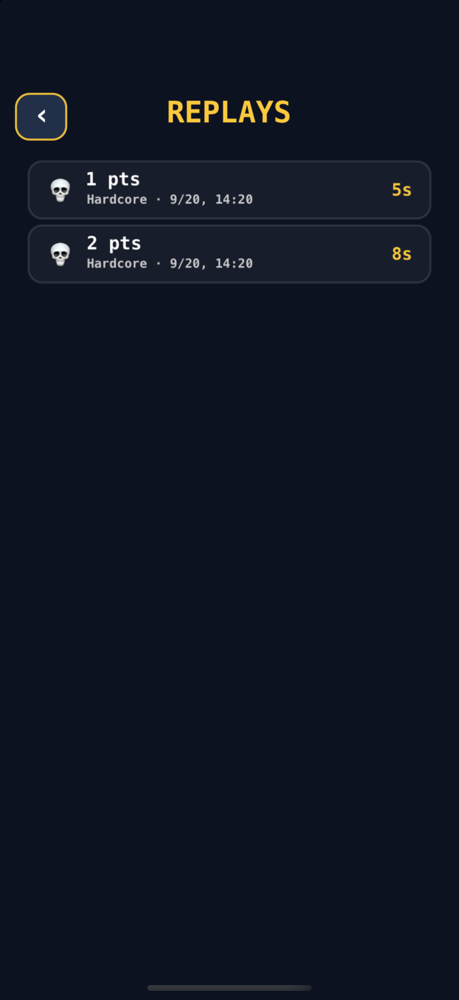
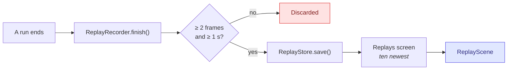
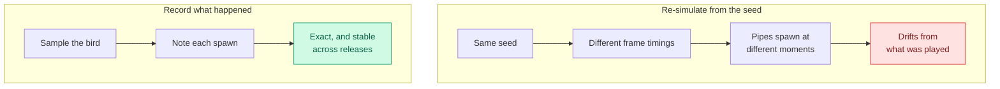
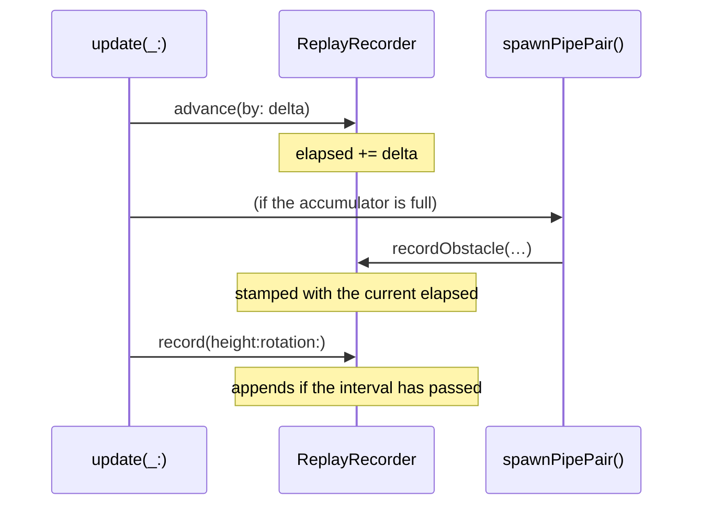
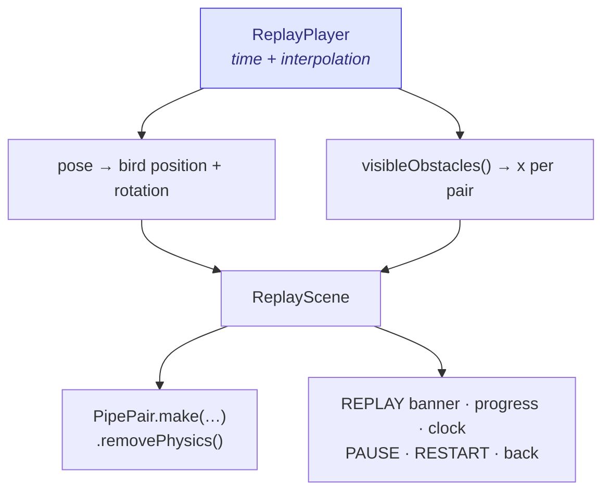
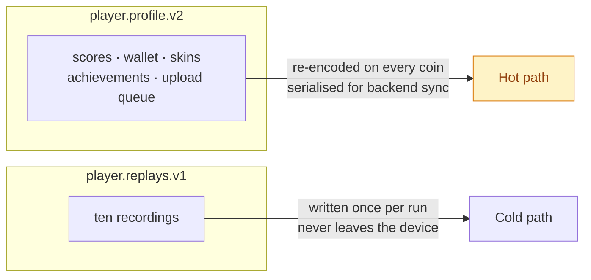
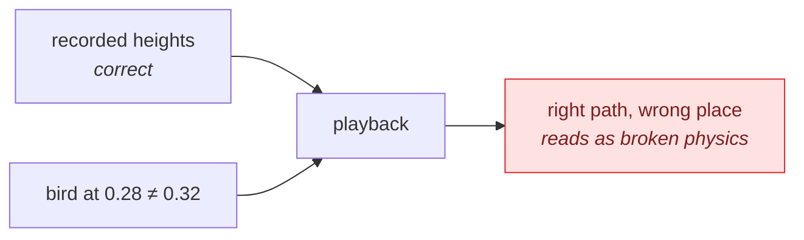

# Replays

Every finished run is recorded and can be watched back. This page covers the
recording format, why it is shaped that way, how playback works, and the
earlier design that was removed.

---

## What you get

<div align="center">
  
  <br/>
  <sub>Ten slots, newest first. Mode, score and length on every row.</sub>
</div>

Finish a run of at least a second and it is saved. The **Replays** screen lists
the ten newest, newest first; tapping one opens playback on its own screen.



---

## Why recorded, not re-simulated

The obvious design is to store the run's seed and replay the simulation. The
world *is* generated from the seed, so in principle the same seed should produce
the same run.

It does not. **Pipe spawning is driven by accumulated frame time**:

```swift
spawnAccumulator += delta * Double(slowMotionFactor)
guard spawnAccumulator >= currentSnapshot.spawnInterval else { return }
```

`delta` is real elapsed time, which varies with frame rate, thermal state and
whatever else the device is doing. Two plays of the same seed drift apart within
seconds. Recording what actually happened removes the question entirely — and it
means a replay stays correct even if the difficulty constants change in a later
release.



---

## The format

```swift
struct Replay {
    struct Frame    { time, height, rotation }
    struct Obstacle { time, gapCentre, gapHeight, startX, travel, duration }

    id, mode, score, coins, pipesPassed, recordedAt
    frames: [Frame]
    obstacles: [Obstacle]
}
```

### Why it stays small

A pipe's motion is **fully determined the moment it spawns**. The live scene
gives each pair one action and never touches it again:

```swift
let move = SKAction.moveBy(x: -distance, y: 0, duration: duration)
pair.run(.sequence([move, .removeFromParent()]))
```

So an obstacle costs *one entry*, not a position per frame. Only the bird —
whose path is the player's actual input — needs sampling, at 30 Hz.

| | Sampled at 30 Hz | One entry per spawn |
|---|---|---|
| Bird | ✅ frames | |
| Pipes | | ✅ obstacles |

A 60-second run is roughly 1,800 frames and ~30 obstacles.

### Normalisation

Every measurement is a **fraction of the scene**, never a point value:

- `height`, `gapCentre`, `gapHeight` → fraction of scene height
- `startX`, `travel` → fraction of scene width

A run recorded on an iPhone SE plays back correctly on an iPad, and the format
does not care about safe-area insets or orientation.

### Caps

| Cap | Value | Reason |
|-----|------:|--------|
| `replaySampleInterval` | 1/30 s | Smooth enough to interpolate |
| `replayMaxFrames` | 3,600 | ~2 minutes; bounds storage |
| `replayMaxObstacles` | 400 | Same |
| `replayMinimumDuration` | 1 s | Nothing shorter is worth watching |
| `ReplayStore.limit` | 10 | Newest kept, oldest dropped |

---

## Recording

The scene owns one `ReplayRecorder` and drives it from the frame loop.



**Order matters.** `advance` runs first, so an obstacle spawned later in the
same frame is stamped with the current time rather than the previous frame's.

The first sample is taken immediately rather than waiting for the interval, so
playback opens on the bird's real starting pose instead of interpolating up from
nothing.

---

## Playback

Its own scene. No physics at all.



`ReplayPlayer` is a value type that knows nothing about scenes — it owns only
the clock and the interpolation, which is what makes it testable without a
simulator. `ReplayScene` owns the nodes.

### Interpolation

Frames are in time order, so the player binary-searches for the bracketing pair
and lerps between them. A linear walk would be fine for a short run and
noticeably wasteful for a two-minute one, every frame.

Outside the recording the ends are **held, not extrapolated** — seeking past the
end gives you the final pose rather than a bird continuing into the floor.

### Obstacle positions

```swift
let age = time - obstacle.time
guard age >= 0, age <= obstacle.duration else { return nil }   // not visible
let fraction = age / obstacle.duration
return obstacle.startX - obstacle.travel * fraction
```

A straight interpolation, because that is exactly what a single `moveBy` does in
the live scene. A pair exists only between its spawn and the end of its travel.

### No physics

`PipePair.removePhysics()` strips every body before the pair joins the replay
scene. Without it a replayed bird — positioned rather than simulated — could
collide with a pipe it had already passed, or trip a score gate nobody is
passing.

---

## Storage

Replays live under their own `UserDefaults` key, `player.replays.v1`, **not** in
`PlayerProfile`.



Keeping them apart matters: the profile is re-encoded constantly and is what
sync sends to the server, while a replay is larger than everything else in the
profile put together and the server has no use for it.

---

## The design that was removed

An earlier version drew the player's best run into the **live game** as a
translucent second bird — a "ghost" to race.

It was removed, and it is worth recording why, because the failure was not the
idea:

1. **It looked like a bug.** A near-identical bird at 26% alpha, drawn over the
   pipes, reads as a rendering artefact rather than a feature.
2. **It replayed its own death.** Recording ran until the run ended, so every
   ghost finished by plummeting to the ground. A clone falling out of the sky is
   indistinguishable from a glitch.
3. **It could not explain itself.** An overlay has nowhere to put a label, a
   control, or any signal that says "this is a recording".

The content was worth keeping; the presentation was not. A replay needs to
announce itself as one, which means a screen with a banner, a clock and
transport controls — which is what this is.

---

## Two ways this went wrong

Both worth recording, because neither produced an error — the feature simply
looked broken.

**Fabricated replays were seeded for screenshots.** `-seed-demo` wrote three
generated recordings: a sine wave for the flight path and obstacles spaced
exactly 1.6 s apart. They filled the list, so the first thing anyone saw on
opening Replays was mechanical bobbing through evenly spaced pipes — not
movement, a pattern. Nothing is seeded now; the list is empty until a run is
played.

**Playback put the bird in the wrong place.** The game starts the bird at
`0.32 × width`; the replay scene used its own `0.28`. Four percent of the screen
is enough that pipes arrive at the wrong moment relative to the recorded
heights, so the bird appeared to clip obstacles it had cleared. Both now read
`GameConfig.birdStartX`, and a test pins it.



The lesson for both: a replay is only credible if it is *the run*. Anything
synthetic in the list, or any geometry that differs from the live scene, makes
the whole feature look untrustworthy even when the recording is perfect.

---

## Tests

`FlappyBirdTests/ReplayTests.swift` covers the recorder, the player and the
store: sampling rate, immediate first sample, clamping, caps, obstacle
stamping, interpolation across many samples, seek clamping, visibility windows,
newest-first ordering, the storage limit, de-duplication by id, and persistence
across a reload.

`FlappyBirdUITests/ReplayUITests.swift` drives the real thing: the menu entry,
the list, opening a row, pause/resume, restart-resumes, returning to the list,
and that the playback clock actually advances.

---

## Where to look next

- [Physics and flight](PHYSICS.md) — the loop a recording is taken from
- [Persistence and state](PERSISTENCE.md) — the other two stores
- [Rendering](RENDERING.md) — the pipes playback reuses
- [Roadmap](ROADMAP.md) — sharing a replay is the obvious next step
