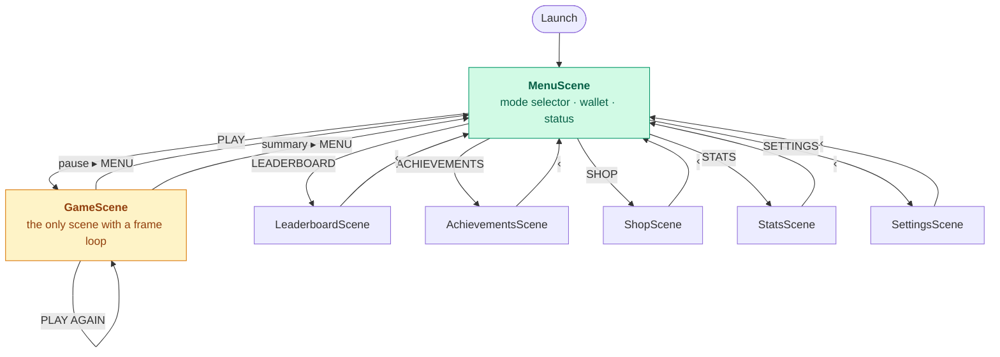
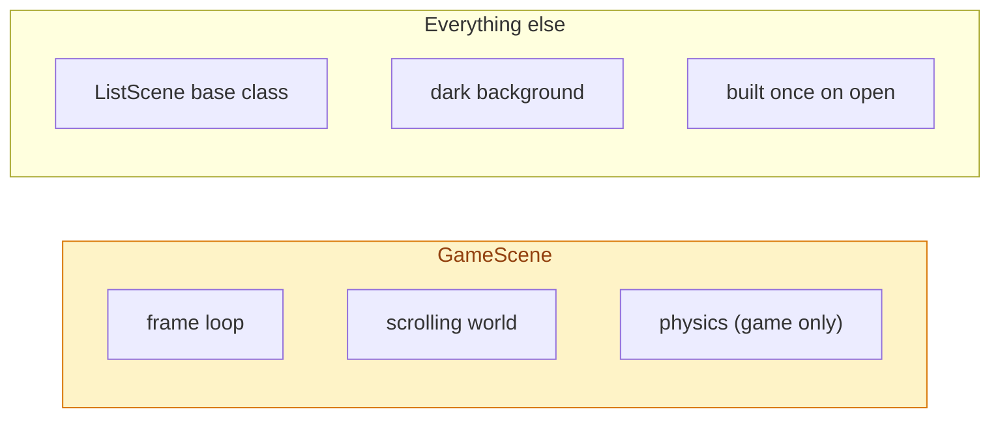
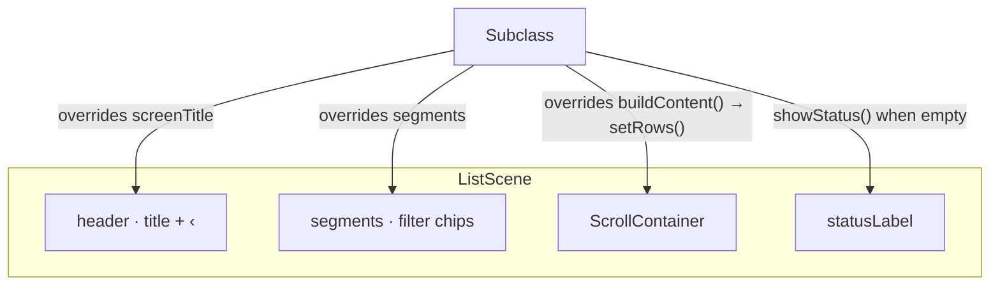
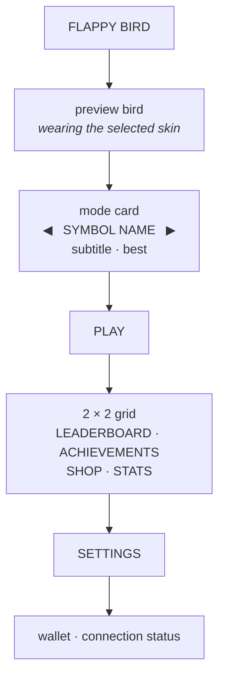
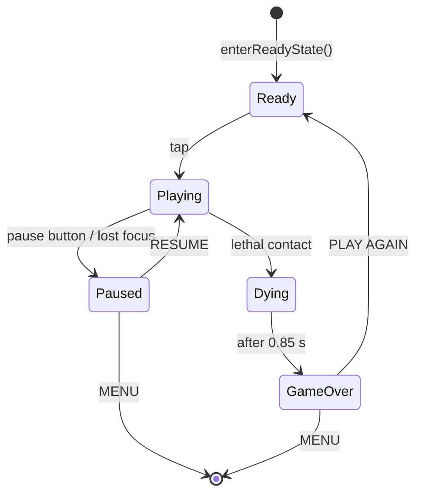
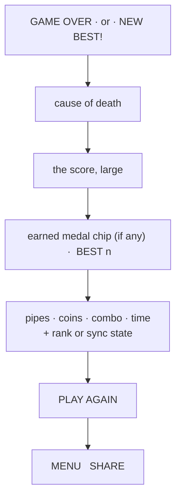

# Screens and navigation

Every screen in the game, how you get there, and what it is built from. There is
no navigation controller and no storyboard — navigation is presenting a new
`SKScene` into the one `SKView`.

---

## The map



Every screen is one push away from the menu. There is no deep stack to unwind,
which is why a single `‹` is always enough.

---

## Two kinds of screen



The distinction matters for cost: list screens build their content once and then
do nothing per frame, which is why they open instantly and why they share a base
class.

---

## `ListScene`

The shared chrome for every full-screen list: title, back button, optional
filter chips, a scroll area and a status line for empty and error states.



A subclass supplies a title, optional segments, and rows. `makeRow` builds the
standard badge / title / subtitle / value layout **and** publishes it as one
accessibility element — see [Accessibility](ACCESSIBILITY.md).

| Screen | Segments |
|--------|----------|
| Leaderboard | ALL TIME · TODAY · WEEK · MONTH |
| Achievements | ALL · UNLOCKED · LOCKED |
| Stats | TOTALS · BY MODE · RECENT |
| Settings | GAME · ACCESS · SERVER |

---

## The menu

<div align="center">
  
  <br/>
  <sub>Captured by `make media`, straight from the simulator.</sub>
</div>



Two details worth knowing:

**The mode card fits its own text.** Labels are centred on the card, so the
usable width is the gap *between the arrows*, not the panel width. `fit(_:)`
shrinks a label until it fits that gap — long subtitles used to run underneath
the arrows.

**The primary grid is 2 × 2.** Settings sits below it as a full-width button,
keeping the four progress screens visually grouped while making configuration
easy to find.

**PLAY is opaque.** It is the one primary action on the screen and uses the
solid positive colour; sky, clouds and pipes cannot show through it or make it
look disabled.

### Leaderboard identity

When online, the first row states **Playing as @username**. A fresh installation
receives a device-bound guest name from the backend automatically, and the row
points guest players to **Settings → Server** to claim that same profile. Ranked
non-Zen runs upload at game over; the backend selects each account's best
eligible run for the board. If a leaderboard window is still empty, a second
row says **Finish a ranked run to join this board** instead of hiding the
player's identity behind a generic empty state.

---

## The game screen

<div align="center">
  
  <br/>
  <sub>The HUD: score, level, wallet, pause. Everything else is the world.</sub>
</div>



The HUD carries the score, best, coins, combo, active power-ups, the mode name,
the connection dot and the pause button. Its right-hand column — pause, mode,
status dot — is aligned to one edge; letting each element pick its own inset is
how "CLASSIC" ended up hanging 46 pt short of the button above it.

`Dying` exists so the death animation and the red flash have a beat before the
summary panel appears.

---

## The summary panel

<div align="center">
  
  <br/>
  <sub>The panel sizes itself from its row count.</sub>
</div>



The panel **sizes itself from its row count**. It used to be a hardcoded 372 or
400 points, which was about 26 pt short of the content — the MENU/SHARE row
rendered two points *below* the card's own bottom edge. `height(forRows:)`
derives it now, and `GameOverPanelTests` pins every variant.

The medal chip is conditional. Scores below Bronze show a centred **BEST** value
with no placeholder ring; the old em dash looked like an unexplained minus
button and carried no information.

---

## Opening a screen directly

Every screen has a launch argument, which is what makes screenshots and UI tests
reproducible:

```bash
xcrun simctl launch booted com.hoangsonww.flappybird -screen shop -seed-demo
xcrun simctl launch booted com.hoangsonww.flappybird -screen stats -segment 2
```

| Argument | Effect |
|----------|--------|
| `-screen <name>` | `menu`, `game`, `leaderboard`, `achievements`, `shop`, `stats`, `settings` |
| `-segment <n>` | Pre-select a filter chip |
| `-mode <name>` | Force a game mode |
| `-seed-demo` | Populate a believable profile |
| `-demo` | Attract mode — the bird plays itself |
| `-demo-die <s>` | End an attract run on cue |
| `-debug-hud` | Overlay live state, velocity and the targeted gap |

Full table in [Configuration](CONFIGURATION.md).

---

## Where to look next

- [Rendering](RENDERING.md) — how these scenes are drawn
- [Accessibility](ACCESSIBILITY.md) — how they reach VoiceOver
- [Gameplay](GAMEPLAY.md) — what the numbers on them mean
- [Testing](TESTING.md) — the UI suite that drives every one of them
