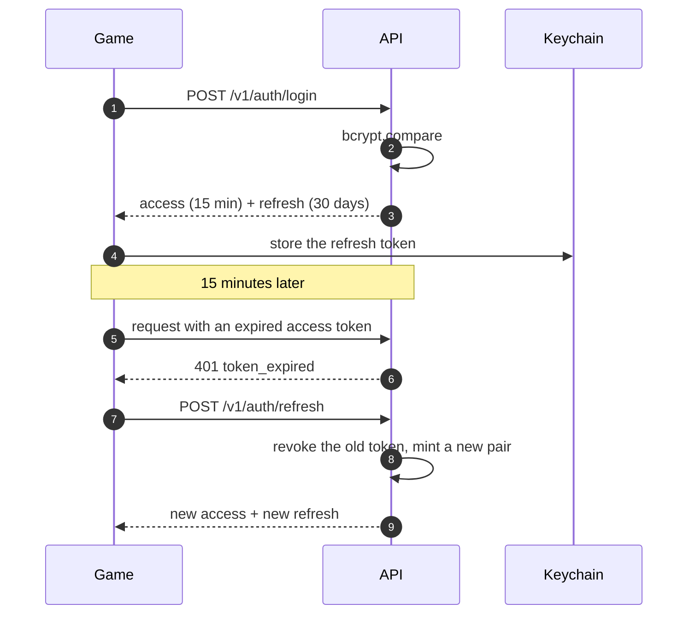

# Security model

The honest framing: this is a hobby game with an optional companion server that
most people will run on `localhost`. The measures below are proportionate to
that, and the places where the trade-off is deliberate are called out.

## Threat model

| Asset | Threat | Mitigation |
|-------|--------|------------|
| Player credentials | Database disclosure | bcrypt, cost 11; never logged |
| Sessions | Token theft or replay | 15-minute access tokens, rotating refresh tokens stored as SHA-256 hashes |
| Leaderboards | Fabricated scores | Plausibility checks, optional HMAC run signatures, moderation |
| The API | Brute force, scraping | Three rate-limit buckets, strict validation |
| The device | Local tampering | *Out of scope* — see below |

## Authentication



* **Access tokens** are JWTs (HS256) carrying `sub`, `username`, `role`, `guest`.
  Short-lived and never persisted to disk.
* **Refresh tokens** are 256 bits of randomness, stored **hashed**. A leaked
  database yields no usable session.
* **Rotation** means a stolen refresh token is single-use; the legitimate client's
  next refresh fails, which is a detectable signal.
* **Revocation** happens on logout, logout-all, password change, ban and account
  deletion.

### Guest accounts

Bound to `identifierForVendor` — no password, no email, no PII. They exist so a
player can sync before deciding to create an account, and
`POST /v1/auth/upgrade` promotes one in place, keeping every score.

If the Keychain is unavailable (unsigned builds, some simulator configurations),
the refresh token falls back to memory for the lifetime of the process. The next
launch simply re-creates the guest session from the device id, which is
idempotent server-side. This is a deliberate trade-off: the alternative was an
app that looked connected and silently uploaded nothing.

## Transport

The game talks **HTTP to localhost** by default. That is the point — a backend
you run on your own machine should not need a certificate.

Exposing it beyond your machine means putting TLS in front of it:

```bash
TRUST_PROXY=true
CORS_ORIGINS=https://your-domain
PUBLIC_URL=https://your-domain
```

The iOS client accepts an explicit `https://` URL in Settings ▸ Server.

## Input handling

Every request body, query and path parameter is parsed with Zod before a handler
sees it. Failures return `422` with the exact field paths. Bodies are capped at
64 KB. Requests carry a correlation id (`X-Request-Id`), echoed in responses and
in every log line.

SQL is parameterised throughout — no string interpolation anywhere in
`repositories/postgres`.

## Fair play

Server-side plausibility checks, with a deliberate bias: **never reject a run a
real player could have produced.**

| Category | Behaviour |
|----------|-----------|
| Impossible | `422`, nothing stored |
| Improbable | `201` with `flagged: true` and reasons; excluded from boards and stats |
| Fine | Stored and ranked |

Optionally, runs can be signed:

```
HMAC-SHA256(RUN_SIGNING_SECRET, "mode|score|coins|pipesPassed|durationMs|seed")
```

With `REQUIRE_SIGNED_RUNS=true` an unsigned or mis-signed run is rejected.

**This is not anti-cheat in the strong sense.** The secret ships inside the app,
so a determined person can extract it. It raises the cost of casual scripting
against a public instance; it does not make the leaderboard tamper-proof, and
pretending otherwise would be dishonest.

Local progress lives in `UserDefaults` and is trivially editable on a
jailbroken device. That is fine: the server never trusts the client's idea of a
personal best — it recomputes ranks from submitted runs.

## Secrets

| Secret | Required | Generate |
|--------|----------|----------|
| `JWT_ACCESS_SECRET` | production | `openssl rand -hex 48` |
| `JWT_REFRESH_SECRET` | production | `openssl rand -hex 48` |
| `ADMIN_TOKEN` | optional | `openssl rand -hex 24` |
| `RUN_SIGNING_SECRET` | optional | `openssl rand -hex 32` |

In development, missing JWT secrets are generated at boot with a warning.
Production **refuses to start** without them, as it refuses `DB_DRIVER=memory`.

## Logging

pino redacts `authorization`, `cookie`, `set-cookie`, and password and refresh
token fields. Error responses expose a stack trace only for non-5xx errors
outside production.

## Hardening already in place

- `helmet` security headers
- CORS allow-list (`*` only by default because the default is localhost)
- `x-powered-by` disabled
- Non-root container user, `dumb-init` for signal handling
- Health endpoints that never leak configuration
- Dependabot and CodeQL on a schedule

## Reporting

Please do not open a public issue for a vulnerability — see
[SECURITY.md](../.github/SECURITY.md).
