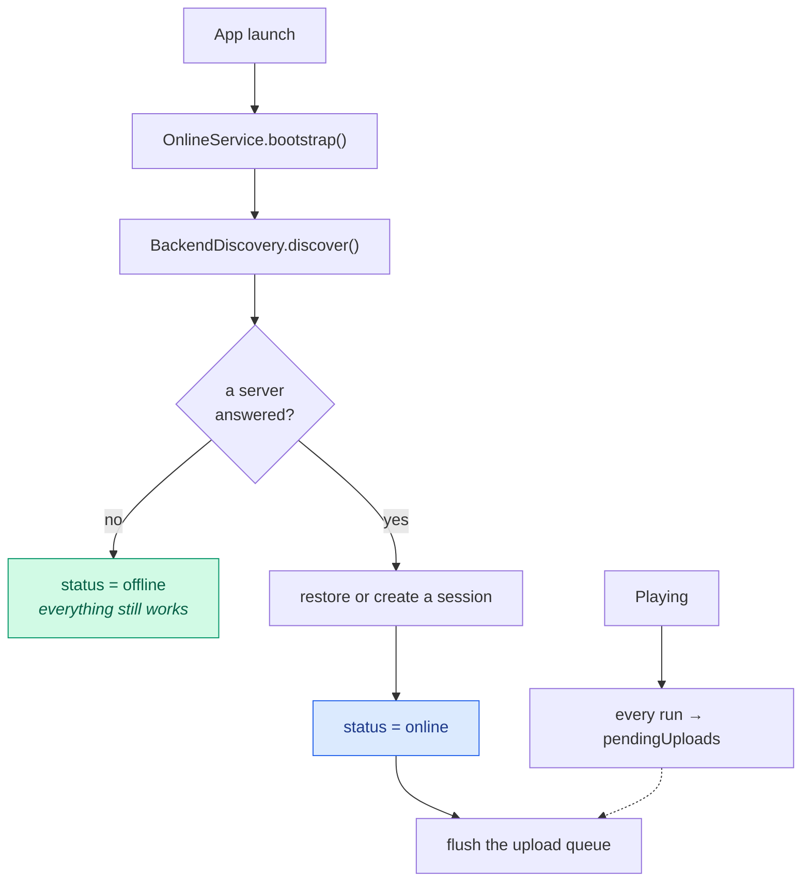
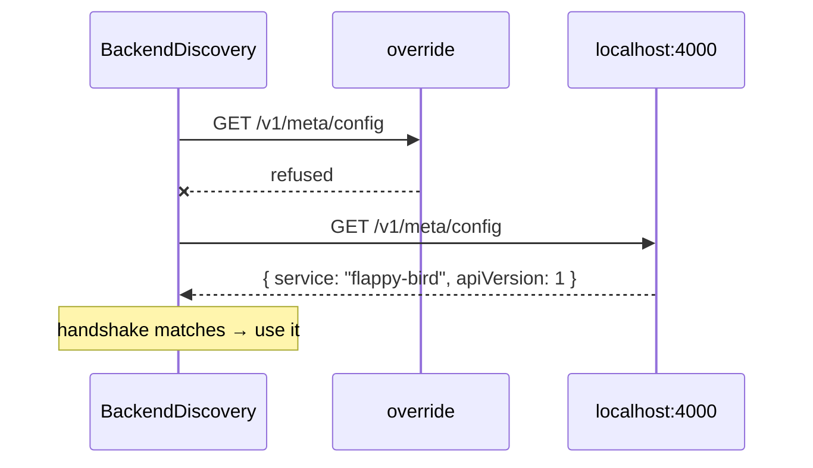
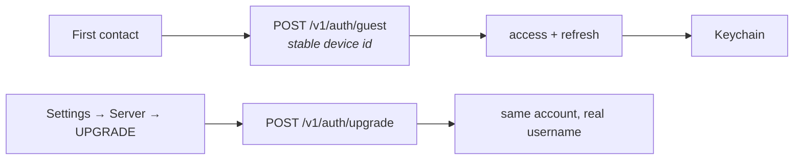
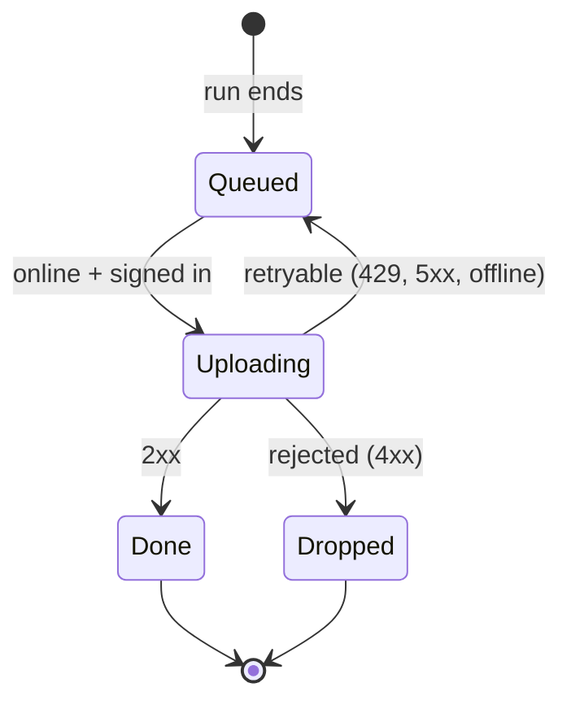
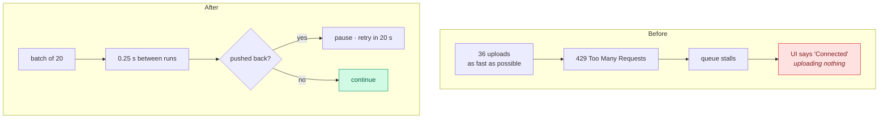
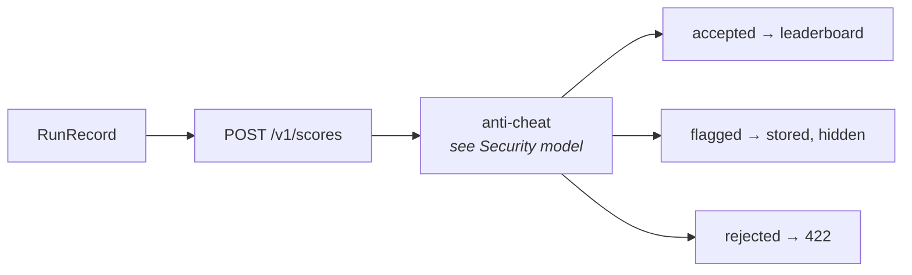
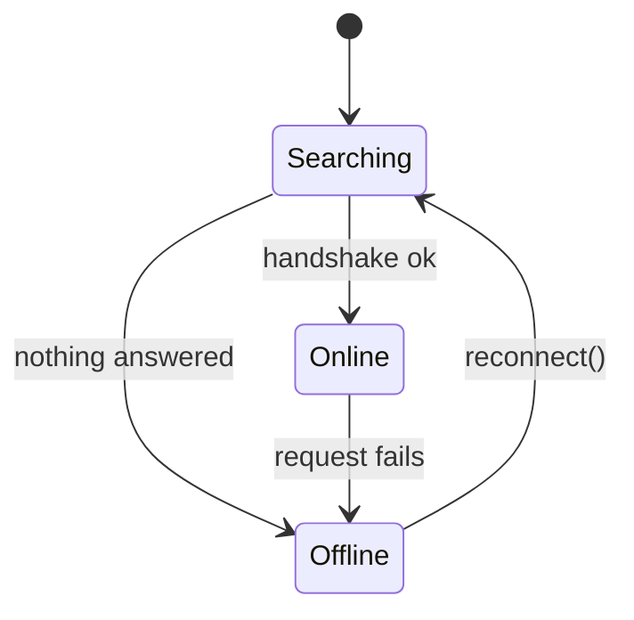

# Sync and the offline queue

How the game finds a backend, how it authenticates, and how runs get from the
device to a leaderboard without ever blocking play. The governing rule is the
one from [ADR 0001](adr/0001-optional-backend.md): **the game must be complete
without any of this.**

---

## The shape of it

Nothing on the critical path of *playing* touches the network. Discovery runs in
the background, uploads happen after a run, and a failure is retried rather than
surfaced as an obstacle.

---

## Discovery

Candidates are tried in order, first answer wins:

1. The **Settings override**, if the player typed one
2. `FlappyBackendURL` from the app's `Info.plist`, if the build sets one
3. `http://localhost:4000`
4. `http://127.0.0.1:4000`

Duplicates are removed while preserving order, so an override equal to a default
does not cost an extra probe.

A probe is not just "did something answer on that port". The response must
identify itself as this API — `flappy-bird/1` — so a random dev server on 4000
is not mistaken for a leaderboard. The per-candidate timeout is deliberately
short, because this runs during launch and must never delay the menu.

### Input normalisation

Players type things like `localhost:4000`, `http://my-mac.local/`, or a value
with a stray space. `normalise` adds a scheme when missing, strips trailing
slashes and trims whitespace, so all of those work.

---

## Sessions

A guest account is created automatically the first time a server is reached, so
leaderboards work without anyone filling in a form. The backend assigns a name
such as `guest_ab12cd`, and the leaderboard publishes it in a **Playing as** row.
Claiming the profile later upgrades the same account rather than starting over.

The app adds every ranked non-Zen run to its local upload queue at game over.
When a session and server are available, `POST /v1/scores` stores the run and
the server recomputes the leaderboard from each player's best eligible score.
That is how a player gets an entry; the client never sends or chooses its rank.

The claim/sign-in UI is a native, keyboard-safe sheet rather than a text-field
alert layered over SpriteKit. Client-side validation mirrors the backend's
username and password constraints, and request failures stay inline in the
sheet with actionable text; they never replace the entire Server tab with a
contextless error message.

### Tokens, and the Keychain trap

Access tokens are short-lived; the refresh token is the durable credential and
lives in the Keychain.

> A silent Keychain failure once left the app **looking connected while never
> uploading anything**: the refresh token could not be written, `isSignedIn`
> returned `false`, and the queue quietly never drained. The store now keeps an
> in-memory fallback and `isSignedIn` is true when *either* token is present, so
> a Keychain that refuses to persist degrades to "works for this launch" rather
> than "works, apparently, but does nothing". `AuthStoreTests` pins the contract.

---

## The upload queue

Every non-Zen run is appended to `pendingUploads` the moment it ends, regardless
of connectivity. Flushing is a separate concern.

A **rejected** run — one the server refuses on its merits, such as a malformed
payload — is dropped rather than retried forever. A **retryable** failure pauses
the flush and schedules another attempt.

### Pacing, and why it exists

The first version uploaded the whole backlog in a tight loop. With a seeded
profile that is 36 runs in a fraction of a second, which trips the server's
submit rate limit (60/min by default). The server returns `429`, the queue
stalls until the app is next foregrounded — and the UI still said **Connected**.

| Knob | Value |
|------|------:|
| `flushBatchSize` | 20 |
| `flushSpacing` | 0.25 s |
| `flushRetryDelay` | 20 s |

### Honest status copy

The Settings screen distinguishes the cases, because "waiting for a server"
while the indicator says Connected reads as a bug even when the queue is simply
being paced:

| Condition | Copy |
|-----------|------|
| Queue empty | Everything is synced |
| Offline | *n* run(s) waiting for a server |
| Online, retrying | *n* run(s) left · retrying shortly |
| Online, flushing | *n* run(s) uploading… |

---

## What is sent

Achievements are reconciled separately through
`POST /v1/achievements/me/sync`, and the merge only ever moves progress
**forward** — a device that has been offline cannot undo progress made
elsewhere.

---

## Status, and what the UI does with it

Screens **observe** the status rather than reading it once.

> This was a real bug: the leaderboard read the status in `buildContent()`,
> which runs on open. Discovery finishes a moment *after* launch, so opening the
> board early showed local scores and never looked again — zero
> `/v1/leaderboard` requests were ever sent. It now registers an observer and
> rebuilds when the status flips.

---

## Demo data never syncs

`-seed-demo` writes a fabricated profile for screenshots and tests. Those runs
are cleared from the queue at seed time, because uploading them would put fake
runs on a real leaderboard — and 36 at once trips the rate heuristic, whose
toast then lands in the middle of the screenshot being taken.

---

## Failure modes, and what the player sees

| Failure | Behaviour |
|---------|-----------|
| No server | Offline; everything local works |
| Server appears mid-session | Next `bootstrap()` finds it and flushes |
| Rate limited | Flush pauses, retries in 20 s, copy says so |
| Token expired | Refreshed transparently |
| Keychain unavailable | In-memory session for this launch |
| Run rejected | Dropped from the queue, logged |
| Server disappears | Status flips to offline; queue grows |

---

## Where to look next

- [Security model](SECURITY-MODEL.md) — tokens, fair play, the threat model
- [Backend](BACKEND.md) — running and configuring the server
- [API reference](API.md) — the endpoints named here
- [Persistence](PERSISTENCE.md) — where the queue lives
